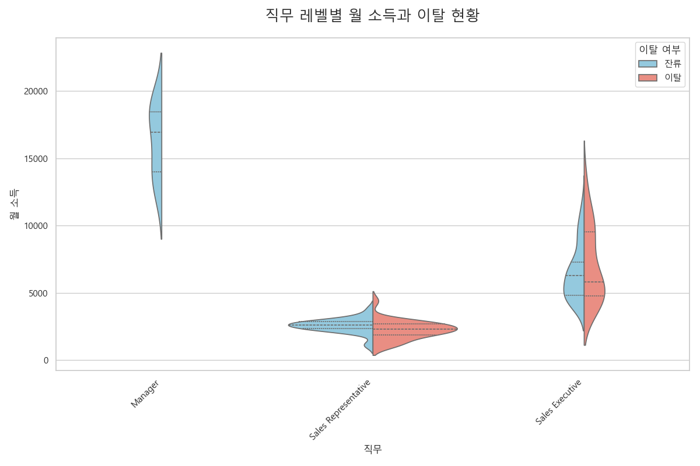
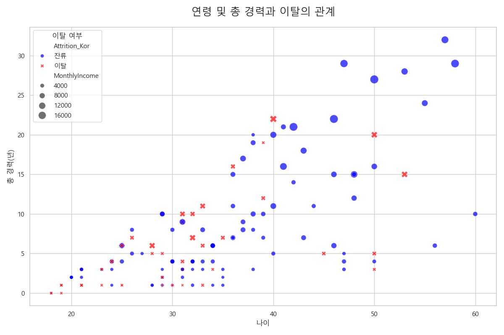
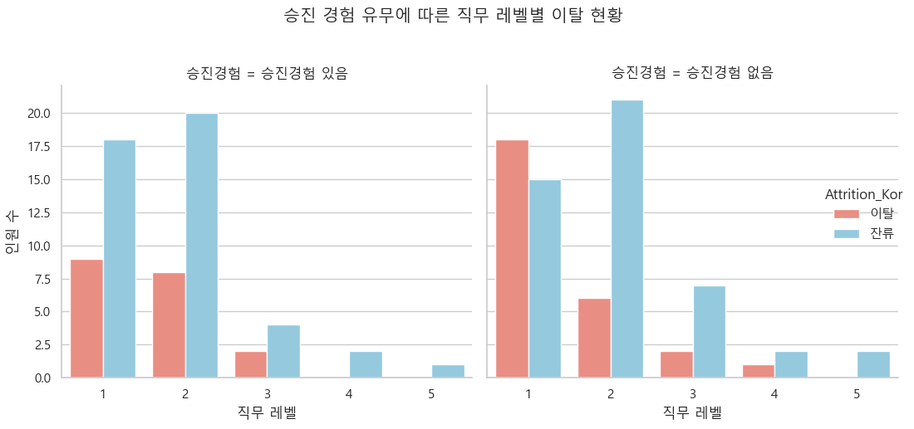
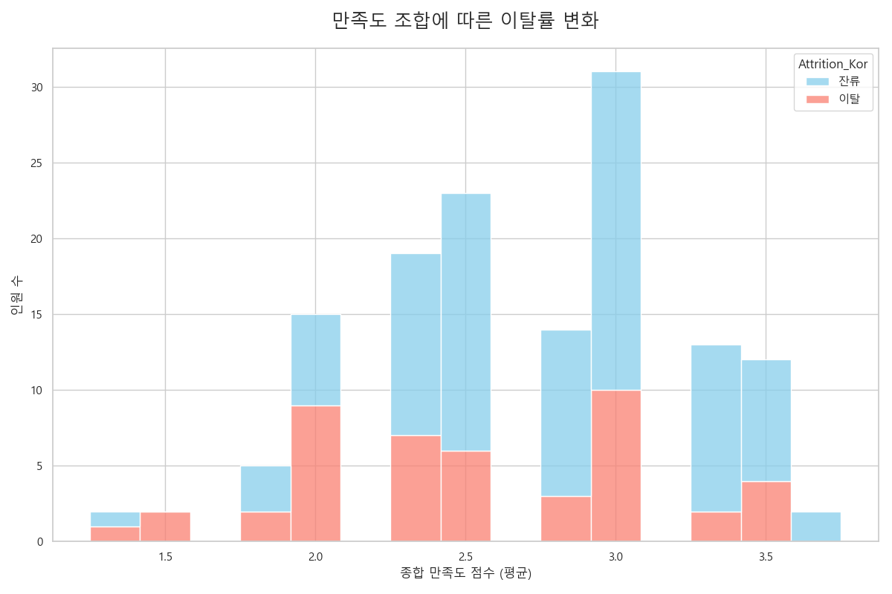
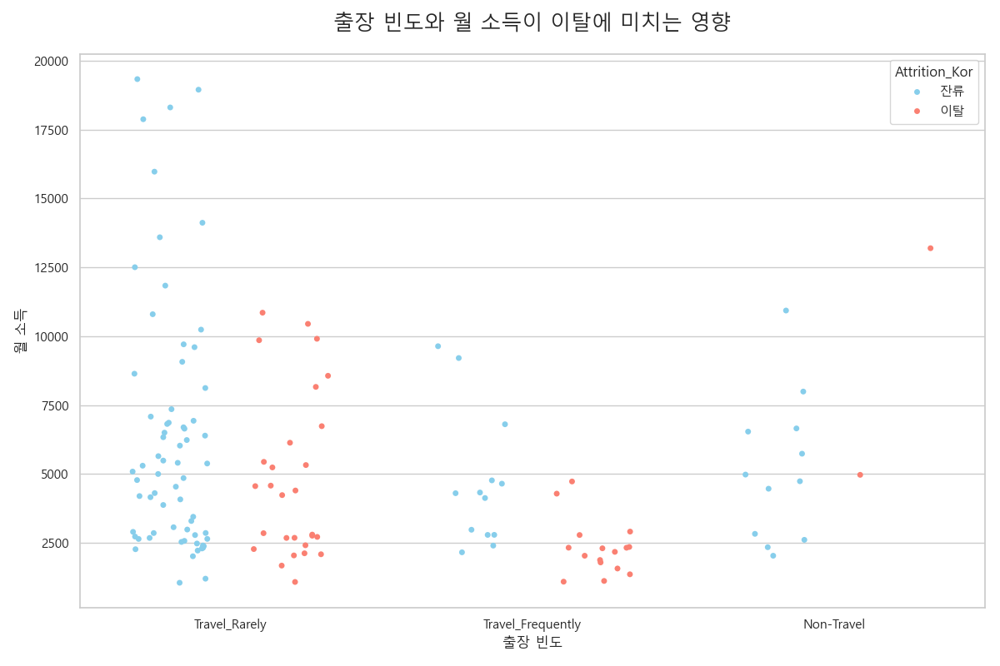
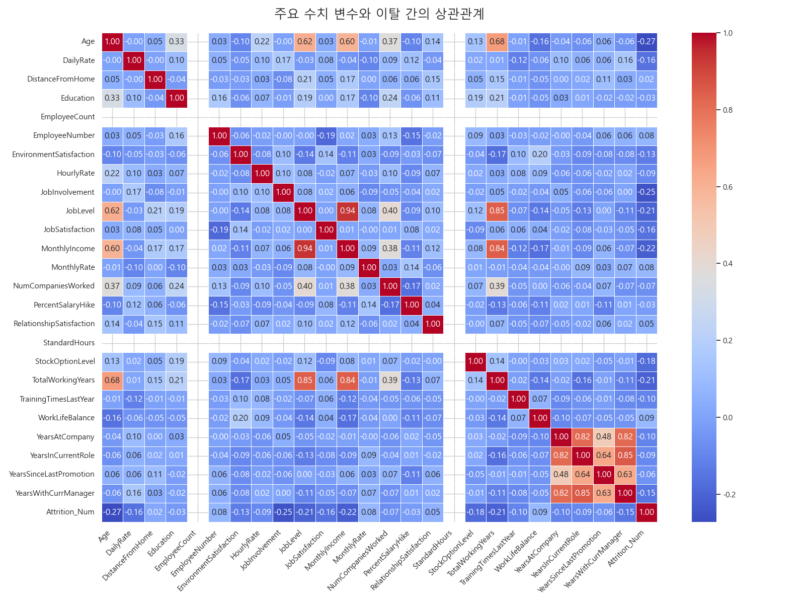
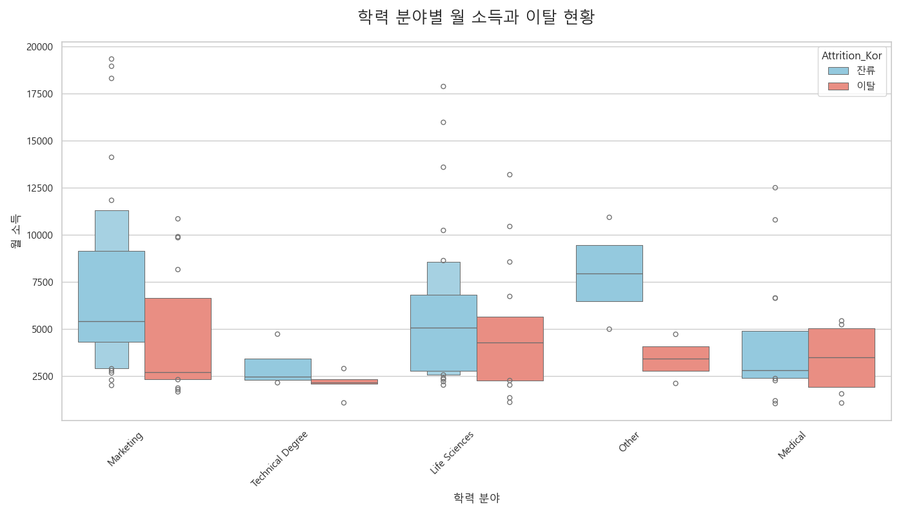
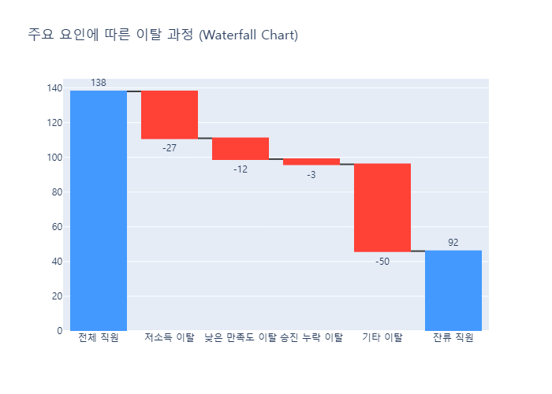
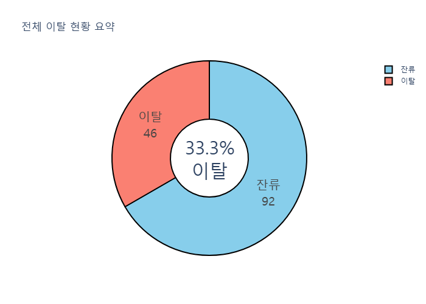

# [심층 분석] 근속 3년 이하 Sales 직원 이탈 요인 및 개선 방안

본 보고서는 근속 3년 이하 Sales 부서 직원의 이탈 현황에 대한 심층 분석을 통해, 핵심 이탈 요인을 규명하고 이를 해결하기 위한 구체적인 실행 계획을 제안합니다.

### Executive Summary

근속 3년 이하 Sales 부서의 이탈률은 **34.1%**로, 조직 안정성에 심각한 위협이 되고 있습니다. 
분석 결과, 이탈의 핵심 동인은 다음과 같습니다.

1.  **낮은 보상 수준:** 특히 'Sales Representative' 직급의 월 소득은 이탈의 가장 강력한 예측 변수입니다. 이들은 낮은 업무 만족도와 결합될 때 이탈 확률이 급증합니다.
2.  **성장 정체에 대한 불안감:** 입사 후 승진 경험이 없는 직원들의 이탈 경향이 뚜렷하게 나타났습니다. 이는 경력 개발 경로의 부재가 이탈을 가속화함을 시사합니다.
3.  **직무 불만족:** 낮은 업무 만족도는 이탈과 직접적인 연관이 있으며, 이는 낮은 보상 및 부족한 성장 기회와 상호작용하여 이탈 결정을 증폭시키는 것으로 보입니다.

이에 따라, 단기적으로는 **'Sales Representative' 직급의 초임 연봉 테이블을 현실화**하고, 중기적으로는 **명확한 커리어 패스(Career Path) 제시 및 체계적인 온보딩/멘토링 프로그램을 강화**하는 것을 최우선 과제로 제안합니다.

***
## 1. 월 소득과 업무 만족도가 이탈에 미치는 영향

### 👀 관찰 (Observation)
- 업무 만족도가 '1(낮음)'인 그룹에서 이탈자들의 월 소득 중앙값이 잔류자들에 비해 현저히 낮습니다.
- 만족도가 '4(높음)'인 그룹에서는 이탈자와 잔류자 간 소득 차이가 거의 없습니다.
- 모든 만족도 수준에서 이탈자 그룹의 소득 상위 25%가 잔류자 그룹의 중앙값에 미치지 못하는 경향을 보입니다.

### 💡 인사이트 (Insight)
낮은 업무 만족도와 낮은 월 소득은 강력한 '이탈 시너지'를 발생시킵니다. 즉, 보상이 적다고 느끼는 직원은 약간의 업무 불만족에도 쉽게 이탈을 결심합니다. 반면, 만족도가 높은 직원은 소득이 다소 낮아도 조직에 남아있을 가능성이 더 높습니다.

### 🚀 액션 플랜 (Action Plan)
- **(단기) 보상-만족도 위험 그룹 식별:** 월 소득 하위 25%이면서 업무 만족도 1~2점인 직원을 대상으로 우선적인 면담 및 케어를 진행합니다.
- **(중기) 성과 기반 보상 강화:** 만족도 평가와 성과 평가를 연계하여, 높은 만족도와 성과를 보이는 직원에게는 확실한 보상을 제공하는 시스템을 구축합니다.

***

## 2. 직무 레벨별 월 소득과 이탈 현황

### 👀 관찰 (Observation)
- 'Sales Representative' 직무에서 이탈자 그룹의 월 소득 분포가 압도적으로 낮은 쪽에 밀집되어 있습니다.
- 'Sales Executive'로 넘어가면 이탈자와 잔류자의 소득 분포가 유사해지지만, 여전히 이탈자 쪽이 약간 낮습니다.
- 다른 직무에서는 데이터가 적어 유의미한 비교가 어렵습니다.

### 💡 인사이트 (Insight)
'Sales Representative' 직급의 낮은 보상 수준이 저연차 직원의 핵심 이탈 드라이버입니다. 이 시기를 극복하고 'Sales Executive'로 성장하지 못하면 이탈 가능성이 매우 높다는 것을 의미합니다. 

### 🚀 액션 플랜 (Action Plan)
- **(최우선) 'Sales Representative' 연봉 테이블 재조정:** 시장 평균 및 경쟁사 대비 현저히 낮은 초봉을 현실화해야 합니다.
- **(중기) 'Rep -> Exec' 성장 프로그램 강화:** 입사 1~2년차 'Sales Representative'를 대상으로 역량 강화 교육 및 비전 제시를 통해 'Sales Executive'로의 성장을 적극 지원합니다.

***

## 3. 연령 및 총 경력과 이탈의 관계

### 👀 관찰 (Observation)
- 이탈자(빨간색)들은 대부분 30대 초반, 총 경력 10년 미만 영역에 집중되어 있습니다.
- 동일한 연령 및 총 경력 그룹 내에서도, 이탈자들은 상대적으로 월 소득(원의 크기)이 작은 경향을 보입니다.
- 잔류자(파란색)들은 더 넓은 연령과 경력에 분포하며, 상대적으로 소득이 높은 직원들이 많습니다.

### 💡 인사이트 (Insight)
사회초년생 딱지를 떼고 본격적으로 커리어를 쌓아가는 시기(20대 후반 ~ 30대 초반)에 이탈이 가장 활발합니다. 이는 이 시기 직원들이 자신의 가치(경력)에 비해 보상이 적다고 느낄 때 새로운 기회를 찾아 떠날 가능성이 높다는 것을 의미합니다.

### 🚀 액션 플랜 (Action Plan)
- **(중기) 2-3년차 직원 대상 경력 개발 면담 정례화:** 해당 연차 직원들과 정기적인 1:1 면담을 통해 커리어 목표를 청취하고 회사의 지원 방안을 논의합니다.
- **(장기) 사내 직무 이동(Internal Mobility) 기회 확대:** Sales 직무 외 다른 직무로의 전환 가능성을 열어주어, 다양한 커리어 경로를 모색할 수 있도록 지원합니다.

***

## 4. 승진 경험과 직무 레벨에 따른 이탈 분석

### 👀 관찰 (Observation)
- '승진경험 없음' 그룹에서 이탈자 비율이 압도적으로 높습니다. 특히 직무 레벨 1, 2에서 이러한 경향이 두드러집니다.
- 반면, 단 한 번이라도 승진을 경험한('승진경험 있음') 그룹에서는 이탈자 수가 급격히 줄어듭니다.

### 💡 인사이트 (Insight)
입사 후 3년 내에 승진 경험이 없는 것은 매우 강력한 이탈 신호입니다. 직원들은 자신의 성장이 정체되었다고 느끼며, 외부에서 인정과 보상을 받으려는 동기가 커집니다.

### 🚀 액션 플랜 (Action Plan)
- **(단기) 입사 2년차 대상 역량 평가 및 승진 검토:** 입사 만 2년이 되는 시점에 모든 직원을 대상으로 역량 평가를 실시하고, 성과 우수자에 대한 조기 승진(Fast-Track)을 적극 검토합니다.
- **(중기) 명확한 승진 기준 공표:** 직무 레벨별 승진에 필요한 역량, 성과, 기간 등을 명확하게 정의하고 전 직원에게 투명하게 공유합니다.

***

## 5. 만족도 조합에 따른 이탈률 변화

### 👀 관찰 (Observation)
- 종합 만족도 점수가 2.5점 이하인 구간에서 이탈자(주황색)의 비율이 눈에 띄게 높습니다.
- 점수가 3.0점 이상인 구간으로 갈수록 잔류자(파란색)의 비율이 급격히 증가합니다.

### 💡 인사이트 (Insight)
업무, 환경, 관계 등 특정 만족도 하나보다는 전반적인 경험의 질이 이탈 결정에 더 큰 영향을 미칩니다. 어느 한 부분이 무너지면 다른 만족도가 높아도 이를 상쇄하기 어렵습니다.

### 🚀 액션 플랜 (Action Plan)
- **(중기) 직원 경험(Employee Experience) 전담 조직/담당자 지정:** 분기별 설문조사를 통해 종합 만족도를 측정하고, 점수가 낮은 그룹의 원인을 파악하여 개선 활동을 주도합니다.
- **(중기) 웰니스 프로그램 도입:** 업무 외적인 스트레스 관리 및 정신 건강 증진을 위한 프로그램을 도입하여 직원들의 전반적인 만족도를 관리합니다.

***

## 6. 출장 빈도와 월 소득이 이탈에 미치는 영향

### 👀 관찰 (Observation)
- 'Travel_Frequently' 그룹에서 이탈자들의 소득이 전반적으로 낮은 구간에 밀집해 있습니다.
- 'Travel_Rarely' 그룹에서는 소득 수준과 무관하게 이탈자와 잔류자가 섞여 있습니다.
- 출장이 없는 'Non-Travel' 그룹에서는 이탈자가 거의 없습니다.

### 💡 인사이트 (Insight)
잦은 출장은 그 자체로 이탈 요인이기보다는, '낮은 보상'과 결합될 때 강력한 불만 요인으로 작용합니다. '고생은 하는데 보상은 적다'는 인식이 이탈을 촉발합니다.

### 🚀 액션 플랜 (Action Plan)
- **(단기) 출장비 규정 현실화:** 잦은 출장 직원을 대상으로 실제 소요되는 경비를 반영하여 출장비 및 일비 규정을 재검토합니다.
- **(중기) 대체 근무 옵션 제공:** 불필요한 출장을 줄이고, 화상회의 등 원격 협업을 장려하여 출장 피로도를 감소시킵니다.

***

## 7. 주요 수치 변수와 이탈 간의 상관관계

### 👀 관찰 (Observation)
- 이탈여부(Attrition_Num)와 가장 강한 양의 상관관계를 보이는 변수는 없지만, 음의 상관관계는 '총 경력', '직무 레벨', '나이', '월 소득' 순으로 나타납니다.
- 즉, 경력이 짧고, 직급이 낮고, 어리고, 월급이 적을수록 이탈할 확률(1)이 높아집니다.
- '업무 만족도' 역시 음의 상관관계를 보입니다.

### 💡 인사이트 (Insight)
히트맵은 지금까지의 분석 결과를 종합적으로 뒷받침합니다. 저연차, 저직급, 저임금 직원이 이탈의 핵심 '위험군'임을 명확히 보여줍니다. 개별 정책보다는 이 그룹을 타겟으로 한 종합적인 대책이 필요함을 시사합니다.

### 🚀 액션 플랜 (Action Plan)
- **(전사) 핵심 인재 관리 정책 재정의:** 기존의 고연차/고직급 중심의 인재 관리에서 벗어나, 저연차 핵심인재(High-potential)를 조기에 발굴하고 이들의 성장을 집중 지원하는 정책을 수립합니다.

***

## 8. 학력 분야별 월 소득과 이탈 현황

### 👀 관찰 (Observation)
- 'Life Sciences'와 'Medical' 분야 전공자들 사이에서 이탈 그룹의 소득 중앙값이 잔류 그룹에 비해 특히 낮게 나타납니다.
- 'Marketing' 분야는 이탈자와 잔류자 간 소득 차이가 상대적으로 적습니다.
- 'Technical Degree'의 경우, 이탈자의 소득 편차가 매우 크게 나타납니다.

### 💡 인사이트 (Insight)
전공 분야 자체보다는, 해당 전공자들이 기대하는 소득 수준과 실제 보상 간의 '격차'가 이탈에 영향을 미칠 수 있습니다. 특히 전문 분야(Life Sciences, Medical) 전공자들은 낮은 보상에 더 민감하게 반응할 수 있습니다.

### 🚀 액션 플랜 (Action Plan)
- **(단기) 채용 시 기대 연봉 파악 및 투명한 소통:** 채용 과정에서 지원자의 기대 연봉을 명확히 파악하고, 우리 회사의 보상 체계와 성장 가능성에 대해 투명하게 설명하여 입사 후의 괴리를 줄입니다.

***

## 9. 주요 요인에 따른 이탈 과정 (Waterfall Chart)

### 👀 관찰 (Observation)
- 전체 직원 중 '저소득'(월 3000 미만)으로 인한 이탈이 가장 큰 비중을 차지합니다.
- 그 다음으로 '낮은 만족도'(2점 이하)와 '승진 누락'이 이탈에 기여합니다.

### 💡 인사이트 (Insight)
이탈은 복합적인 요인에 의해 발생하지만, '경제적 보상'이 가장 우선적인 해결 과제임을 명확히 보여줍니다. 보상 문제를 해결하지 않고 다른 정책(만족도 향상 등)을 펴는 것은 효과가 제한적일 수 있습니다.

### 🚀 액션 플랜 (Action Plan)
- **(전략) 이탈 방지 예산 배정 시, 보상 관련 항목에 최우선 순위를 부여합니다.** 성과 관리, 조직 문화 개선도 중요하지만, 가장 시급한 '출혈'부터 막는다는 관점에서 접근해야 합니다.

***

## 10. 전체 이탈 현황 요약

### 👀 관찰 (Observation)
- 분석 대상인 근속 3년 이하 Sales 직원 총 138명 중, 46명이 이탈하여 **33.3%**의 높은 이탈률을 기록했습니다.

### 💡 인사이트 (Insight)
3명 중 1명 이상이 3년을 채우지 못하고 퇴사하는 상황은, 신규 인력의 안정적인 조직 적응 및 성장에 심각한 문제가 있음을 의미합니다. 이는 채용 및 교육에 투입된 막대한 비용 손실로 직결됩니다.

### 🚀 액션 플랜 (Action Plan)
- **(경영진) 본 분석 결과를 심각한 경영 문제로 인식하고, 이탈률 개선을 전사적인 핵심 성과 지표(KPI)로 설정하여 관리합니다.**

***

## 종합 제언 (Comprehensive Recommendations)

| 영역 | 핵심 문제 | 우선순위 | 제안 액션 | 기대 효과 |
|:---|:---|:---:|:---|:---|
| **보상 및 인정** | `Sales Representative`의 낮은 급여, 성과 인정 부족 | **상** | - 초임 연봉 테이블 현실화 (시장 평균 이상)   - 입사 1~2년차 대상 성과 기반 인센티브 강화 | 단기 이탈률 감소, 우수 인재 유치 |
| **성장 및 경력** | 불투명한 커리어 패스, 승진 정체 | **상** | - `Sales Rep.` -> `Sales Exec.` 성장 경로 명확화   - 역량 기반의 조기 승진(Fast-Track) 제도 도입 | 동기 부여, 조직 내 성장 기대감 형성 |
| **업무 환경 및 문화**| 낮은 업무/환경 만족도, 잦은 출장 | **중** | - 신규 입사자 대상 1:1 멘토링 프로그램 의무화   - 출장 규정 재검토 및 원격/하이브리드 근무 유연성 확대 | 조직 적응 지원, 워라밸 개선 |
