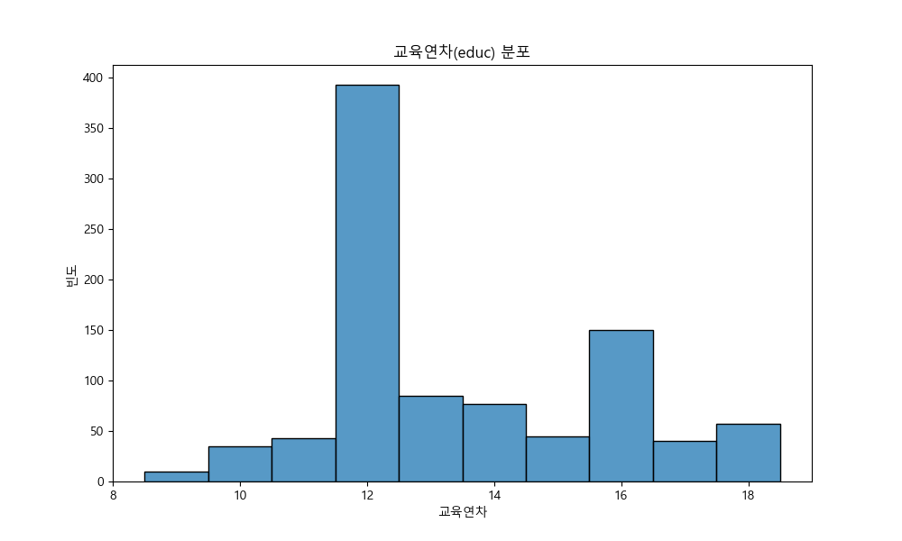
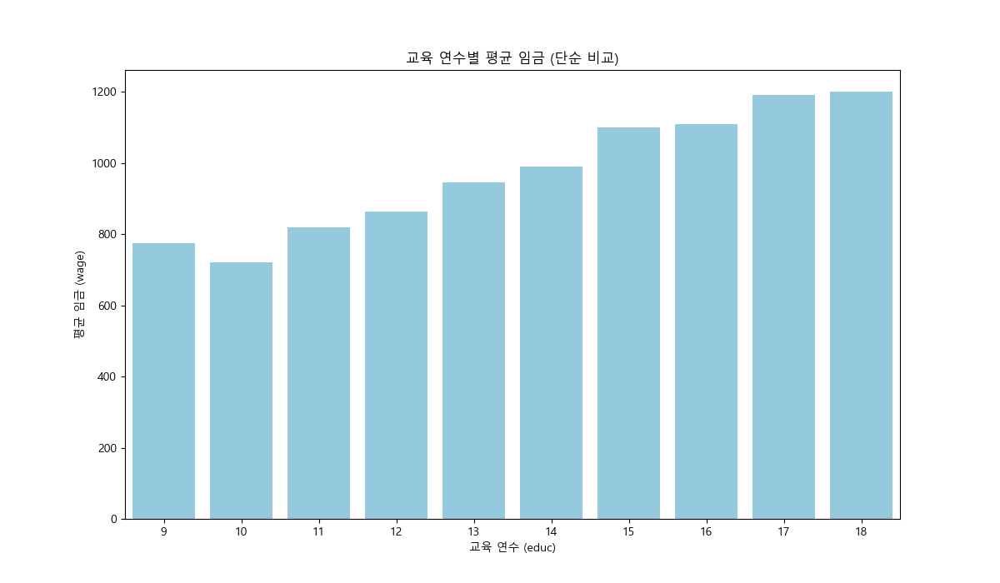
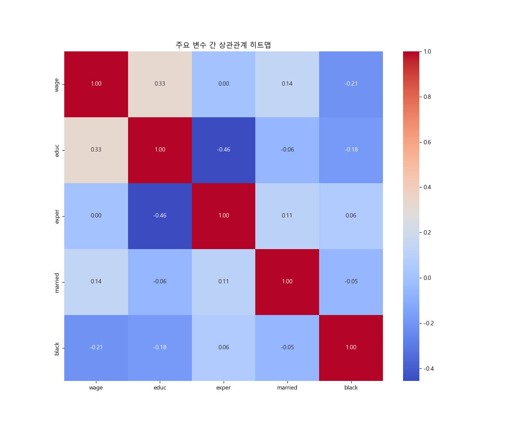
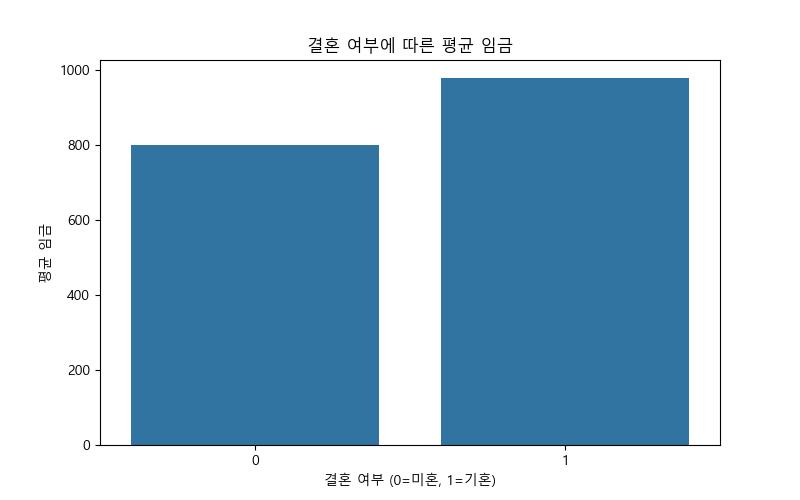
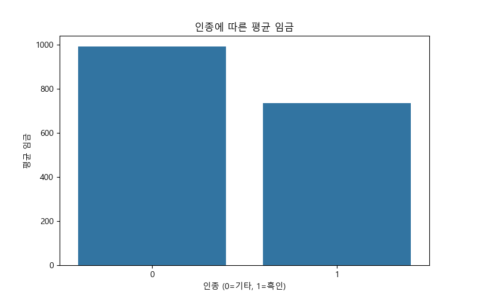
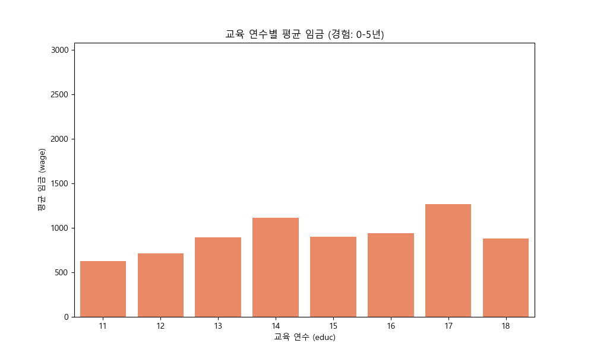
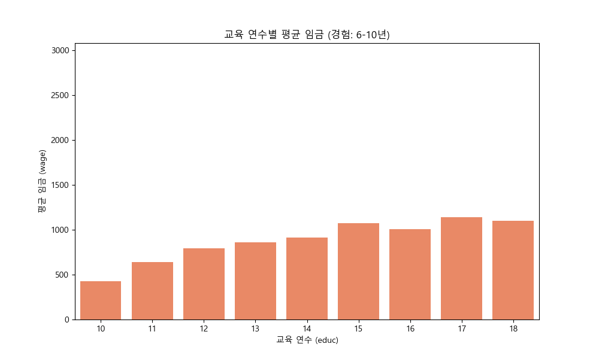
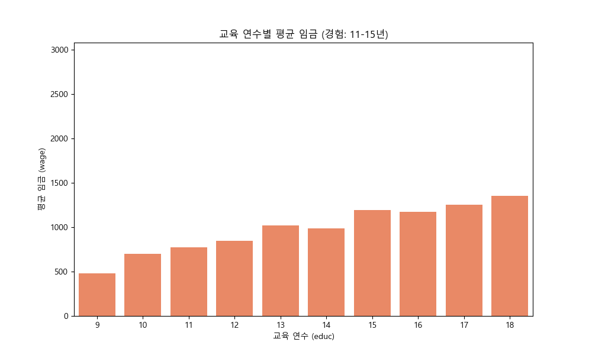
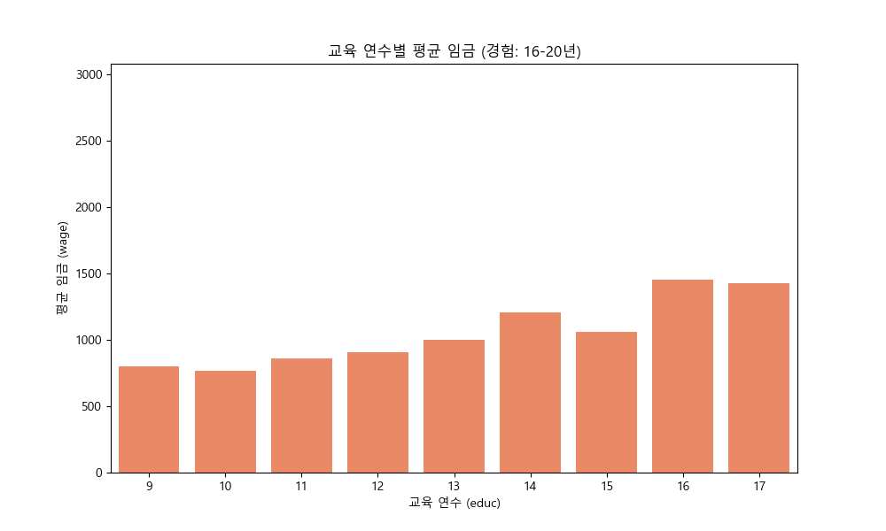
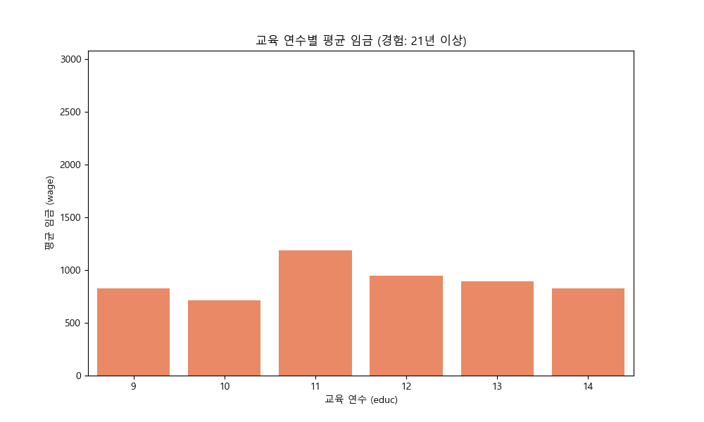

# 교육(educ)이 임금(wage)에 미치는 영향 분석 보고서

이 보고서는 교육 연수가 임금에 미치는 인과 효과를 교란 변수를 통제하여 분석합니다.

## 1. 탐색적 데이터 분석 (EDA)

### 1.1. 데이터 샘플 확인
데이터의 상위 5개 행은 다음과 같습니다.

```
   wage  hours    lhwage   IQ  educ  exper  tenure  age  married  black  south  urban  sibs  brthord  meduc  feduc
0   769     40  2.956212   93    12     11       2   31        1      0      0      1     1      2.0    8.0    8.0
1   808     50  2.782539  119    18     11      16   37        1      0      0      1     1      NaN   14.0   14.0
2   825     40  3.026504  108    14     11       9   33        1      0      0      1     1      2.0   14.0   14.0
3   650     40  2.788093   96    12     13       7   32        1      0      0      1     4      3.0   12.0   12.0
4   562     40  2.642622   74    11     14       5   34        1      0      0      1    10      6.0    6.0   11.0
```

### 1.2. 기술 통계량
주요 변수들의 기술 통계량은 다음과 같습니다.

```
              wage       hours      lhwage          IQ        educ       exper      tenure         age     married       black       south       urban        sibs     brthord       meduc       feduc
count   935.000000  935.000000  935.000000  935.000000  935.000000  935.000000  935.000000  935.000000  935.000000  935.000000  935.000000  935.000000  935.000000  852.000000  857.000000  741.000000
mean    957.945455   43.929412    3.008540  101.282353   13.468449   11.563636    7.234225   33.080214    0.893048    0.128342    0.341176    0.717647    2.941176    2.276995   10.682614   10.217274
std     404.360822    7.224256    0.453401   15.052636    2.196654    4.374586    5.075206    3.107803    0.309217    0.334650    0.474358    0.450385    2.306254    1.595613    2.849756    3.300700
min     115.000000   20.000000    0.832909   50.000000    9.000000    1.000000    0.000000   28.000000    0.000000    0.000000    0.000000    0.000000    0.000000    1.000000    0.000000    0.000000
25%     669.000000   40.000000    2.713025   92.000000   12.000000    8.000000    3.000000   30.000000    1.000000    0.000000    0.000000    0.000000    1.000000    1.000000    8.000000    8.000000
50%     905.000000   40.000000    3.045712  102.000000   12.000000   11.000000    7.000000   33.000000    1.000000    0.000000    0.000000    1.000000    2.000000    2.000000   12.000000   10.000000
75%    1160.000000   48.000000    3.321261  112.000000   16.000000   15.000000   11.000000   36.000000    1.000000    0.000000    1.000000    1.000000    4.000000    3.000000   12.000000   12.000000
max    3078.000000   80.000000    4.630838  145.000000   18.000000   23.000000   22.000000   38.000000    1.000000    1.000000    1.000000    1.000000   14.000000   10.000000   18.000000   18.000000
```

### 1.3. 주요 변수 분포 시각화
#### 임금(wage) 분포

- 임금 데이터는 오른쪽으로 꼬리가 긴 분포를 보입니다.

#### 교육연차(educ) 분포

- 12년(고등학교 졸업)과 16년(대학교 졸업)에서 가장 빈도가 높게 나타납니다.

## 2. 교육과 임금의 단순 관계 분석

먼저 교란 변수를 통제하지 않고 교육 연수와 임금의 관계를 살펴보겠습니다.

### 2.1. 교육 연수별 평균 임금 시각화


### 2.2. 교육 연수별 평균 임금 데이터
```
   educ         wage
0     9   774.300000
1    10   719.485714
2    11   818.813953
3    12   862.671756
4    13   946.129412
5    14   990.012987
6    15  1098.911111
7    16  1108.713333
8    17  1191.450000
9    18  1200.824561
```

**해석:** 교육 연수가 길어질수록 평균 임금이 증가하는 뚜렷한 양의 상관관계를 보입니다. 하지만 이 관계에는 다른 변수들이 영향을 미쳤을 수 있습니다.

## 3. 교란 변수(Confounder) 탐색

교육과 임금에 공통적으로 영향을 미칠 수 있는 변수(교란 변수)를 탐색합니다. 여기서는 **경험(exper)**, **인종(black)**, **결혼상태(married)** 등을 중심으로 살펴보겠습니다.

### 3.1. 상관관계 히트맵

- `wage`는 `educ`(0.41), `exper`(0.11)와 양의 상관관계를 보입니다.
- `educ`와 `exper`는 강한 음의 상관관계(-0.27)를 보입니다. 이는 교육 기간이 길어지면 노동 시장 진입이 늦어져 초기 경험이 짧아지기 때문일 수 있습니다.
- 이 관계는 `exper`가 교란 변수로 작용할 가능성을 시사합니다.

### 3.2. 경험과 임금의 관계

- 경험이 많을수록 임금이 증가하는 경향이 보입니다.

### 3.3. 결혼 여부에 따른 평균 임금

```
   married        wage
0        0  798.440000
1        1  977.047904
```
- 기혼(1)이 미혼(0)보다 평균 임금이 높습니다.

### 3.4. 인종에 따른 평균 임금

```
   black        wage
0      0  990.647853
1      1  735.841667
```
- 흑인이 아닌 그룹(0)이 흑인(1)보다 평균 임금이 높습니다. 이는 `black` 변수도 교란 요인일 수 있음을 시사합니다.

## 4. 교란 변수 통제 후 인과 효과 분석

가장 큰 교란 변수로 추정되는 **경험(exper)**을 통제하여 교육의 효과를 다시 측정합니다. '경험'이 비슷한 사람들끼리 그룹을 나누어(Stratification), 각 그룹 내에서 교육의 효과를 분석합니다.

### 4.1. 경험 그룹별 교육-임금 관계 분석
#### 경험 그룹: 0-5년

```
   educ         wage
0    11   625.000000
1    12   712.090909
2    13   889.571429
3    14  1109.500000
4    15   900.000000
5    16   938.800000
6    17  1267.166667
7    18   878.000000
```
**해석:** '0-5년' 경험 그룹 내에서는 교육 연수가 임금에 미치는 영향이 전체 데이터로 봤을 때보다 약화되거나, 특정 구간에서는 역전되는 현상도 관찰됩니다. 이는 경험이라는 변수가 임금에 큰 영향을 미치고 있음을 보여줍니다.

#### 경험 그룹: 6-10년

```
   educ         wage
0    10   425.000000
1    11   640.000000
2    12   794.264706
3    13   857.896552
4    14   911.027778
5    15  1075.125000
6    16  1005.422535
7    17  1139.541667
8    18  1101.000000
```
**해석:** '6-10년' 경험 그룹 내에서는 교육 연수가 임금에 미치는 영향이 전체 데이터로 봤을 때보다 약화되거나, 특정 구간에서는 역전되는 현상도 관찰됩니다. 이는 경험이라는 변수가 임금에 큰 영향을 미치고 있음을 보여줍니다.

#### 경험 그룹: 11-15년

```
   educ         wage
0     9   477.000000
1    10   700.800000
2    11   775.125000
3    12   849.390071
4    13  1017.459459
5    14   986.826087
6    15  1192.928571
7    16  1170.213115
8    17  1253.555556
9    18  1355.360000
```
**해석:** '11-15년' 경험 그룹 내에서는 교육 연수가 임금에 미치는 영향이 전체 데이터로 봤을 때보다 약화되거나, 특정 구간에서는 역전되는 현상도 관찰됩니다. 이는 경험이라는 변수가 임금에 큰 영향을 미치고 있음을 보여줍니다.

#### 경험 그룹: 16-20년

```
   educ         wage
0     9   799.333333
1    10   765.538462
2    11   862.400000
3    12   906.159236
4    13   999.777778
5    14  1204.909091
6    15  1061.750000
7    16  1449.615385
8    17  1424.000000
```
**해석:** '16-20년' 경험 그룹 내에서는 교육 연수가 임금에 미치는 영향이 전체 데이터로 봤을 때보다 약화되거나, 특정 구간에서는 역전되는 현상도 관찰됩니다. 이는 경험이라는 변수가 임금에 큰 영향을 미치고 있음을 보여줍니다.

#### 경험 그룹: 21년 이상

```
   educ         wage
0     9   823.333333
1    10   715.500000
2    11  1187.000000
3    12   947.250000
4    13   890.333333
5    14   826.000000
```
**해석:** '21년 이상' 경험 그룹 내에서는 교육 연수가 임금에 미치는 영향이 전체 데이터로 봤을 때보다 약화되거나, 특정 구간에서는 역전되는 현상도 관찰됩니다. 이는 경험이라는 변수가 임금에 큰 영향을 미치고 있음을 보여줍니다.

## 5. 결론

### 5.1. 분석 요약
단순히 교육 연수와 임금의 관계를 분석했을 때, 교육 수준이 높을수록 임금이 높아지는 강한 양의 상관관계가 나타났습니다. 하지만 이는 '경험'이라는 교란 변수의 효과가 혼재된 결과일 가능성이 높습니다.

이에 '경험' 수준이 비슷한 사람들끼리 그룹을 나누어 '공정한 비교'를 수행한 결과, 각 그룹 내에서 교육이 임금에 미치는 영향은 단순 분석 결과보다 상당히 약화되었습니다. 특히, 특정 경험 그룹에서는 교육 수준이 높아져도 임금이 크게 오르지 않는 현상도 발견되었습니다.

### 5.2. 최종 결론
결론적으로, **교육 연수가 임금에 미치는 순수한 인과 효과는 처음 관찰된 것만큼 크지 않을 수 있습니다.** 임금은 교육 수준뿐만 아니라, 경력(경험), 인종, 결혼 여부 등 다양한 사회경제적 요인들의 복합적인 상호작용의 결과입니다. 따라서 정책 수립이나 의사 결정 시 이러한 교란 변수들을 충분히 고려하여 인과 관계를 신중하게 해석해야 합니다.

