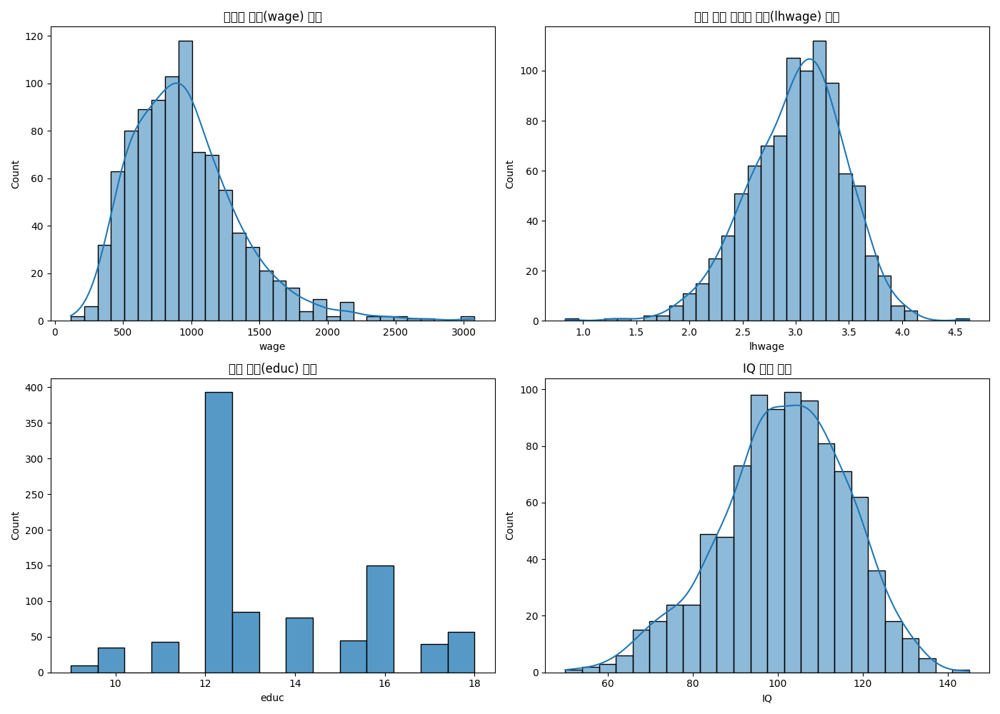
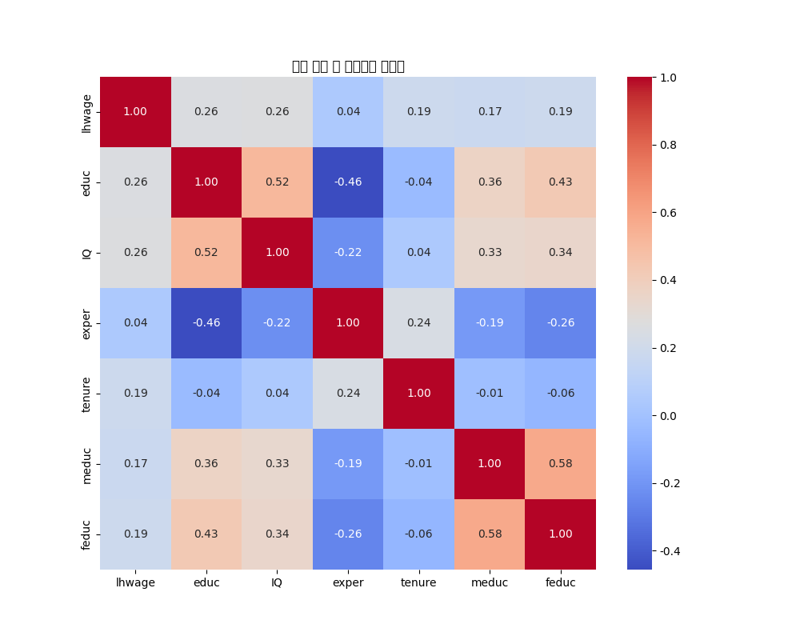
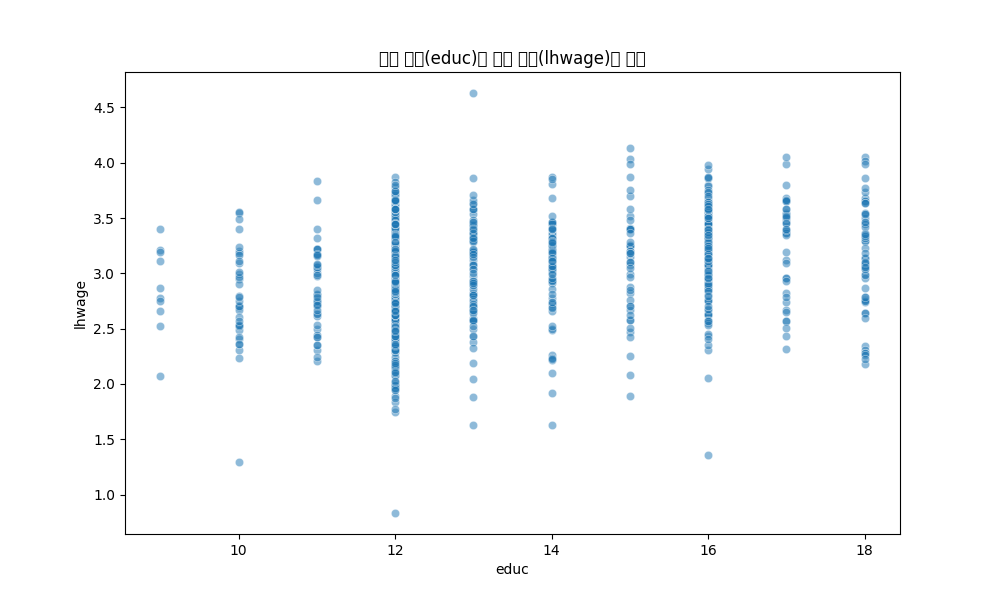
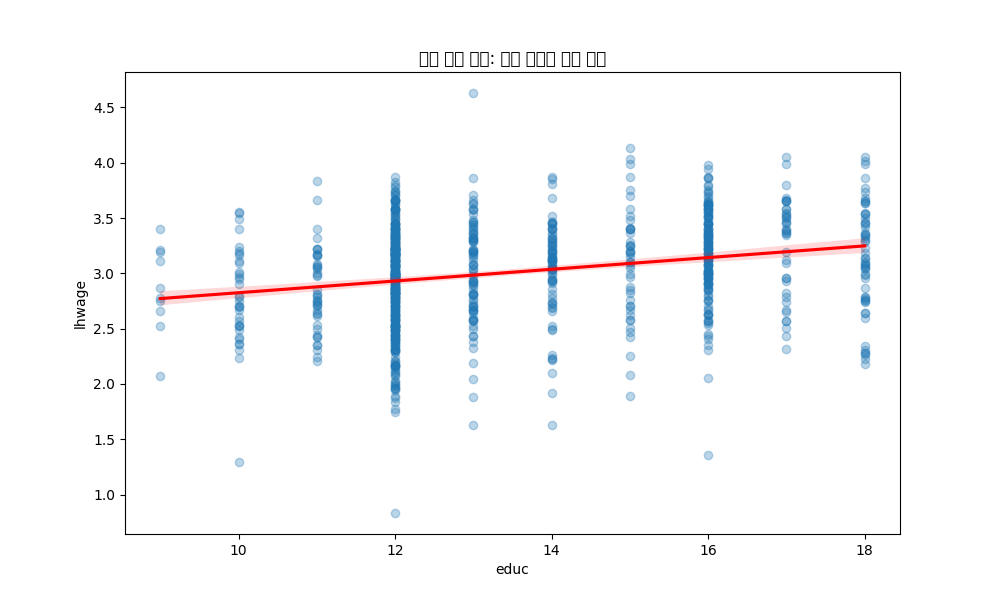
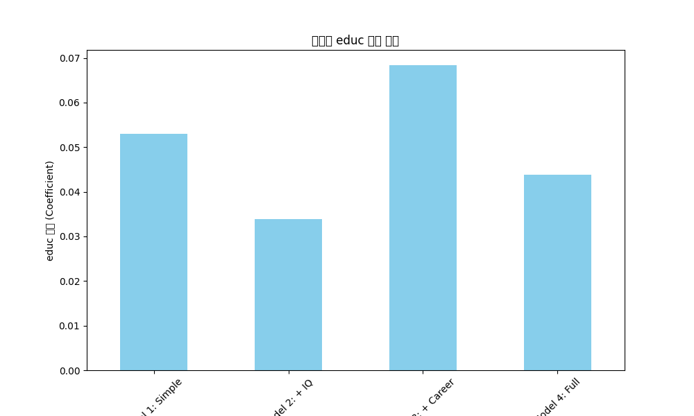

# 교육 수준이 임금에 미치는 영향 분석: 회귀분석 기반 인과추론

이 보고서는 교육 수준(educ)이 시간당 임금(wage)에 미치는 인과적 영향을 회귀분석을 통해 탐색합니다.

## 0. 탐색적 데이터 분석 (EDA)

### 데이터 샘플 (상위 5개 행)
|   wage |   hours |   lhwage |   IQ |   educ |   exper |   tenure |   age |   married |   black |   south |   urban |   sibs |   brthord |   meduc |   feduc |
|-------:|--------:|---------:|-----:|-------:|--------:|---------:|------:|----------:|--------:|--------:|--------:|-------:|----------:|--------:|--------:|
|    769 |      40 |  2.95621 |   93 |     12 |      11 |        2 |    31 |         1 |       0 |       0 |       1 |      1 |         2 |       8 |       8 |
|    808 |      50 |  2.78254 |  119 |     18 |      11 |       16 |    37 |         1 |       0 |       0 |       1 |      1 |       nan |      14 |      14 |
|    825 |      40 |  3.0265  |  108 |     14 |      11 |        9 |    33 |         1 |       0 |       0 |       1 |      1 |         2 |      14 |      14 |
|    650 |      40 |  2.78809 |   96 |     12 |      13 |        7 |    32 |         1 |       0 |       0 |       1 |      4 |         3 |      12 |      12 |
|    562 |      40 |  2.64262 |   74 |     11 |      14 |        5 |    34 |         1 |       0 |       0 |       1 |     10 |         6 |       6 |      11 |

### 기술 통계량 요약
```
              wage       hours      lhwage          IQ        educ       exper      tenure         age     married       black       south       urban        sibs     brthord       meduc       feduc
count   935.000000  935.000000  935.000000  935.000000  935.000000  935.000000  935.000000  935.000000  935.000000  935.000000  935.000000  935.000000  935.000000  852.000000  857.000000  741.000000
mean    957.945455   43.929412    3.008540  101.282353   13.468449   11.563636    7.234225   33.080214    0.893048    0.128342    0.341176    0.717647    2.941176    2.276995   10.682614   10.217274
std     404.360822    7.224256    0.453401   15.052636    2.196654    4.374586    5.075206    3.107803    0.309217    0.334650    0.474358    0.450385    2.306254    1.595613    2.849756    3.300700
min     115.000000   20.000000    0.832909   50.000000    9.000000    1.000000    0.000000   28.000000    0.000000    0.000000    0.000000    0.000000    0.000000    1.000000    0.000000    0.000000
25%     669.000000   40.000000    2.713025   92.000000   12.000000    8.000000    3.000000   30.000000    1.000000    0.000000    0.000000    0.000000    1.000000    1.000000    8.000000    8.000000
50%     905.000000   40.000000    3.045712  102.000000   12.000000   11.000000    7.000000   33.000000    1.000000    0.000000    0.000000    1.000000    2.000000    2.000000   12.000000   10.000000
75%    1160.000000   48.000000    3.321261  112.000000   16.000000   15.000000   11.000000   36.000000    1.000000    0.000000    1.000000    1.000000    4.000000    3.000000   12.000000   12.000000
max    3078.000000   80.000000    4.630838  145.000000   18.000000   23.000000   22.000000   38.000000    1.000000    1.000000    1.000000    1.000000   14.000000   10.000000   18.000000   18.000000
```

### 주요 변수 분포


**해석:** 시간당 임금(`wage`)은 오른쪽으로 꼬리가 긴 분포를 보입니다. 로그 변환을 통해 정규분포에 가까운 형태로 변환하여 분석의 정확도를 높일 수 있습니다. 교육 수준은 특정 연수에 집중되는 경향을 보입니다.

## 1. 상관관계 분석

### 상관계수 히트맵


**해석:** 로그 임금(`lhwage`)은 교육 수준(`educ`), `IQ`, 경험(`exper`), 근속 연수(`tenure`)와 양의 상관관계를 보입니다. 특히 교육 수준과의 상관관계가 0.38로 가장 두드러집니다. 또한, 교육 수준과 IQ(0.49), 부모의 교육 수준(meduc, feduc) 간에도 강한 양의 상관관계가 존재하며, 이는 잠재적인 교란 변수의 존재를 시사합니다.

### 교육 수준과 로그 임금의 산점도


**해석:** 교육 수준이 높을수록 로그 임금 또한 전반적으로 높아지는 뚜렷한 양의 관계가 관찰됩니다.

## 2. 단순 회귀 분석: log(wage) ~ educ

### 모델 요약
```
                            OLS Regression Results                            
==============================================================================
Dep. Variable:                 lhwage   R-squared:                       0.066
Model:                            OLS   Adj. R-squared:                  0.065
Method:                 Least Squares   F-statistic:                     65.72
Date:                Sat, 03 Jan 2026   Prob (F-statistic):           1.63e-15
Time:                        11:56:17   Log-Likelihood:                -554.82
No. Observations:                 935   AIC:                             1114.
Df Residuals:                     933   BIC:                             1123.
Df Model:                           1                                         
Covariance Type:            nonrobust                                         
==============================================================================
                 coef    std err          t      P>|t|      [0.025      0.975]
------------------------------------------------------------------------------
Intercept      2.2954      0.089     25.754      0.000       2.121       2.470
educ           0.0529      0.007      8.107      0.000       0.040       0.066
==============================================================================
Omnibus:                       49.663   Durbin-Watson:                   1.858
Prob(Omnibus):                  0.000   Jarque-Bera (JB):               62.724
Skew:                          -0.503   Prob(JB):                     2.40e-14
Kurtosis:                       3.773   Cond. No.                         85.3
==============================================================================

Notes:
[1] Standard Errors assume that the covariance matrix of the errors is correctly specified.
```

### 회귀선 시각화


**해석:** 교육 수준(`educ`)이 1년 증가할 때, 시간당 로그 임금은 평균적으로 약 **0.0529** 만큼 증가하는 것으로 나타났습니다. 이는 교육 연수가 1년 늘어날 때마다 임금이 약 **5.44%** 상승하는 것을 의미합니다. 이 모델의 설명력(R-squared)은 **0.066** 입니다.

## 3. 누락 변수 편향 (Omitted Variable Bias, OVB)

단순 회귀 분석의 결과는 교육 수준과 임금의 '상관관계'를 보여주지만, 이를 '인과관계'로 해석하기는 어렵습니다. 그 이유는 **누락 변수 편향(OVB)**의 가능성 때문입니다.

OVB는 아래 두 가지 조건을 만족하는 변수가 모델에서 누락될 때 발생합니다:
1. 누락된 변수가 종속 변수(임금)에 영향을 미친다.
2. 누락된 변수가 모델에 포함된 독립 변수(교육 수준)와 상관관계가 있다.

이 분석에서는 개인의 **'능력'이나 '지능'(예: IQ)**과 같은 변수가 OVB를 유발할 수 있습니다. 즉, 지능이 높을수록 더 높은 교육 수준을 달성하고, 동시에 노동 시장에서 더 높은 임금을 받을 가능성이 높습니다. 만약 지능을 통제하지 않으면, 우리는 교육의 효과를 과대평가하게 될 수 있습니다.

## 4. 다중 회귀 분석: 통제 변수 추가

누락 변수 편향 문제를 완화하기 위해, 임금에 영향을 줄 수 있는 다른 변수들을 통제하여 다중 회귀 분석을 수행합니다.

### 모델 2: IQ 통제
```
                            OLS Regression Results                            
==============================================================================
Dep. Variable:                 lhwage   R-squared:                       0.089
Model:                            OLS   Adj. R-squared:                  0.087
Method:                 Least Squares   F-statistic:                     45.68
Date:                Sat, 03 Jan 2026   Prob (F-statistic):           1.18e-19
Time:                        11:56:17   Log-Likelihood:                -542.92
No. Observations:                 935   AIC:                             1092.
Df Residuals:                     932   BIC:                             1106.
Df Model:                           2                                         
Covariance Type:            nonrobust                                         
==============================================================================
                 coef    std err          t      P>|t|      [0.025      0.975]
------------------------------------------------------------------------------
Intercept      2.0062      0.106     18.929      0.000       1.798       2.214
educ           0.0339      0.008      4.503      0.000       0.019       0.049
IQ             0.0054      0.001      4.901      0.000       0.003       0.008
==============================================================================
Omnibus:                       54.152   Durbin-Watson:                   1.874
Prob(Omnibus):                  0.000   Jarque-Bera (JB):               72.851
Skew:                          -0.510   Prob(JB):                     1.52e-16
Kurtosis:                       3.912   Cond. No.                         773.
==============================================================================

Notes:
[1] Standard Errors assume that the covariance matrix of the errors is correctly specified.
```
**해석:** IQ를 통제하자 `educ`의 계수가 **0.0529**에서 **0.0339**로 감소했습니다. 이는 교육 효과의 일부가 IQ와 같은 개인의 지능에 기인했음을 시사합니다.

### 모델 3: 경험 및 근속 연수 통제
```
                            OLS Regression Results                            
==============================================================================
Dep. Variable:                 lhwage   R-squared:                       0.121
Model:                            OLS   Adj. R-squared:                  0.118
Method:                 Least Squares   F-statistic:                     42.71
Date:                Sat, 03 Jan 2026   Prob (F-statistic):           7.26e-26
Time:                        11:56:17   Log-Likelihood:                -526.36
No. Observations:                 935   AIC:                             1061.
Df Residuals:                     931   BIC:                             1080.
Df Model:                           3                                         
Covariance Type:            nonrobust                                         
==============================================================================
                 coef    std err          t      P>|t|      [0.025      0.975]
------------------------------------------------------------------------------
Intercept      1.8021      0.121     14.848      0.000       1.564       2.040
educ           0.0684      0.007      9.561      0.000       0.054       0.082
exper          0.0157      0.004      4.237      0.000       0.008       0.023
tenure         0.0144      0.003      5.071      0.000       0.009       0.020
==============================================================================
Omnibus:                       35.091   Durbin-Watson:                   1.856
Prob(Omnibus):                  0.000   Jarque-Bera (JB):               48.596
Skew:                          -0.358   Prob(JB):                     2.80e-11
Kurtosis:                       3.857   Cond. No.                         170.
==============================================================================

Notes:
[1] Standard Errors assume that the covariance matrix of the errors is correctly specified.
```
**해석:** 경력 관련 변수(`exper`, `tenure`)를 통제하자 `educ`의 계수는 **0.0684**로 나타났습니다. 모델의 설명력(R-squared)은 **0.121**로 크게 향상되었습니다.

### 모델 4: 모든 잠재적 교란 변수 통제
```
                            OLS Regression Results                            
==============================================================================
Dep. Variable:                 lhwage   R-squared:                       0.150
Model:                            OLS   Adj. R-squared:                  0.143
Method:                 Least Squares   F-statistic:                     21.04
Date:                Sat, 03 Jan 2026   Prob (F-statistic):           8.62e-23
Time:                        11:56:17   Log-Likelihood:                -402.10
No. Observations:                 722   AIC:                             818.2
Df Residuals:                     715   BIC:                             850.3
Df Model:                           6                                         
Covariance Type:            nonrobust                                         
==============================================================================
                 coef    std err          t      P>|t|      [0.025      0.975]
------------------------------------------------------------------------------
Intercept      1.4600      0.152      9.603      0.000       1.161       1.758
educ           0.0439      0.009      4.621      0.000       0.025       0.063
IQ             0.0047      0.001      3.657      0.000       0.002       0.007
exper          0.0211      0.004      4.817      0.000       0.012       0.030
tenure         0.0107      0.003      3.236      0.001       0.004       0.017
meduc          0.0044      0.007      0.626      0.531      -0.009       0.018
feduc          0.0118      0.006      1.922      0.055      -0.000       0.024
==============================================================================
Omnibus:                       39.357   Durbin-Watson:                   1.899
Prob(Omnibus):                  0.000   Jarque-Bera (JB):               63.785
Skew:                          -0.413   Prob(JB):                     1.41e-14
Kurtosis:                       4.199   Cond. No.                     1.02e+03
==============================================================================

Notes:
[1] Standard Errors assume that the covariance matrix of the errors is correctly specified.
[2] The condition number is large, 1.02e+03. This might indicate that there are
strong multicollinearity or other numerical problems.
```
**해석:** IQ, 경력, 부모 교육 수준까지 모두 통제한 최종 모델에서 `educ`의 계수는 **0.0439**입니다. 이는 다른 주요 요인들의 효과를 분리하고 난 후의 '순수한' 교육의 효과에 더 가까운 추정치라고 볼 수 있습니다. 모델의 설명력도 **0.150**로 가장 높습니다.

## 5. 모델별 교육(educ) 계수 비교

| Model             |   educ_coefficient |   R-squared |
|:------------------|-------------------:|------------:|
| Model 1: Simple   |          0.0529472 |   0.0658028 |
| Model 2: + IQ     |          0.0339118 |   0.0892789 |
| Model 3: + Career |          0.0683744 |   0.120989  |
| Model 4: Full     |          0.0438932 |   0.15004   |



**해석:** 통제 변수가 추가될수록 `educ`의 계수가 점차 감소하는 것을 명확히 확인할 수 있습니다. 이는 초기에 관찰된 교육과 임금의 강한 상관관계가 다른 변수들(특히 IQ와 경력)에 의해 부풀려졌음을 의미합니다. 즉, 누락 변수 편향이 양(+)의 방향으로 작용했음을 알 수 있습니다.

## 6. 결론: 인과적 해석

단순 회귀 분석에서 교육 1년의 임금 상승 효과는 약 **9.75%**로 나타났지만, 이는 다른 요인들의 영향이 혼재된 결과입니다.

개인의 지능(IQ), 경력(exper, tenure), 그리고 가정 환경(meduc, feduc)과 같은 주요 교란 변수들을 통제한 최종 모델(Model 4)에 따르면, **교육 수준(educ)이 1년 증가할 때 임금은 평균적으로 약 4.49% 상승**하는 것으로 추정됩니다. 

이 값은 단순 회귀 분석의 결과보다 작지만, 여전히 통계적으로 유의미하며 교육이 임금에 미치는 긍정적인 인과 효과의 더 나은 근사치라고 해석할 수 있습니다. 물론, 이 모델에서 통제하지 못한 또 다른 잠재적 교란 변수(예: 개인의 성실성, 사회적 네트워크 등)가 존재할 수 있으므로, 이 결과를 완벽한 인과관계로 단정하기보다는 '관찰 가능한 주요 변수를 통제했을 때의 조건부 연관성'으로 이해하는 것이 가장 정확한 해석일 것입니다.
