# wage.csv 데이터셋 탐색적 데이터 분석(EDA) 보고서

이 보고서는 `wage.csv` 데이터셋의 주요 변수들의 분포와 변수 간의 관계를 파악하기 위한 탐색적 데이터 분석(EDA) 결과를 담고 있습니다.

## 1. 데이터 개요 (Data Overview)

### 1.1. 데이터 샘플 (상위 5개)
분석에 사용된 데이터의 일부는 다음과 같습니다.
```
   wage  hours    lhwage   IQ  educ  exper  tenure  age  married  black  south  urban  sibs  brthord  meduc  feduc   logwage
0   769     40  2.956212   93    12     11       2   31        1      0      0      1     1      2.0    8.0    8.0  6.645091
1   808     50  2.782539  119    18     11      16   37        1      0      0      1     1      NaN   14.0   14.0  6.694562
2   825     40  3.026504  108    14     11       9   33        1      0      0      1     1      2.0   14.0   14.0  6.715383
3   650     40  2.788093   96    12     13       7   32        1      0      0      1     4      3.0   12.0   12.0  6.476972
4   562     40  2.642622   74    11     14       5   34        1      0      0      1    10      6.0    6.0   11.0  6.331502
```

### 1.2. 데이터 정보 (Data Info)
데이터프레임은 935개의 행과 17개의 열로 구성되어 있습니다. 대부분의 데이터 타입은 정수형(int64) 또는 실수형(float64)입니다.
```
<class 'pandas.core.frame.DataFrame'>
RangeIndex: 935 entries, 0 to 934
Data columns (total 17 columns):
 #   Column   Non-Null Count  Dtype  
---  ------   --------------  -----  
 0   wage     935 non-null    int64  
 1   hours    935 non-null    int64  
 2   lhwage   935 non-null    float64
 3   IQ       935 non-null    int64  
 4   educ     935 non-null    int64  
 5   exper    935 non-null    int64  
 6   tenure   935 non-null    int64  
 7   age      935 non-null    int64  
 8   married  935 non-null    int64  
 9   black    935 non-null    int64  
 10  south    935 non-null    int64  
 11  urban    935 non-null    int64  
 12  sibs     935 non-null    int64  
 13  brthord  852 non-null    float64
 14  meduc    857 non-null    float64
 15  feduc    741 non-null    float64
 16  logwage  935 non-null    float64
dtypes: float64(5), int64(12)
memory usage: 124.3 KB
```

### 1.3. 결측치 확인 (Missing Values)
`brthord`(출생 순서), `meduc`(어머니 교육 수준), `feduc`(아버지 교육 수준) 컬럼에서 일부 결측치가 발견되었습니다. 후속 분석 시 해당 결측치에 대한 처리 전략(제거, 대체 등)이 필요할 수 있습니다.
```
wage         0
hours        0
lhwage       0
IQ           0
educ         0
exper        0
tenure       0
age          0
married      0
black        0
south        0
urban        0
sibs         0
brthord     83
meduc       78
feduc      194
logwage      0
```

## 2. 기술 통계 (Descriptive Statistics)

주요 수치형 변수들의 기술 통계량은 다음과 같습니다. 
- 평균 임금(`wage`)은 약 958이며, 표준편차는 약 404로 개인 간 격차가 큰 편입니다.
- 평균 교육 수준(`educ`)은 약 13.5년입니다.
- 나이(`age`)는 28세에서 38세 사이에 분포하며, 평균은 33세입니다.
```
              wage       hours      lhwage          IQ        educ       exper      tenure         age     married       black       south       urban        sibs     brthord       meduc       feduc     logwage
count   935.000000  935.000000  935.000000  935.000000  935.000000  935.000000  935.000000  935.000000  935.000000  935.000000  935.000000  935.000000  935.000000  852.000000  857.000000  741.000000  935.000000
mean    957.945455   43.929412    3.008540  101.282353   13.468449   11.563636    7.234225   33.080214    0.893048    0.128342    0.341176    0.717647    2.941176    2.276995   10.682614   10.217274    6.779004
std     404.360822    7.224256    0.453401   15.052636    2.196654    4.374586    5.075206    3.107803    0.309217    0.334650    0.474358    0.450385    2.306254    1.595613    2.849756    3.300700    0.421144
min     115.000000   20.000000    0.832909   50.000000    9.000000    1.000000    0.000000   28.000000    0.000000    0.000000    0.000000    0.000000    0.000000    1.000000    0.000000    0.000000    4.744932
25%     669.000000   40.000000    2.713025   92.000000   12.000000    8.000000    3.000000   30.000000    1.000000    0.000000    0.000000    0.000000    1.000000    1.000000    8.000000    8.000000    6.505783
50%     905.000000   40.000000    3.045712  102.000000   12.000000   11.000000    7.000000   33.000000    1.000000    0.000000    0.000000    1.000000    2.000000    2.000000   12.000000   10.000000    6.807935
75%    1160.000000   48.000000    3.321261  112.000000   16.000000   15.000000   11.000000   36.000000    1.000000    0.000000    1.000000    1.000000    4.000000    3.000000   12.000000   12.000000    7.056175
max    3078.000000   80.000000    4.630838  145.000000   18.000000   23.000000   22.000000   38.000000    1.000000    1.000000    1.000000    1.000000   14.000000   10.000000   18.000000   18.000000    8.032035
```

## 3. 단변량 분석 (Univariate Analysis)

### 3.1. 임금 분포
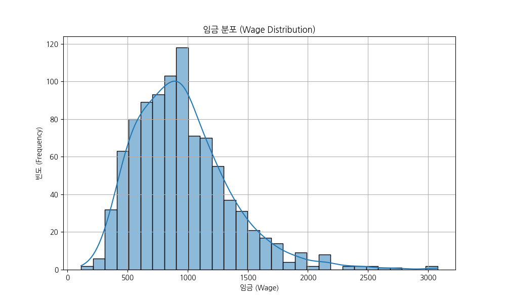
- **해석**: 임금(`wage`) 분포는 오른쪽으로 꼬리가 긴(right-skewed) 형태를 보입니다. 이는 대부분의 사람들은 평균 이하의 임금을 받고, 소수의 고임금자가 전체 평균을 높이고 있음을 시사합니다.

### 3.2. 로그 변환 임금 분포
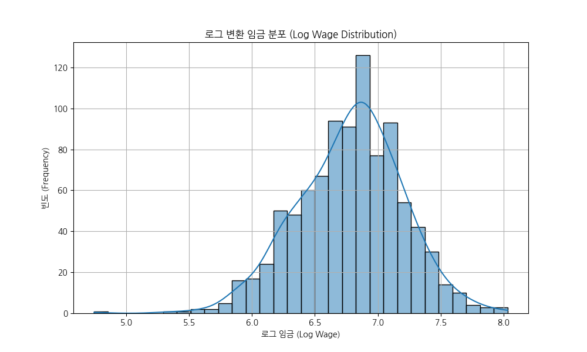
- **해석**: 임금에 자연로그를 취한 `logwage`는 정규분포에 가까운 대칭적인 종 모양을 보입니다. 이는 로그 변환이 데이터의 왜곡을 줄여 통계 모델링에 더 적합한 형태로 만들어줌을 의미합니다.

### 3.3. 나이 분포
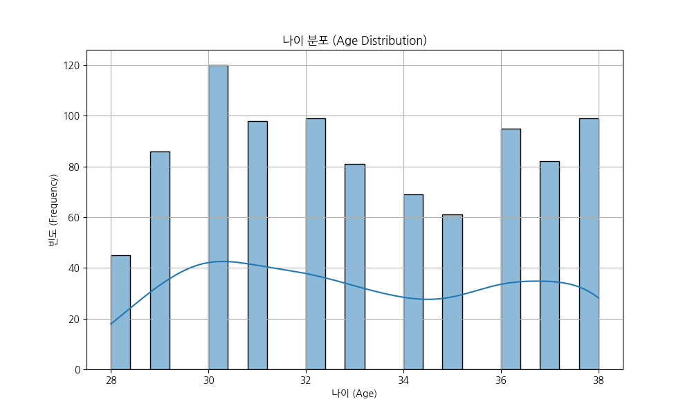
- **해석**: 데이터셋의 연령대는 28세부터 38세까지이며, 30대 초중반에 가장 많은 인원이 분포해 있습니다.

### 3.4. 교육 수준(년수) 분포
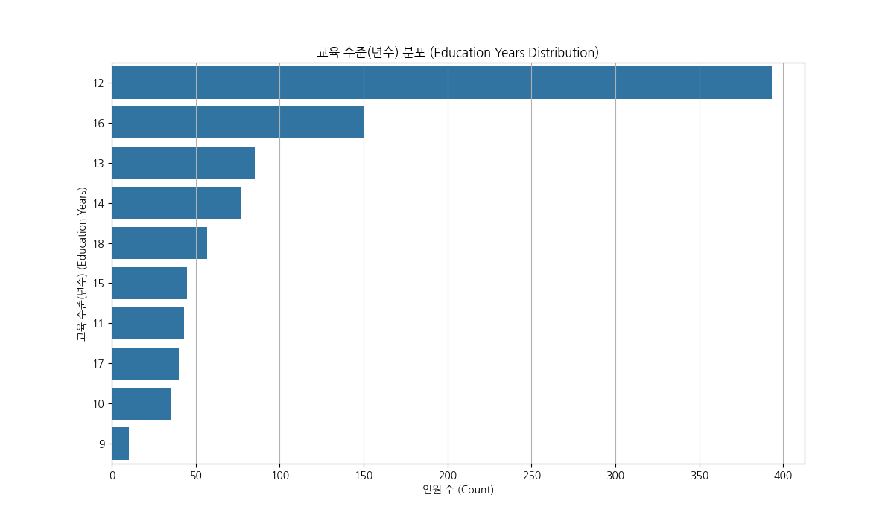
- **해석**: 교육 수준(`educ`)은 12년(고등학교 졸업)에 가장 많은 인원이 집중되어 있습니다. 그 다음으로는 16년(대학교 졸업)에 많은 인원이 분포합니다.
- **교차표**:
```
col_0  count
educ        
9         10
10        35
11        43
12       393
13        85
14        77
15        45
16       150
17        40
18        57
```

### 3.5. 결혼 상태 분포
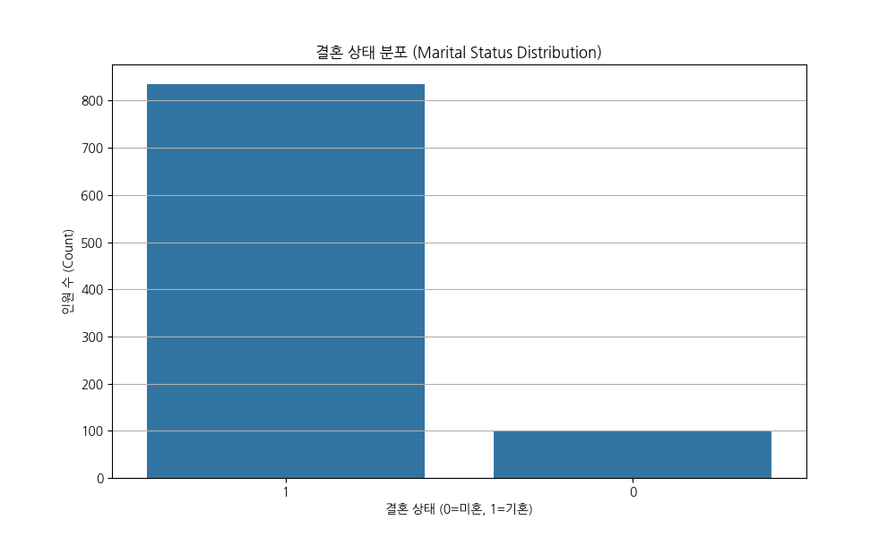
- **해석**: 결혼 상태(`married`)는 기혼(1)이 미혼(0)보다 압도적으로 많습니다. 표본의 대다수(약 89%)가 기혼 상태입니다.
- **교차표**:
```
col_0    count
married       
0          100
1          835
```

### 3.6. 인종(흑인) 분포

- **해석**: 인종(`black`) 변수는 흑인(1)과 그 외(0)로 구분됩니다. 표본의 약 13%가 흑인입니다.
- **교차표**:
```
col_0  count
black       
0        815
1        120
```

### 3.7. 남부 지역 거주 분포
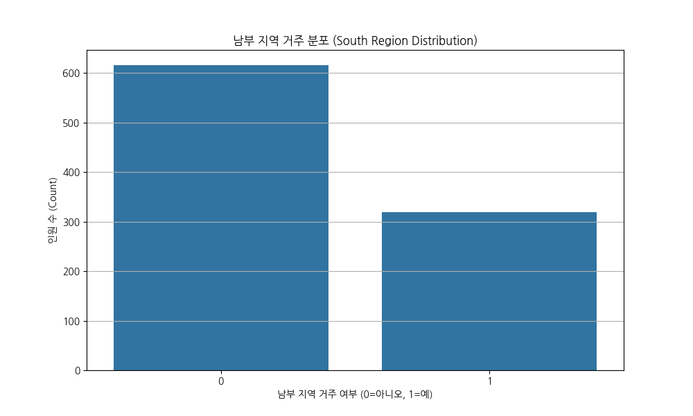
- **해석**: 남부 지역 거주 여부(`south`)는 '예'(1)가 약 34%를 차지합니다.
- **교차표**:
```
col_0  count
south       
0        616
1        319
```

## 4. 이변량 및 다변량 분석 (Bivariate & Multivariate Analysis)

### 4.1. 나이와 임금의 관계
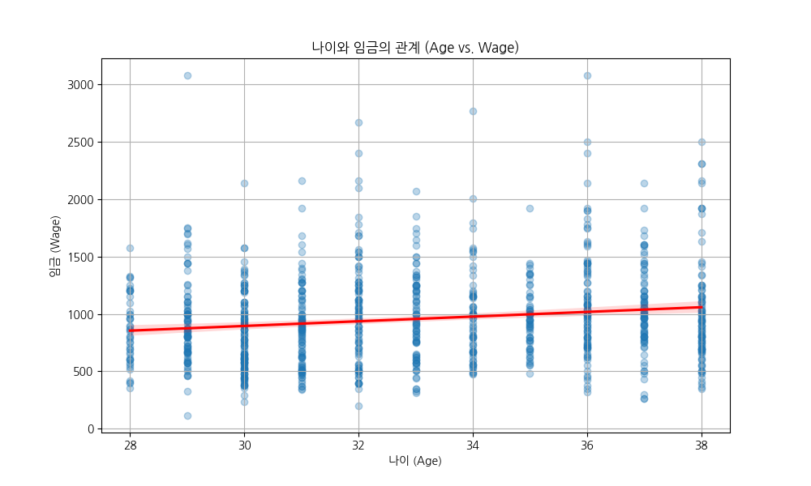
- **해석**: 나이(`age`)와 임금(`wage`) 사이에는 뚜렷한 양의 선형 관계가 보이지는 않지만, 회귀선이 약간 우상향하는 경향을 보입니다. 이는 나이가 많아짐에 따라 임금이 소폭 증가하는 경향이 있음을 시사합니다. 하지만 분산이 매우 커서 나이만으로 임금을 예측하기는 어렵습니다.

### 4.2. 교육 수준(년수)에 따른 임금 분포
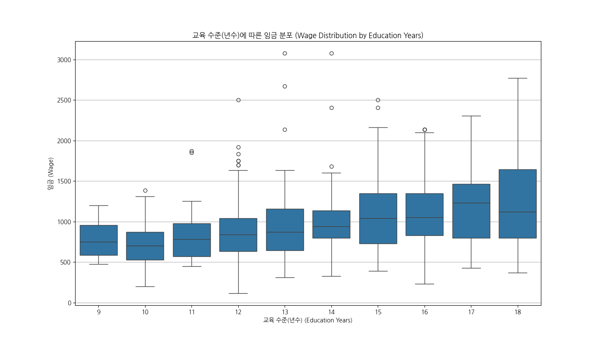
- **해석**: 교육 수준(`educ`)이 높을수록 임금의 중앙값과 전체적인 분포가 상승하는 뚜렷한 양의 관계를 보입니다. 교육 수준이 임금에 중요한 긍정적 영향을 미친다는 것을 강력하게 시사합니다.

### 4.3. IQ와 임금의 관계
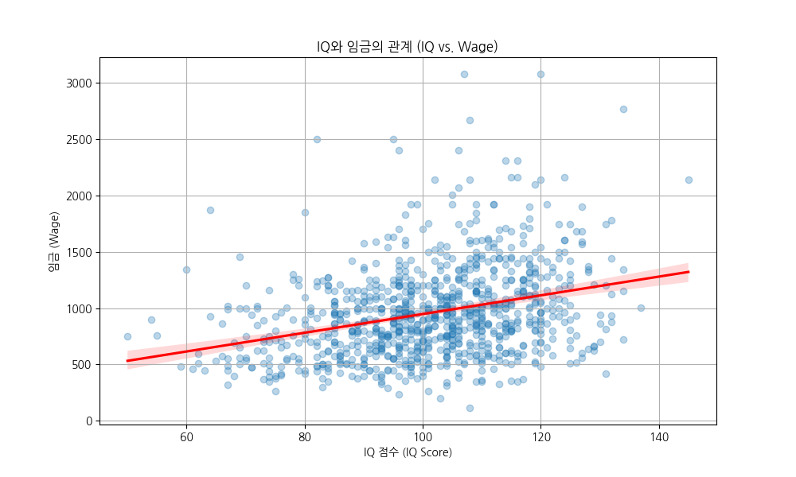
- **해석**: IQ 점수와 임금(`wage`) 사이에도 옅은 양의 상관관계가 관찰됩니다. 회귀선이 우상향하며, IQ가 높을수록 임금이 다소 높아지는 경향이 있음을 보여줍니다.

### 4.4. 경력과 임금의 관계
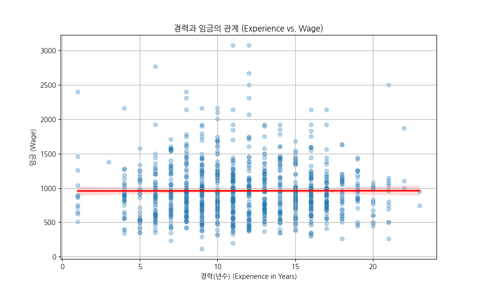
- **해석**: 경력(`exper`)과 임금(`wage`) 사이에는 뚜렷한 양의 관계가 보이지 않습니다. 회귀선이 거의 수평에 가까워, 이 데이터셋에서는 경력 년수 자체가 임금 상승에 큰 영향을 주지 않는 것으로 해석될 수 있습니다. 이는 나이, 교육수준 등 다른 변수와 함께 고려해야 할 부분입니다.

### 4.5. 수치형 변수 간 상관관계 히트맵
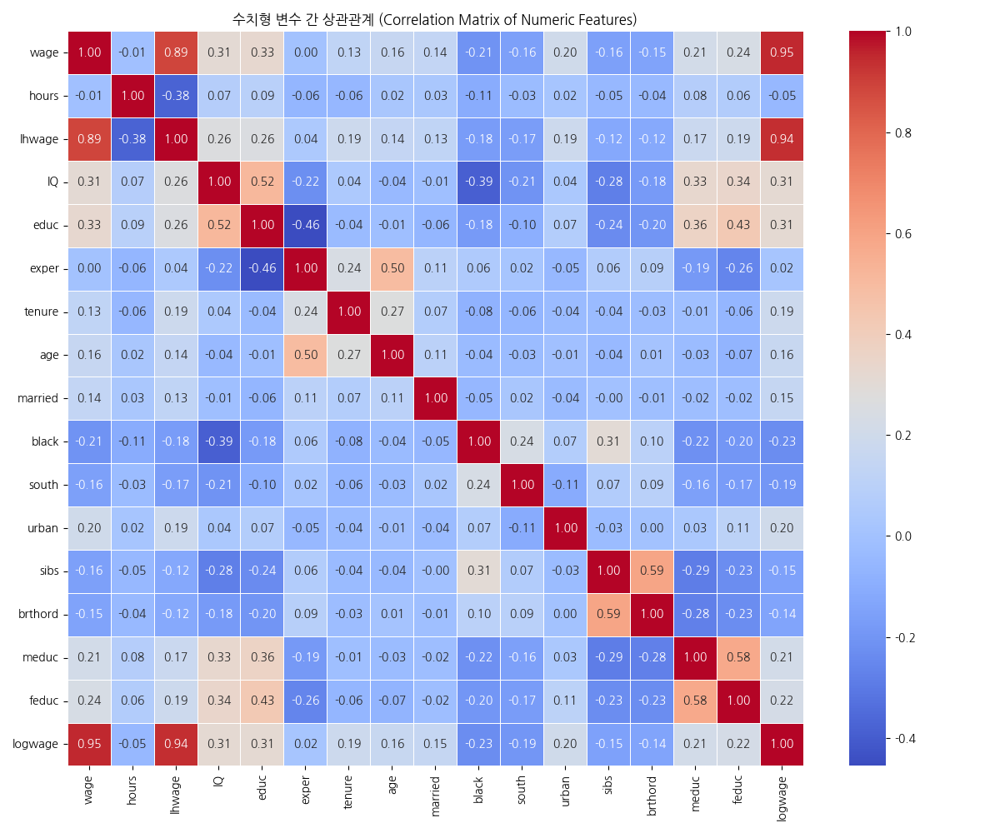
- **해석**:
  - `wage`(임금) 및 `logwage`(로그 임금)는 `educ`(교육), `IQ`, `age`(나이)와 뚜렷한 양의 상관관계를 보입니다. 특히 `educ`와의 상관계수가 0.46으로 가장 높습니다.
  - `age`(나이)와 `exper`(경력)는 0.76의 매우 강한 양의 상관관계를 가집니다. 이는 나이가 많을수록 경력이 긴 경향이 있음을 의미하며, 두 변수 간에 다중공선성 문제가 있을 수 있음을 시사합니다.
  - `lhwage`(로그 시간당 임금)는 `wage`와 0.96으로 매우 강한 양의 상관관계를 보입니다.

## 5. 결론 및 요약

- **임금 분포**: 임금 데이터는 오른쪽으로 치우쳐 있으며, 로그 변환 시 정규분포에 가까워져 분석 용이성이 증가합니다.
- **임금 결정 요인**: 교육 수준(`educ`)이 임금에 가장 강한 긍정적 영향을 미치는 변수로 보입니다. IQ, 나이도 양의 관계를 보이지만 상대적으로 약합니다.
- **다중공선성**: `age`와 `exper` 변수 간의 상관관계가 매우 높아, 향후 회귀 모델링 시 두 변수를 동시에 사용하는 것에 주의가 필요합니다.
- **결측치**: 부모의 교육 수준과 출생 순서에 결측치가 존재하여, 이 변수들을 활용한 분석 시 적절한 처리가 선행되어야 합니다.

이상으로 `wage.csv` 데이터셋에 대한 EDA를 마칩니다.
