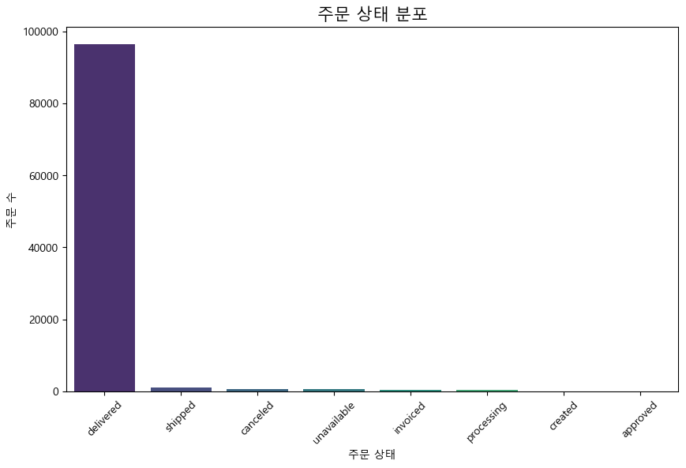
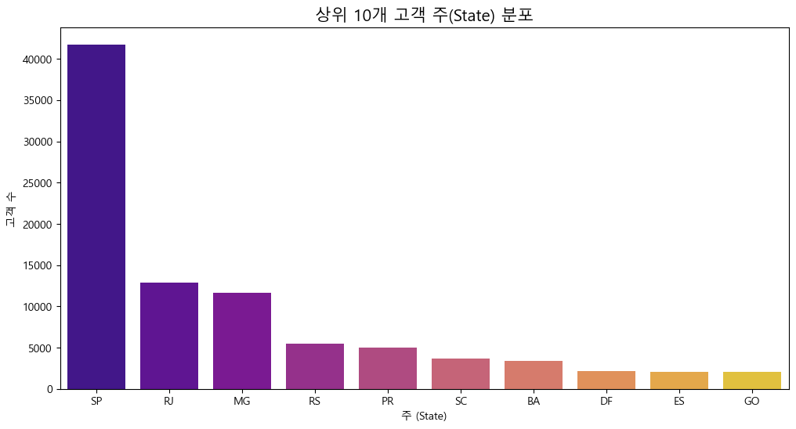
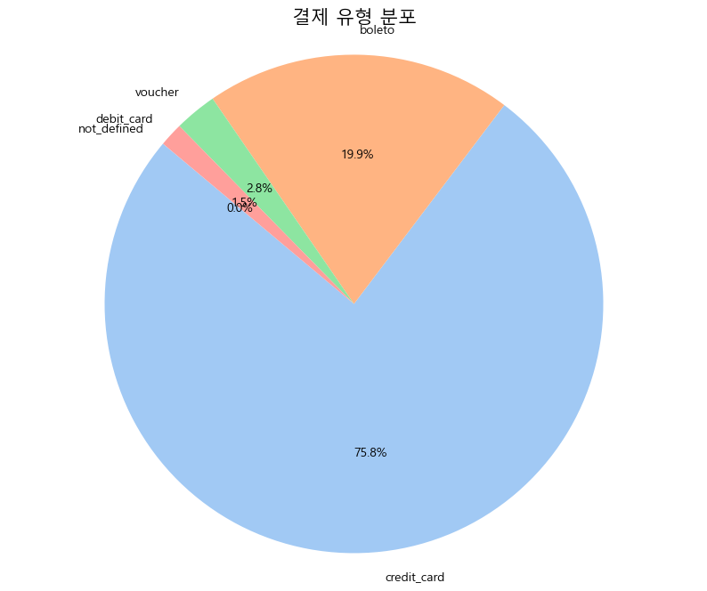
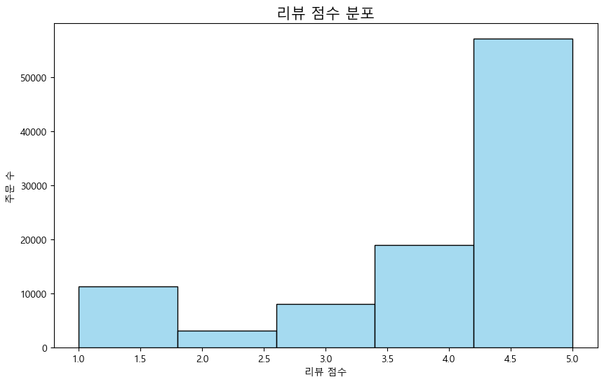
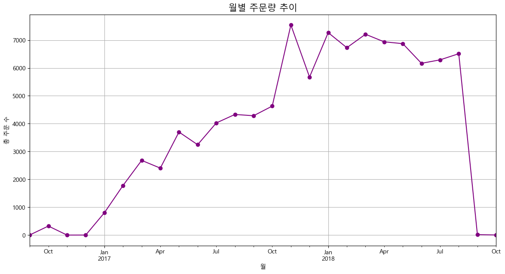
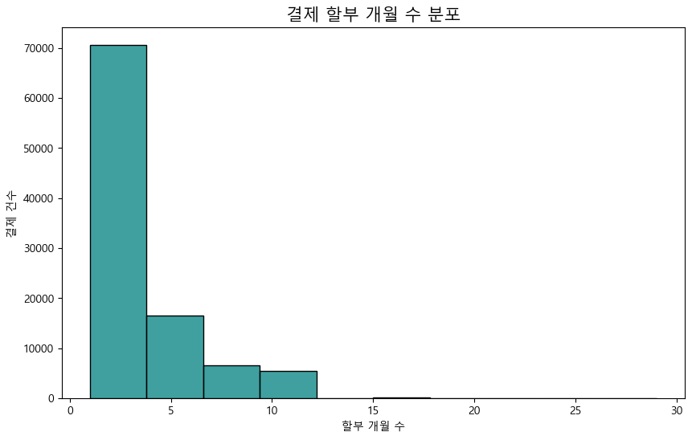
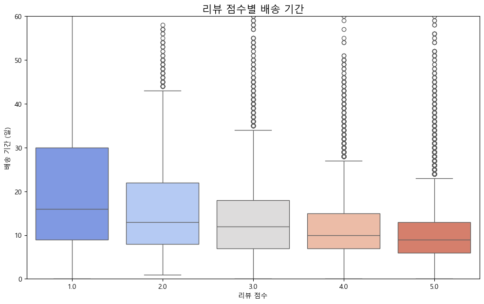
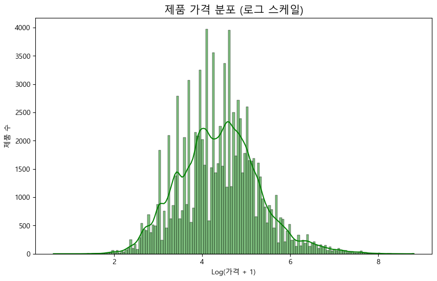
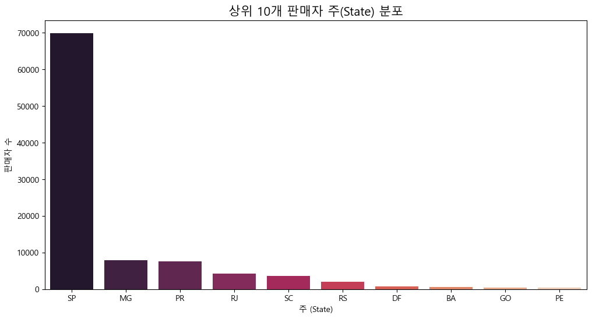

# Olist 데이터셋 KPI Tree 분석을 위한 EDA 보고서

이 보고서는 Olist 데이터셋의 주요 특징을 파악하고 KPI Tree 설계를 위한 인사이트를 얻기 위해 작성되었습니다.

## 1. 데이터 기본 정보

### 데이터 샘플 (상위 5개)
| order_id                         | customer_id                      | order_status   | order_purchase_timestamp   | order_approved_at   | order_delivered_carrier_date   | order_delivered_customer_date   | order_estimated_delivery_date   | customer_unique_id               |   customer_zip_code_prefix | customer_city           | customer_state   |   order_item_id | product_id                       | seller_id                        | shipping_limit_date   |   main_product_price |   main_product_freight_value |   item_count |   total_price |   total_freight_value |   payment_sequential_count |   payment_installments_sum |   payment_value_sum | payment_type   | review_id                        |   review_score | review_comment_title   | review_comment_message                                                                                                                                                     | review_creation_date   | review_answer_timestamp   | product_category_name   |   product_name_lenght |   product_description_lenght |   product_photos_qty |   product_weight_g |   product_length_cm |   product_height_cm |   product_width_cm |   seller_zip_code_prefix | seller_city     | seller_state   | product_category_name_english   |
|:---------------------------------|:---------------------------------|:---------------|:---------------------------|:--------------------|:-------------------------------|:--------------------------------|:--------------------------------|:---------------------------------|---------------------------:|:------------------------|:-----------------|----------------:|:---------------------------------|:---------------------------------|:----------------------|---------------------:|-----------------------------:|-------------:|--------------:|----------------------:|---------------------------:|---------------------------:|--------------------:|:---------------|:---------------------------------|---------------:|:-----------------------|:---------------------------------------------------------------------------------------------------------------------------------------------------------------------------|:-----------------------|:--------------------------|:------------------------|----------------------:|-----------------------------:|---------------------:|-------------------:|--------------------:|--------------------:|-------------------:|-------------------------:|:----------------|:---------------|:--------------------------------|
| e481f51cbdc54678b7cc49136f2d6af7 | 9ef432eb6251297304e76186b10a928d | delivered      | 2017-10-02 10:56:33        | 2017-10-02 11:07:15 | 2017-10-04 19:55:00            | 2017-10-10 21:25:13             | 2017-10-18 00:00:00             | 7c396fd4830fd04220f754e42b4e5bff |                       3149 | sao paulo               | SP               |               1 | 87285b34884572647811a353c7ac498a | 3504c0cb71d7fa48d967e0e4c94d59d9 | 2017-10-06 11:07:15   |                29.99 |                         8.72 |            1 |         29.99 |                  8.72 |                          3 |                          3 |               38.71 | credit_card    | a54f0611adc9ed256b57ede6b6eb5114 |              4 | nan                    | Não testei o produto ainda, mas ele veio correto e em boas condições. Apenas a caixa que veio bem amassada e danificada, o que ficará chato, pois se trata de um presente. | 2017-10-11 00:00:00    | 2017-10-12 03:43:48       | utilidades_domesticas   |                    40 |                          268 |                    4 |                500 |                  19 |                   8 |                 13 |                     9350 | maua            | SP             | housewares                      |
| 53cdb2fc8bc7dce0b6741e2150273451 | b0830fb4747a6c6d20dea0b8c802d7ef | delivered      | 2018-07-24 20:41:37        | 2018-07-26 03:24:27 | 2018-07-26 14:31:00            | 2018-08-07 15:27:45             | 2018-08-13 00:00:00             | af07308b275d755c9edb36a90c618231 |                      47813 | barreiras               | BA               |               1 | 595fac2a385ac33a80bd5114aec74eb8 | 289cdb325fb7e7f891c38608bf9e0962 | 2018-07-30 03:24:27   |               118.7  |                        22.76 |            1 |        118.7  |                 22.76 |                          1 |                          1 |              141.46 | boleto         | 8d5266042046a06655c8db133d120ba5 |              4 | Muito boa a loja       | Muito bom o produto.                                                                                                                                                       | 2018-08-08 00:00:00    | 2018-08-08 18:37:50       | perfumaria              |                    29 |                          178 |                    1 |                400 |                  19 |                  13 |                 19 |                    31570 | belo horizonte  | SP             | perfumery                       |
| 47770eb9100c2d0c44946d9cf07ec65d | 41ce2a54c0b03bf3443c3d931a367089 | delivered      | 2018-08-08 08:38:49        | 2018-08-08 08:55:23 | 2018-08-08 13:50:00            | 2018-08-17 18:06:29             | 2018-09-04 00:00:00             | 3a653a41f6f9fc3d2a113cf8398680e8 |                      75265 | vianopolis              | GO               |               1 | aa4383b373c6aca5d8797843e5594415 | 4869f7a5dfa277a7dca6462dcf3b52b2 | 2018-08-13 08:55:23   |               159.9  |                        19.22 |            1 |        159.9  |                 19.22 |                          1 |                          3 |              179.12 | credit_card    | e73b67b67587f7644d5bd1a52deb1b01 |              5 | nan                    | nan                                                                                                                                                                        | 2018-08-18 00:00:00    | 2018-08-22 19:07:58       | automotivo              |                    46 |                          232 |                    1 |                420 |                  24 |                  19 |                 21 |                    14840 | guariba         | SP             | auto                            |
| 949d5b44dbf5de918fe9c16f97b45f8a | f88197465ea7920adcdbec7375364d82 | delivered      | 2017-11-18 19:28:06        | 2017-11-18 19:45:59 | 2017-11-22 13:39:59            | 2017-12-02 00:28:42             | 2017-12-15 00:00:00             | 7c142cf63193a1473d2e66489a9ae977 |                      59296 | sao goncalo do amarante | RN               |               1 | d0b61bfb1de832b15ba9d266ca96e5b0 | 66922902710d126a0e7d26b0e3805106 | 2017-11-23 19:45:59   |                45    |                        27.2  |            1 |         45    |                 27.2  |                          1 |                          1 |               72.2  | credit_card    | 359d03e676b3c069f62cadba8dd3f6e8 |              5 | nan                    | O produto foi exatamente o que eu esperava e estava descrito no site e chegou bem antes da data prevista.                                                                  | 2017-12-03 00:00:00    | 2017-12-05 19:21:58       | pet_shop                |                    59 |                          468 |                    3 |                450 |                  30 |                  10 |                 20 |                    31842 | belo horizonte  | MG             | pet_shop                        |
| ad21c59c0840e6cb83a9ceb5573f8159 | 8ab97904e6daea8866dbdbc4fb7aad2c | delivered      | 2018-02-13 21:18:39        | 2018-02-13 22:20:29 | 2018-02-14 19:46:34            | 2018-02-16 18:17:02             | 2018-02-26 00:00:00             | 72632f0f9dd73dfee390c9b22eb56dd6 |                       9195 | santo andre             | SP               |               1 | 65266b2da20d04dbe00c5c2d3bb7859e | 2c9e548be18521d1c43cde1c582c6de8 | 2018-02-19 20:31:37   |                19.9  |                         8.72 |            1 |         19.9  |                  8.72 |                          1 |                          1 |               28.62 | credit_card    | e50934924e227544ba8246aeb3770dd4 |              5 | nan                    | nan                                                                                                                                                                        | 2018-02-17 00:00:00    | 2018-02-18 13:02:51       | papelaria               |                    38 |                          316 |                    4 |                250 |                  51 |                  15 |                 15 |                     8752 | mogi das cruzes | SP             | stationery                      |

### 기술 통계
```
                                order_id                       customer_id order_status order_purchase_timestamp    order_approved_at order_delivered_carrier_date order_delivered_customer_date order_estimated_delivery_date                customer_unique_id  customer_zip_code_prefix customer_city customer_state  order_item_id                        product_id                         seller_id  shipping_limit_date  main_product_price  main_product_freight_value    item_count   total_price  total_freight_value  payment_sequential_count  payment_installments_sum  payment_value_sum payment_type                         review_id  review_score review_comment_title review_comment_message review_creation_date review_answer_timestamp product_category_name  product_name_lenght  product_description_lenght  product_photos_qty  product_weight_g  product_length_cm  product_height_cm  product_width_cm  seller_zip_code_prefix seller_city seller_state product_category_name_english
count                              99441                             99441        99441                    99441                99281                        97658                         96476                         99441                             99441              99441.000000         99441          99441   98666.000000                             98666                             98666                98666        98666.000000                98666.000000  98666.000000  98666.000000         98666.000000              99440.000000              99440.000000       99440.000000        99440                             98673  98673.000000                11551                  40767                98673                   98673                 97251         97251.000000                97251.000000        97251.000000      98650.000000       98650.000000       98650.000000      98650.000000            98666.000000       98666        98666                         97229
unique                             99441                             99441            8                    98875                90733                        81018                         95664                           459                             96096                       NaN          4119             27            NaN                             31864                              3086                92999                 NaN                         NaN           NaN           NaN                  NaN                       NaN                       NaN                NaN            5                             98127           NaN                 4523                  36062                  636                   97965                    73                  NaN                         NaN                 NaN               NaN                NaN                NaN               NaN                     NaN         611           23                            71
top     e481f51cbdc54678b7cc49136f2d6af7  9ef432eb6251297304e76186b10a928d    delivered      2018-08-02 12:05:26  2018-02-27 04:31:10          2018-05-09 15:48:00           2018-05-08 19:36:48           2017-12-20 00:00:00  8d50f5eadf50201ccdcedfb9e2ac8455                       NaN     sao paulo             SP            NaN  99a4788cb24856965c36a24e339b6058  6560211a19b47992c3666cc44a7e94c0  2018-06-11 03:31:04                 NaN                         NaN           NaN           NaN                  NaN                       NaN                       NaN                NaN  credit_card  3415c9f764e478409e8e0660ae816dd2           NaN            Recomendo              Muito bom  2017-12-19 00:00:00     2017-06-15 23:21:05       cama_mesa_banho                  NaN                         NaN                 NaN               NaN                NaN                NaN               NaN                     NaN   sao paulo           SP                bed_bath_table
freq                                   1                                 1        96478                        3                    9                           47                             3                           522                                17                       NaN         15540          41746            NaN                               433                              1836                    6                 NaN                         NaN           NaN           NaN                  NaN                       NaN                       NaN                NaN        75387                                 3           NaN                  423                    229                  459                       4                  9328                  NaN                         NaN                 NaN               NaN                NaN                NaN               NaN                     NaN       24365        69939                          9328
mean                                 NaN                               NaN          NaN                      NaN                  NaN                          NaN                           NaN                           NaN                               NaN              35137.474583           NaN            NaN       1.014787                               NaN                               NaN                  NaN          126.631705                   20.230624      1.141731    137.754076            22.823562                  1.045515                  2.980923         160.990267          NaN                               NaN      4.088879                  NaN                    NaN                  NaN                     NaN                   NaN            48.851374                  795.076842            2.250969       2115.515297          30.139351          16.515063         23.052924            24632.364766         NaN          NaN                           NaN
std                                  NaN                               NaN          NaN                      NaN                  NaN                          NaN                           NaN                           NaN                               NaN              29797.938996           NaN            NaN       0.155490                               NaN                               NaN                  NaN          191.688201                   15.901888      0.538452    210.645145            21.650909                  0.382177                  2.741810         221.951257          NaN                               NaN      1.345905                  NaN                    NaN                  NaN                     NaN                   NaN             9.993639                  655.136144            1.746564       3778.520131          16.145119          13.351386         11.759004            27700.831009         NaN          NaN                           NaN
min                                  NaN                               NaN          NaN                      NaN                  NaN                          NaN                           NaN                           NaN                               NaN               1003.000000           NaN            NaN       1.000000                               NaN                               NaN                  NaN            0.850000                    0.000000      1.000000      0.850000             0.000000                  1.000000                  0.000000           0.000000          NaN                               NaN      1.000000                  NaN                    NaN                  NaN                     NaN                   NaN             5.000000                    4.000000            1.000000          0.000000           7.000000           2.000000          6.000000             1001.000000         NaN          NaN                           NaN
25%                                  NaN                               NaN          NaN                      NaN                  NaN                          NaN                           NaN                           NaN                               NaN              11347.000000           NaN            NaN       1.000000                               NaN                               NaN                  NaN           42.200000                   13.340000      1.000000     45.900000            13.850000                  1.000000                  1.000000          62.010000          NaN                               NaN      4.000000                  NaN                    NaN                  NaN                     NaN                   NaN            42.000000                  350.000000            1.000000        300.000000          18.000000           8.000000         15.000000             6429.000000         NaN          NaN                           NaN
50%                                  NaN                               NaN          NaN                      NaN                  NaN                          NaN                           NaN                           NaN                               NaN              24416.000000           NaN            NaN       1.000000                               NaN                               NaN                  NaN           79.900000                   16.390000      1.000000     86.900000            17.170000                  1.000000                  2.000000         105.290000          NaN                               NaN      5.000000                  NaN                    NaN                  NaN                     NaN                   NaN            52.000000                  608.000000            2.000000        700.000000          25.000000          13.000000         20.000000            13566.000000         NaN          NaN                           NaN
75%                                  NaN                               NaN          NaN                      NaN                  NaN                          NaN                           NaN                           NaN                               NaN              58900.000000           NaN            NaN       1.000000                               NaN                               NaN                  NaN          139.900000                   21.270000      1.000000    149.900000            24.040000                  1.000000                  4.000000         176.970000          NaN                               NaN      5.000000                  NaN                    NaN                  NaN                     NaN                   NaN            57.000000                  998.000000            3.000000       1825.000000          38.000000          20.000000         30.000000            29156.000000         NaN          NaN                           NaN
max                                  NaN                               NaN          NaN                      NaN                  NaN                          NaN                           NaN                           NaN                               NaN              99990.000000           NaN            NaN      21.000000                               NaN                               NaN                  NaN         6735.000000                  409.680000     21.000000  13440.000000          1794.960000                 29.000000                 29.000000       13664.080000          NaN                               NaN      5.000000                  NaN                    NaN                  NaN                     NaN                   NaN            76.000000                 3992.000000           20.000000      40425.000000         105.000000         105.000000        118.000000            99730.000000         NaN          NaN                           NaN
```

### 결측치 확인
| 컬럼명                           |   결측치 수 |
|:------------------------------|--------:|
| order_approved_at             |     160 |
| order_delivered_carrier_date  |    1783 |
| order_delivered_customer_date |    2965 |
| order_item_id                 |     775 |
| product_id                    |     775 |
| seller_id                     |     775 |
| shipping_limit_date           |     775 |
| main_product_price            |     775 |
| main_product_freight_value    |     775 |
| item_count                    |     775 |
| total_price                   |     775 |
| total_freight_value           |     775 |
| payment_sequential_count      |       1 |
| payment_installments_sum      |       1 |
| payment_value_sum             |       1 |
| payment_type                  |       1 |
| review_id                     |     768 |
| review_score                  |     768 |
| review_comment_title          |   87890 |
| review_comment_message        |   58674 |
| review_creation_date          |     768 |
| review_answer_timestamp       |     768 |
| product_category_name         |    2190 |
| product_name_lenght           |    2190 |
| product_description_lenght    |    2190 |
| product_photos_qty            |    2190 |
| product_weight_g              |     791 |
| product_length_cm             |     791 |
| product_height_cm             |     791 |
| product_width_cm              |     791 |
| seller_zip_code_prefix        |     775 |
| seller_city                   |     775 |
| seller_state                  |     775 |
| product_category_name_english |    2212 |

## 2. 탐색적 데이터 분석 (EDA)

### 1. 주문 상태 분포



**해석:** 대부분의 주문이 `delivered` 상태임을 알 수 있습니다. `shipped`, `processing` 등 다른 상태의 주문은 상대적으로 적습니다. 이는 대부분의 주문이 정상적으로 고객에게 배송 완료되었음을 의미합니다.

**데이터 테이블:**
|    | 주문 수        |   count |
|---:|:------------|--------:|
|  0 | delivered   |   96478 |
|  1 | shipped     |    1107 |
|  2 | canceled    |     625 |
|  3 | unavailable |     609 |
|  4 | invoiced    |     314 |
|  5 | processing  |     301 |
|  6 | created     |       5 |
|  7 | approved    |       2 |

### 2. 상위 10개 고객 주(State) 분포



**해석:** 고객은 주로 `SP`(상파울루) 주에 집중되어 있습니다. 이어서 `RJ`(리우데자네이루), `MG`(미나스제라이스) 순으로 많습니다. 이는 Olist의 핵심 고객 기반이 브라질 남동부 지역에 있음을 시사합니다.

**데이터 테이블:**
|    | 고객 수   |   count |
|---:|:-------|--------:|
|  0 | SP     |   41746 |
|  1 | RJ     |   12852 |
|  2 | MG     |   11635 |
|  3 | RS     |    5466 |
|  4 | PR     |    5045 |
|  5 | SC     |    3637 |
|  6 | BA     |    3380 |
|  7 | DF     |    2140 |
|  8 | ES     |    2033 |
|  9 | GO     |    2020 |

### 3. 결제 유형 분포



**해석:** `credit_card`(신용카드)가 가장 보편적인 결제 수단이며, 전체의 약 74%를 차지합니다. `boleto`(은행 송금)와 `voucher`(상품권)가 그 뒤를 잇습니다. `debit_card`(직불카드) 사용은 매우 적습니다.

**데이터 테이블:**
|    | 횟수          |   count |
|---:|:------------|--------:|
|  0 | credit_card |   75387 |
|  1 | boleto      |   19784 |
|  2 | voucher     |    2739 |
|  3 | debit_card  |    1527 |
|  4 | not_defined |       3 |

### 4. 리뷰 점수 분포



**해석:** 리뷰 점수는 5점이 압도적으로 많으며, 긍정적인 고객 경험이 많음을 나타냅니다. 반면, 1점 리뷰도 상당수 존재하여 부정적인 경험을 한 고객도 많다는 것을 알 수 있습니다. 중간 점수(2, 3점)는 상대적으로 적습니다.

**데이터 테이블:**
|    |   주문 수 |   count |
|---:|-------:|--------:|
|  0 |      1 |   11316 |
|  1 |      2 |    3121 |
|  2 |      3 |    8116 |
|  3 |      4 |   19044 |
|  4 |      5 |   57076 |

### 5. 상위 10개 제품 카테고리별 주문 수


**해석:** `bed_bath_table`(침실/욕실/테이블 용품)이 가장 많이 판매된 카테고리입니다. 그 뒤로 `health_beauty`(건강/미용), `sports_leisure`(스포츠/레저)가 인기가 많습니다. 생활용품과 개인 관리 용품이 주요 판매 품목임을 알 수 있습니다.

**데이터 테이블:**
|    | 주문 수                  |   count |
|---:|:----------------------|--------:|
|  0 | bed_bath_table        |    9328 |
|  1 | health_beauty         |    8801 |
|  2 | sports_leisure        |    7683 |
|  3 | computers_accessories |    6670 |
|  4 | furniture_decor       |    6330 |
|  5 | housewares            |    5821 |
|  6 | watches_gifts         |    5607 |
|  7 | telephony             |    4179 |
|  8 | auto                  |    3880 |
|  9 | toys                  |    3870 |

### 6. 월별 주문량 추이



**해석:** 전반적으로 주문량이 증가하는 추세를 보이다가, 2017년 말부터 2018년 초에 급증하는 패턴을 보입니다. 이후 안정화되는 모습을 보입니다. 특정 시점의 프로모션이나 이벤트가 주문량에 큰 영향을 미쳤을 수 있습니다.

**데이터 테이블:**
|    | 월                   |   주문 수 |
|---:|:--------------------|-------:|
|  0 | 2016-09-30 00:00:00 |      4 |
|  1 | 2016-10-31 00:00:00 |    324 |
|  2 | 2016-11-30 00:00:00 |      0 |
|  3 | 2016-12-31 00:00:00 |      1 |
|  4 | 2017-01-31 00:00:00 |    800 |
|  5 | 2017-02-28 00:00:00 |   1780 |
|  6 | 2017-03-31 00:00:00 |   2682 |
|  7 | 2017-04-30 00:00:00 |   2404 |
|  8 | 2017-05-31 00:00:00 |   3700 |
|  9 | 2017-06-30 00:00:00 |   3245 |
| 10 | 2017-07-31 00:00:00 |   4026 |
| 11 | 2017-08-31 00:00:00 |   4331 |
| 12 | 2017-09-30 00:00:00 |   4285 |
| 13 | 2017-10-31 00:00:00 |   4631 |
| 14 | 2017-11-30 00:00:00 |   7544 |
| 15 | 2017-12-31 00:00:00 |   5673 |
| 16 | 2018-01-31 00:00:00 |   7269 |
| 17 | 2018-02-28 00:00:00 |   6728 |
| 18 | 2018-03-31 00:00:00 |   7211 |
| 19 | 2018-04-30 00:00:00 |   6939 |
| 20 | 2018-05-31 00:00:00 |   6873 |
| 21 | 2018-06-30 00:00:00 |   6167 |
| 22 | 2018-07-31 00:00:00 |   6292 |
| 23 | 2018-08-31 00:00:00 |   6512 |
| 24 | 2018-09-30 00:00:00 |     16 |
| 25 | 2018-10-31 00:00:00 |      4 |

### 7. 결제 할부 개월 수 분포



**해석:** 할부 결제는 주로 1~3개월 사이에 집중되어 있습니다. 10개월 장기 할부도 비교적 많이 사용됩니다. 고객들은 소액 할부 결제를 선호하는 경향이 있습니다.

**데이터 테이블:**
|    |   결제 건수 |   count |
|---:|--------:|--------:|
|  0 |       0 |       2 |
|  1 |       1 |   46264 |
|  2 |       2 |   13605 |
|  3 |       3 |   10709 |
|  4 |       4 |    7223 |
|  5 |       5 |    5295 |
|  6 |       6 |    3967 |
|  7 |       7 |    1689 |
|  8 |       8 |    4239 |
|  9 |       9 |     693 |
| 10 |      10 |    5224 |
| 11 |      11 |     129 |
| 12 |      12 |     146 |
| 13 |      13 |      29 |
| 14 |      14 |      23 |
| 15 |      15 |      80 |
| 16 |      16 |      26 |
| 17 |      17 |       9 |
| 18 |      18 |      28 |
| 19 |      19 |       3 |
| 20 |      20 |      29 |
| 21 |      21 |       5 |
| 22 |      22 |       2 |
| 23 |      23 |       1 |
| 24 |      24 |      16 |
| 25 |      25 |       2 |
| 26 |      26 |       1 |
| 27 |      29 |       1 |

### 8. 리뷰 점수별 배송 기간



**해석:** 리뷰 점수가 낮을수록(1-2점) 평균 배송 기간이 길어지는 경향이 뚜렷하게 나타납니다. 반면, 5점 리뷰는 배송 기간이 상대적으로 짧습니다. 즉, 빠른 배송이 고객 만족도에 매우 중요한 요소임을 알 수 있습니다.

### 9. 제품 가격 분포 (로그 스케일)



**해석:** 제품 가격은 대부분 낮은 가격대에 집중되어 있는 긴 꼬리 분포를 보입니다. 로그 변환 시, 여러 개의 봉우리가 나타나며 특정 가격대에 제품이 몰려있음을 시사합니다. 이는 저가 상품이 주를 이루지만, 다양한 가격대의 상품이 존재함을 의미합니다.

### 10. 상위 10개 판매자 주(State) 분포



**해석:** 판매자 역시 고객과 마찬가지로 `SP`(상파울루) 주에 가장 많이 분포해 있습니다. 이는 Olist의 물류 및 비즈니스 허브가 `SP` 지역에 집중되어 있음을 강력하게 시사합니다. 고객과 판매자의 지역적 일치는 효율적인 배송으로 이어질 수 있습니다.

**데이터 테이블:**
|    | 판매자 수   |   count |
|---:|:--------|--------:|
|  0 | SP      |   69939 |
|  1 | MG      |    7858 |
|  2 | PR      |    7605 |
|  3 | RJ      |    4309 |
|  4 | SC      |    3622 |
|  5 | RS      |    1972 |
|  6 | DF      |     822 |
|  7 | BA      |     566 |
|  8 | GO      |     460 |
|  9 | PE      |     404 |

