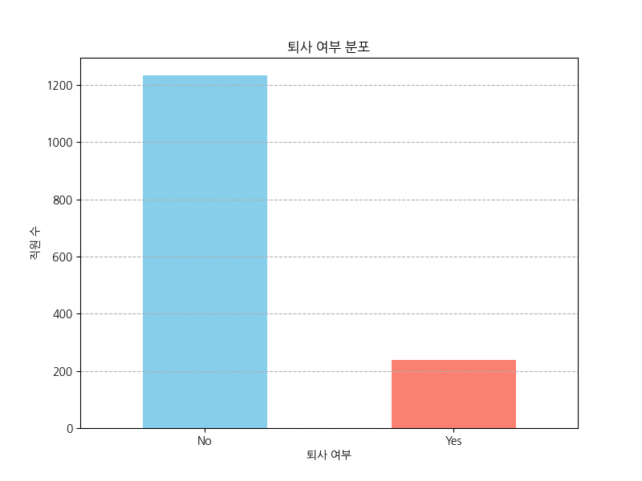
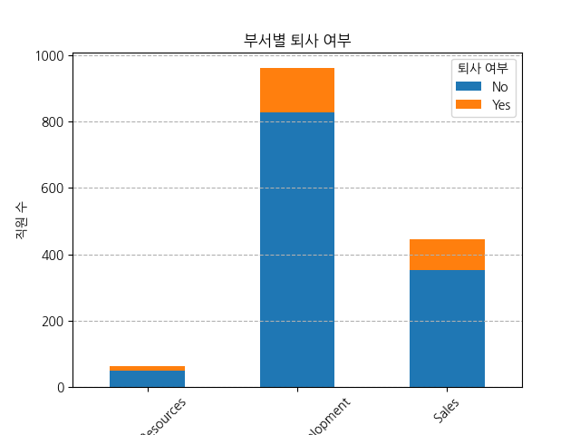
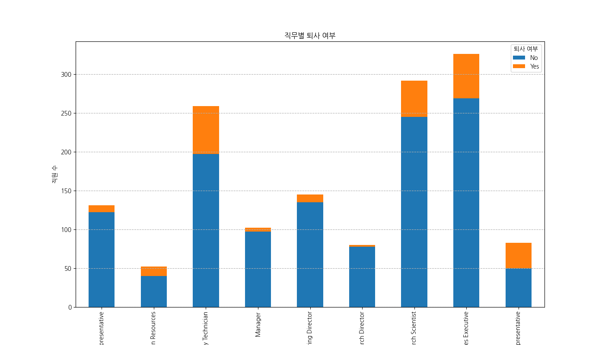
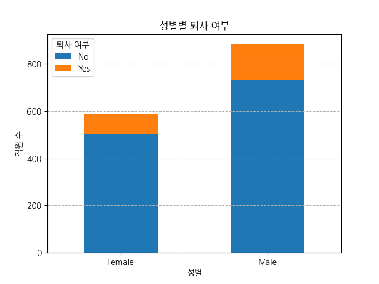
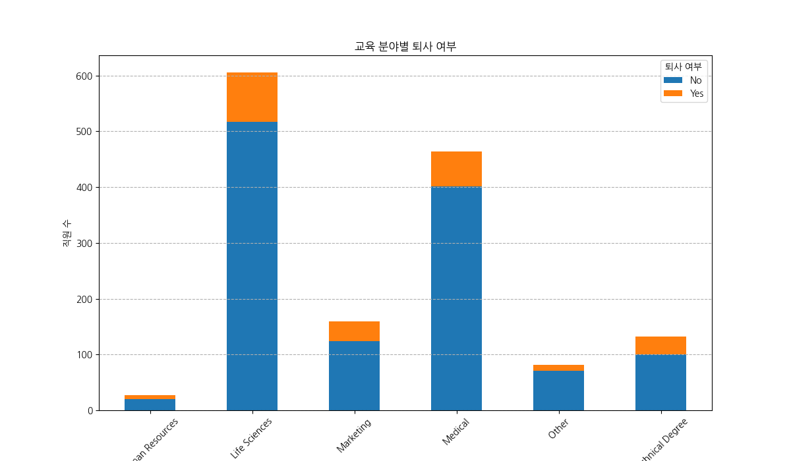
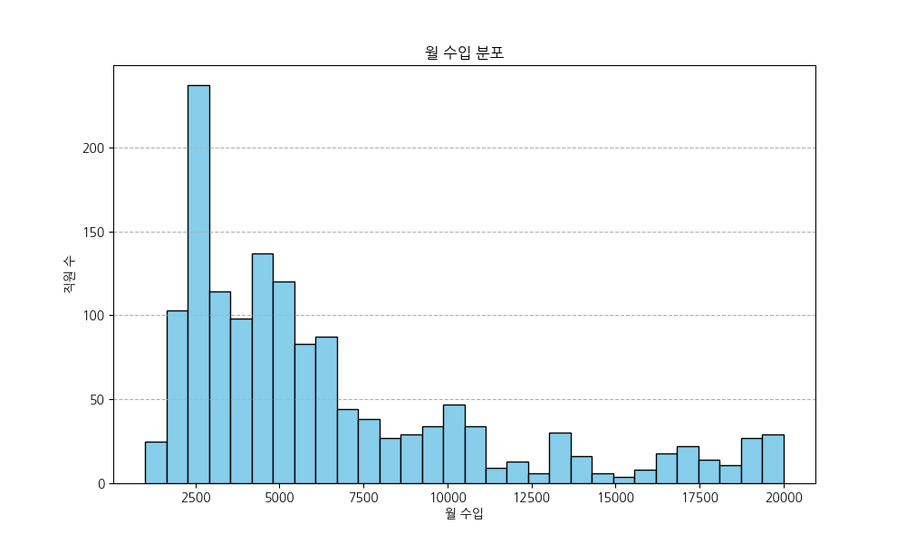
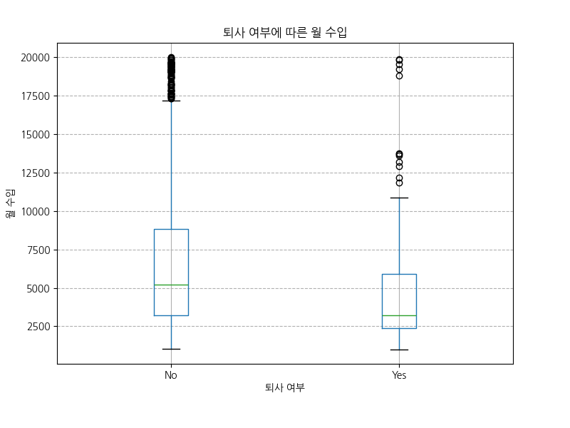
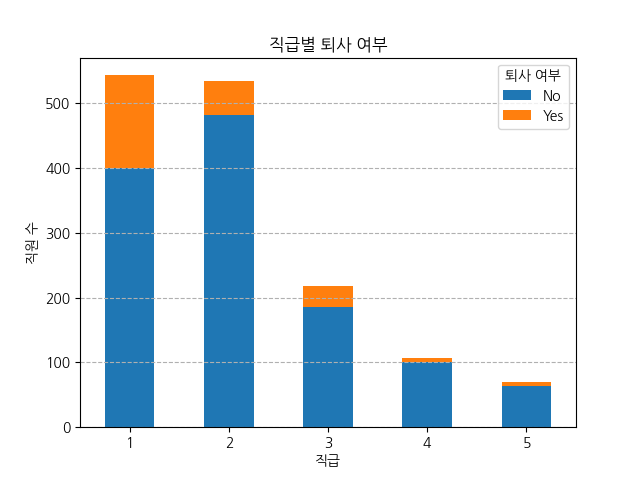
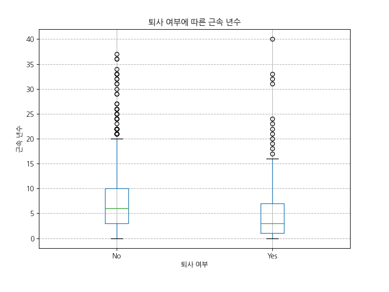
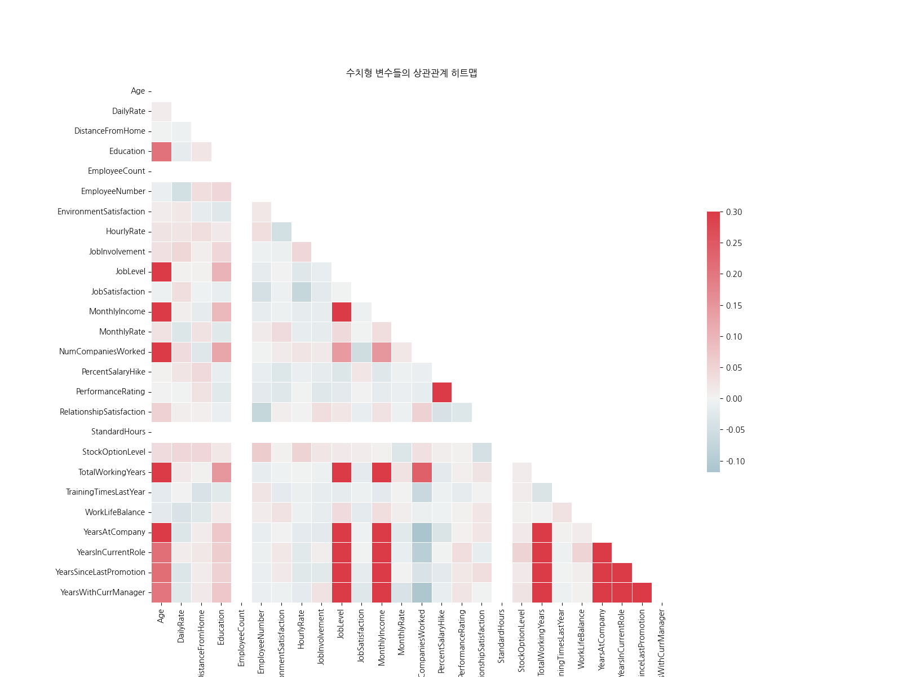

# HR 직원 퇴사 분석 EDA

## 1. 데이터 개요

### 데이터 샘플
|    |   Age | Attrition   | BusinessTravel    |   DailyRate | Department             |   DistanceFromHome |   Education | EducationField   |   EmployeeCount |   EmployeeNumber |   EnvironmentSatisfaction | Gender   |   HourlyRate |   JobInvolvement |   JobLevel | JobRole               |   JobSatisfaction | MaritalStatus   |   MonthlyIncome |   MonthlyRate |   NumCompaniesWorked | Over18   | OverTime   |   PercentSalaryHike |   PerformanceRating |   RelationshipSatisfaction |   StandardHours |   StockOptionLevel |   TotalWorkingYears |   TrainingTimesLastYear |   WorkLifeBalance |   YearsAtCompany |   YearsInCurrentRole |   YearsSinceLastPromotion |   YearsWithCurrManager |
|---:|------:|:------------|:------------------|------------:|:-----------------------|-------------------:|------------:|:-----------------|----------------:|-----------------:|--------------------------:|:---------|-------------:|-----------------:|-----------:|:----------------------|------------------:|:----------------|----------------:|--------------:|---------------------:|:---------|:-----------|--------------------:|--------------------:|---------------------------:|----------------:|-------------------:|--------------------:|------------------------:|------------------:|-----------------:|---------------------:|--------------------------:|-----------------------:|
|  0 |    41 | Yes         | Travel_Rarely     |        1102 | Sales                  |                  1 |           2 | Life Sciences    |               1 |                1 |                         2 | Female   |           94 |                3 |          2 | Sales Executive       |                 4 | Single          |            5993 |         19479 |                    8 | Y        | Yes        |                  11 |                   3 |                          1 |              80 |                  0 |                   8 |                       0 |                 1 |                6 |                    4 |                         0 |                      5 |
|  1 |    49 | No          | Travel_Frequently |         279 | Research & Development |                  8 |           1 | Life Sciences    |               1 |                2 |                         3 | Male     |           61 |                2 |          2 | Research Scientist    |                 2 | Married         |            5130 |         24907 |                    1 | Y        | No         |                  23 |                   4 |                          4 |              80 |                  1 |                  10 |                       3 |                 3 |               10 |                    7 |                         1 |                      7 |
|  2 |    37 | Yes         | Travel_Rarely     |        1373 | Research & Development |                  2 |           2 | Other            |               1 |                4 |                         4 | Male     |           92 |                2 |          1 | Laboratory Technician |                 3 | Single          |            2090 |          2396 |                    6 | Y        | Yes        |                  15 |                   3 |                          2 |              80 |                  0 |                   7 |                       3 |                 3 |                0 |                    0 |                         0 |                      0 |
|  3 |    33 | No          | Travel_Frequently |        1392 | Research & Development |                  3 |           4 | Life Sciences    |               1 |                5 |                         4 | Female   |           56 |                3 |          1 | Research Scientist    |                 3 | Married         |            2909 |         23159 |                    1 | Y        | Yes        |                  11 |                   3 |                          3 |              80 |                  0 |                   8 |                       3 |                 3 |                8 |                    7 |                         3 |                      0 |
|  4 |    27 | No          | Travel_Rarely     |         591 | Research & Development |                  2 |           1 | Medical          |               1 |                7 |                         1 | Male     |           40 |                3 |          1 | Laboratory Technician |                 2 | Married         |            3468 |         16632 |                    9 | Y        | No         |                  12 |                   3 |                          4 |              80 |                  1 |                   6 |                       3 |                 3 |                2 |                    2 |                         2 |                      2 |

### 데이터 정보
<class 'pandas.core.frame.DataFrame'>
RangeIndex: 1470 entries, 0 to 1469
Data columns (total 35 columns):
 #   Column                    Non-Null Count  Dtype 
---  ------                    --------------  ----- 
 0   Age                       1470 non-null   int64 
 1   Attrition                 1470 non-null   object
 2   BusinessTravel            1470 non-null   object
 3   DailyRate                 1470 non-null   int64 
 4   Department                1470 non-null   object
 5   DistanceFromHome          1470 non-null   int64 
 6   Education                 1470 non-null   int64 
 7   EducationField            1470 non-null   object
 8   EmployeeCount             1470 non-null   int64 
 9   EmployeeNumber            1470 non-null   int64 
 10  EnvironmentSatisfaction   1470 non-null   int64 
 11  Gender                    1470 non-null   object
 12  HourlyRate                1470 non-null   int64 
 13  JobInvolvement            1470 non-null   int64 
 14  JobLevel                  1470 non-null   int64 
 15  JobRole                   1470 non-null   object
 16  JobSatisfaction           1470 non-null   int64 
 17  MaritalStatus             1470 non-null   object
 18  MonthlyIncome             1470 non-null   int64 
 19  MonthlyRate               1470 non-null   int64 
 20  NumCompaniesWorked        1470 non-null   int64 
 21  Over18                    1470 non-null   object
 22  OverTime                  1470 non-null   object
 23  PercentSalaryHike         1470 non-null   int64 
 24  PerformanceRating         1470 non-null   int64 
 25  RelationshipSatisfaction  1470 non-null   int64 
 26  StandardHours             1470 non-null   int64 
 27  StockOptionLevel          1470 non-null   int64 
 28  TotalWorkingYears         1470 non-null   int64 
 29  TrainingTimesLastYear     1470 non-null   int64 
 30  WorkLifeBalance           1470 non-null   int64 
 31  YearsAtCompany            1470 non-null   int64 
 32  YearsInCurrentRole        1470 non-null   int64 
 33  YearsSinceLastPromotion   1470 non-null   int64 
 34  YearsWithCurrManager      1470 non-null   int64 
dtypes: int64(26), object(9)
memory usage: 402.1+ KB

### 기술 통계
|       |        Age |   DailyRate |   DistanceFromHome |   Education |   EmployeeCount |   EmployeeNumber |   EnvironmentSatisfaction |   HourlyRate |   JobInvolvement |   JobLevel |   JobSatisfaction |   MonthlyIncome |   MonthlyRate |   NumCompaniesWorked |   PercentSalaryHike |   PerformanceRating |   RelationshipSatisfaction |   StandardHours |   StockOptionLevel |   TotalWorkingYears |   TrainingTimesLastYear |   WorkLifeBalance |   YearsAtCompany |   YearsInCurrentRole |   YearsSinceLastPromotion |   YearsWithCurrManager |
|:------|-----------:|------------:|-------------------:|------------:|----------------:|-----------------:|--------------------------:|-------------:|-----------------:|-----------:|------------------:|----------------:|--------------:|---------------------:|--------------------:|--------------------:|---------------------------:|----------------:|-------------------:|--------------------:|------------------------:|------------------:|-----------------:|---------------------:|--------------------------:|-----------------------:|
| count | 1470       |    1470     |         1470       |  1470       |            1470 |         1470     |                1470       |    1470      |      1470        | 1470       |        1470       |         1470    |       1470    |           1470       |          1470       |         1470        |                 1470       |            1470 |        1470        |          1470       |              1470       |       1470        |       1470       |           1470       |                1470       |             1470       |
| mean  |   36.9238  |     802.486 |            9.19252 |     2.91293 |               1 |         1024.87  |                   2.72177 |      65.8912 |         2.72993  |    2.06395 |           2.72857 |         6502.93 |      14313.1  |              2.6932  |            15.2095  |            3.15374  |                    2.71224 |              80 |           0.793878 |            11.2796  |                 2.79932 |          2.76122  |          7.00816 |              4.22925 |                   2.18776 |                4.12313 |
| std   |    9.13537 |     403.509 |            8.10686 |     1.02416 |               0 |          602.024 |                   1.09308 |      20.3294 |         0.711561 |    1.10694 |           1.10285 |         4707.96 |       7117.79 |              2.49801 |             3.65994 |            0.360824 |                    1.08121 |               0 |           0.852077 |             7.78078 |                 1.28927 |          0.706476 |          6.12653 |              3.62314 |                   3.22243 |                3.56814 |
| min   |   18       |     102     |            1       |     1       |               1 |            1     |                   1       |      30      |         1        |    1       |           1       |         1009    |       2094    |              0       |            11       |            3        |                    1       |              80 |           0        |             0       |                 0       |          1        |          0       |              0       |                   0       |                0       |
| 25%   |   30       |     465     |            2       |     2       |               1 |          491.25  |                   2       |      48      |         2        |    1       |           2       |         2911    |       8047    |              1       |            12       |            3        |                    2       |              80 |           0        |             6       |                 2       |          2        |          3       |              2       |                   0       |                2       |
| 50%   |   36       |     802     |            7       |     3       |               1 |         1020.5   |                   3       |      66      |         3        |    2       |           3       |         4919    |      14235.5  |              2       |            14       |            3        |                    3       |              80 |           1        |            10       |                 3       |          3        |          5       |              3       |                   1       |                3       |
| 75%   |   43       |    1157     |           14       |     4       |               1 |         1555.75  |                   4       |      83.75   |         3        |    3       |           4       |         8379    |      20461.5  |              4       |            18       |            3        |                    4       |              80 |           1        |            15       |                 3       |          3        |          9       |              7       |                   3       |                7       |
| max   |   60       |    1499     |           29       |     5       |               1 |         2068     |                   4       |     100      |         4        |    5       |           4       |        19999    |      26999    |              9       |            25       |            4        |                    4       |              80 |           3        |            40       |                 6       |          4        |         40       |             18       |                  15       |               17       |

## 2. 데이터 시각화 및 분석

### 1. 퇴사 여부 분포

| Attrition   |   count |
|:------------|--------:|
| No          |    1233 |
| Yes         |     237 |

### 2. 부서별 퇴사 여부

| Department             |   No |   Yes |
|:-----------------------|-----:|------:|
| Human Resources        |   51 |    12 |
| Research & Development |  828 |   133 |
| Sales                  |  354 |    92 |

### 3. 직무별 퇴사 여부

| JobRole                   |   No |   Yes |
|:--------------------------|-----:|------:|
| Healthcare Representative |  122 |     9 |
| Human Resources           |   40 |    12 |
| Laboratory Technician     |  197 |    62 |
| Manager                   |   97 |     5 |
| Manufacturing Director    |  135 |    10 |
| Research Director         |   78 |     2 |
| Research Scientist        |  245 |    47 |
| Sales Executive           |  269 |    57 |
| Sales Representative      |   50 |    33 |

### 4. 성별별 퇴사 여부

| Gender   |   No |   Yes |
|:---------|-----:|------:|
| Female   |  501 |    87 |
| Male     |  732 |   150 |

### 5. 교육 분야별 퇴사 여부

| EducationField   |   No |   Yes |
|:-----------------|-----:|------:|
| Human Resources  |   20 |     7 |
| Life Sciences    |  517 |    89 |
| Marketing        |  124 |    35 |
| Medical          |  401 |    63 |
| Other            |   71 |    11 |
| Technical Degree |  100 |    32 |

### 6. 월 수입 분포

월 수입 분포를 확인하여 직원들의 급여 수준을 파악합니다.

### 7. 퇴사 여부에 따른 월 수입

퇴사 여부 그룹 간의 월 수입 분포를 비교하여 급여 수준이 퇴사에 미치는 영향을 분석합니다.

### 8. 직급별 퇴사 여부

|   JobLevel |   No |   Yes |
|-----------:|-----:|------:|
|          1 |  400 |   143 |
|          2 |  482 |    52 |
|          3 |  186 |    32 |
|          4 |  101 |     5 |
|          5 |   64 |     5 |

### 9. 퇴사 여부에 따른 근속 년수

퇴사 여부 그룹 간의 근속 년수 분포를 비교하여 근속 기간이 퇴사에 미치는 영향을 분석합니다.

### 10. 수치형 변수들의 상관관계 히트맵

수치형 변수들 간의 상관관계를 히트맵으로 시각화하여 변수 간의 관계를 파악합니다.

