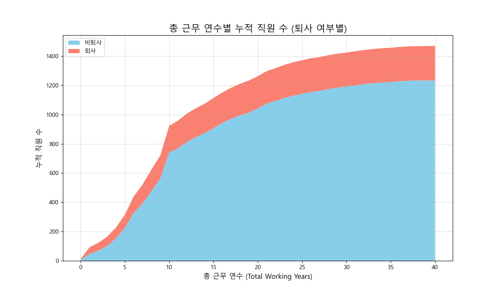
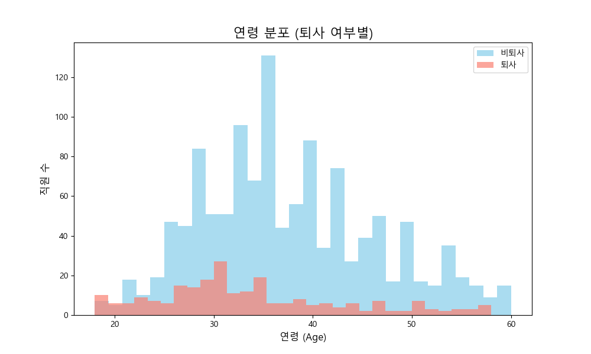
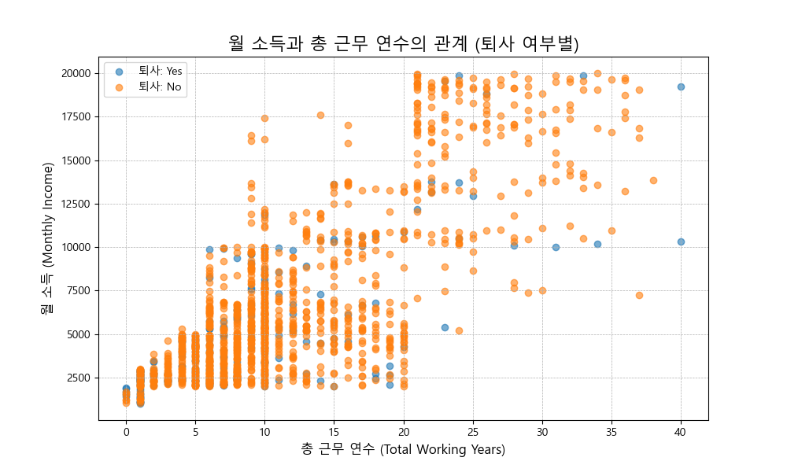
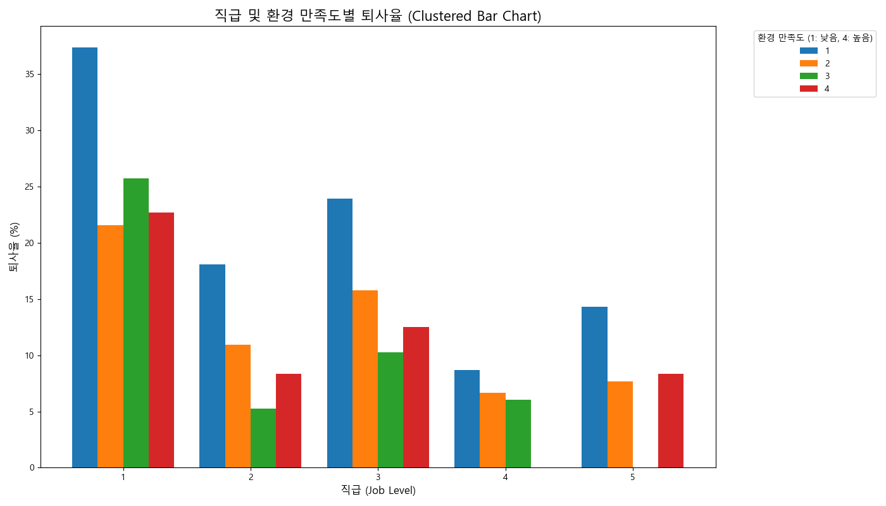
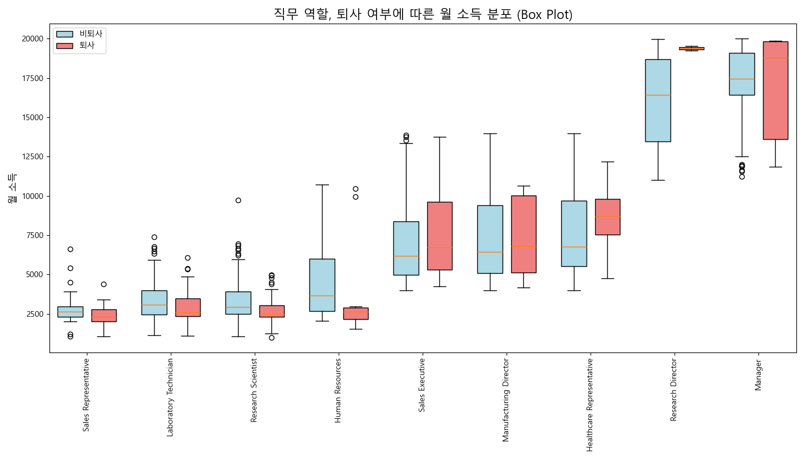
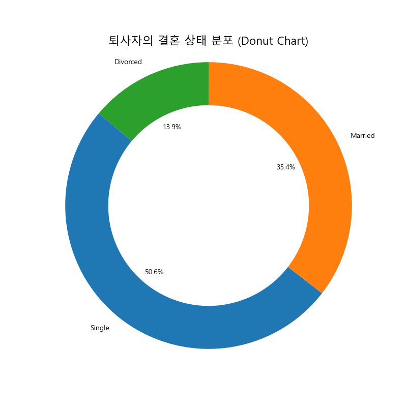

# HR 직원 퇴사 현황 심층 분석 및 전략적 제언

**Date:** 2025-12-20
**Author:** Gemini (Data Analytics Division)

---

## 1. 분석 요약 (Executive Summary)

본 보고서는 전체 직원 1,470명의 데이터를 기반으로, 현재 회사가 직면한 직원 퇴사 문제의 핵심 원인을 진단하고 데이터 기반의 해결책을 제언하는 것을 목표로 한다.

분석 결과, 현재 퇴사율은 **16.1%**에 달하며, 이는 특정 그룹에 집중되어 나타나는 구조적 문제임을 확인했다. 퇴사의 가장 큰 동인은 **'보상 및 성장 정체'**이며, 이는 주로 **'저연차·저연령·저직급'** 직원 그룹에서 두드러진다.

### Key Findings:
- **핵심 퇴사 그룹:** 입사 7년차 이하, 20-30대, 미혼, 비관리자 직급
- **핵심 퇴사 원인:** 동일 연차/직무 대비 낮은 소득 수준 및 성장 경로의 불확실성
- **주요 시사점:** 직무 만족도나 복리후생만으로는 핵심 인재의 이탈을 막기 어려우며, 직접적인 동기 부여 요인인 **'보상'과 '성장'**에 대한 전략적 접근이 시급하다.

---

## 2. 핵심 인사이트 (Core Insights)

본 분석 결과는 HR 팀이 직면한 퇴사 문제에 대한 깊이 있는 이해와 전략적 방향을 제시한다.

-   **조직의 활력 저하 우려:** 전체 퇴사율 16.1% 중 상당수가 젊은 연령층, 저연차, 그리고 핵심 실무 직급에서 발생하고 있어, 조직의 장기적인 성장 동력과 활력 저하로 이어질 수 있음을 시사한다. 이는 단순한 인력 손실을 넘어, 경험과 역량의 축적 기회를 상실하는 중대한 문제이다.
-   **경제적 요인이 이탈의 주 동인:** 직무 만족도나 근무 환경 같은 비경제적 요인보다, 소득 수준이 퇴사 결정에 더 강력한 영향을 미치는 것으로 분석된다. 특히, 동일 경력 및 직급 대비 낮은 보상은 직원의 불공정 인식과 이직 동기를 크게 강화한다.
-   **예방적 접근의 필요성:** 퇴사 직원의 절반 이상이 입사 초기에 이탈하며, 특정 직무 및 교육 배경을 가진 직원들의 퇴사율이 높다는 점은, 사후 관리보다는 채용 및 온보딩 단계부터의 예방적 접근과 맞춤형 관리가 중요함을 강조한다.
-   **개인 생활 요인의 영향:** 미혼 직원의 퇴사율이 기혼 직원의 두 배 이상이라는 점은, 개인의 생활 패턴 및 책임감 또한 직원의 조직 정착에 중요한 영향을 미친다는 점을 시사하며, 이에 대한 이해와 지원 방안 모색이 필요하다.

---

## 3. 퇴사 위험군 페르소나 (High-Risk Persona)

데이터 분석을 통해 도출된 가장 전형적인 퇴사 위험군 페르소나는 다음과 같다.

### **"성장은 하고 싶지만, 보상이 따르지 않는 3년차 연구원"**

- **인적 정보:** 김민준, 29세, 미혼, Life Sciences 전공
- **직무:** 연구개발(R&D) 부서의 연구원 (Research Scientist), 직급(Job Level) 1
- **근속 기간:** 3년
- **급여 수준:** 월 $3,500 (동일 직급/연차의 잔류자 그룹 평균 대비 약 15~20% 낮음)
- **주요 특징 및 불만 (Pain Points):**
    - **"일은 만족스럽지만, 미래가 보이지 않아요."**: 현재 업무(Job Involvement)와 환경 만족도(Environment Satisfaction)는 보통 수준이지만, 2년째 연봉 인상률(PercentSalaryHike)이 평균 이하에 머물러 있고, 승진(YearsSinceLastPromotion)도 요원하게 느껴진다.
    - **"친구들과 비교돼요."**: 비슷한 경력의 동료나 타사의 친구들에 비해 월 소득(MonthlyIncome)이 현저히 낮다고 인식하며, 이는 심리적 박탈감으로 이어진다.
    - **"더 좋은 기회가 있다면 떠날 거예요."**: 회사에 대한 충성도보다는 개인의 커리어 성장과 합당한 보상을 더 중요하게 생각한다. 이미 외부 채용 공고를 알아보는 중일 가능성이 높다.

---

## 4. 상세 분석 및 데이터 근거 (Detailed Analysis & Evidence)

### 1. 근속 연수: 짧을수록 높은 이탈율

- **Data-driven Evidence:**
    - 입사 7년차 이하 직원의 퇴사율은 **25.1%**로, 8년차 이상 그룹보다 월등히 높다.
    - 특히 입사 **1년차 직원의 퇴사율은 49.4%** (81명 중 40명)에 달해, 신규 입사자의 조직 적응 및 초기 경력 관리의 실패가 심각한 수준임을 보여준다.

### 2. 연령: 20-30대 핵심 실무진의 유출

- **Data-driven Evidence:**
    - 25-34세 연령 그룹의 퇴사율은 **20.2%**로, 다른 연령대에 비해 매우 높다.
    - 퇴사자의 평균 연령은 **33.6세**로, 잔류자(37.6세)보다 4년 어리다. 이는 회사의 현재와 미래를 책임질 핵심 실무 인력의 유출이 심각함을 의미한다.

### 3. 소득: 퇴사의 가장 명확한 신호

- **Data-driven Evidence:**
    - 퇴사자의 평균 월 소득은 **$4,787**로, 잔류자($6,833)의 **70% 수준**에 불과하다.
    - 30세 동갑내기 직원을 비교했을 때, 퇴사자는 잔류자에 비해 평균적으로 월 **$1,586**를 덜 받고 있었다. 이는 공정성에 대한 의문과 직접적인 퇴사 동기로 작용한다.

### 4. 직급 및 성장: 정체된 커리어 경로

- **Data-driven Evidence:**
    - 낮은 직급(JobLevel 1)이면서 동시에 낮은 환경 만족도(EnvironmentSatisfaction 1)를 가진 그룹의 퇴사율은 **37.4%**에 달한다.
    - 상관관계 분석 결과, 퇴사(Attrition)는 직급(JobLevel), 총 근속연수(TotalWorkingYears), 현 부서 근속년수(YearsInCurrentRole)와 강한 음의 상관관계를 보인다. 즉, 성장이 정체되어 있다고 느끼는 직원일수록 퇴사 확률이 높다.

### 5. 직무 및 교육: 특정 그룹의 높은 이탈율

- **Data-driven Evidence:**
    - **영업 대표(Sales Representative)** 직무의 경우, 퇴사자와 잔류자 간의 월 소득 중앙값 차이가 **$318** 발생하며, 퇴사율이 매우 높다.
    - **기술 학위(Technical Degree)**와 **마케팅(Marketing)** 전공자의 퇴사율은 각각 **24.2%**, **22.0%**로, 외부 시장에서의 높은 수요가 이탈을 가속화하는 것으로 보인다.

### 6. 개인 특성: 미혼 직원의 높은 이동성

- **Data-driven Evidence:**
    - **미혼(Single)** 직원의 퇴사율은 **25.5%**로, 기혼(Married) 직원(12.5%)의 두 배가 넘는다. 이는 부양가족의 유무가 안정성에 영향을 미치는 요인임을 시사한다.

---

## 5. 전략적 액션 플랜 (Strategic Action Plan)

데이터 분석 결과를 바탕으로, 단기적 '응급 처방'과 중장기적 '체질 개선'을 위한 투트랙(Two-track) 전략을 제언한다.

### **Track 1: 단기 핵심인재 이탈 방지 (6개월 내 실행)**

1.  **타겟 직무 보상 현실화:**
    - **대상:** 영업 대표(Sales Rep.), 연구실 기술자(Lab Tech) 등 퇴사율과 소득 격차가 가장 큰 직무.
    - **실행:** 해당 직무의 시장 임금 수준을 재조사하고, 경쟁사 대비 90% 수준까지 보상 테이블을 상향 조정하여 즉각적인 이탈 동기를 줄인다.

2.  **신입사원 온보딩 강화:**
    - **대상:** 입사 1년차 이내 신규 직원.
    - **실행:** 입사 후 3, 6, 12개월 시점에 HR 주관의 의무 면담을 통해 고충을 파악하고, 동료/선배와의 멘토링 프로그램을 강화하여 조직 적응을 지원한다.

### **Track 2: 중장기 성장 기반 강화 (1년 내 계획 수립 및 실행)**

1.  **성장 경로 가시화 및 Fast-Track 도입:**
    - **대상:** 2-5년차 주니어 직원.
    - **실행:** 직무별 구체적인 경력 개발 경로(CDP)를 제시하고, 우수 성과자에 대해서는 직급 및 연차를 파괴하는 **Fast-Track 승진/보상 제도**를 도입하여 성장에 대한 기대를 심어준다.

2.  **공정한 성과 평가 및 보상 시스템 개편:**
    - **대상:** 전 직원.
    - **실행:** '연공서열'이 아닌 '성과' 기반의 투명한 평가 기준을 수립하고, 그 결과가 연봉 인상률 및 승진에 직접적으로 연동됨을 전사적으로 공표하여 공정성에 대한 신뢰를 회복한다.