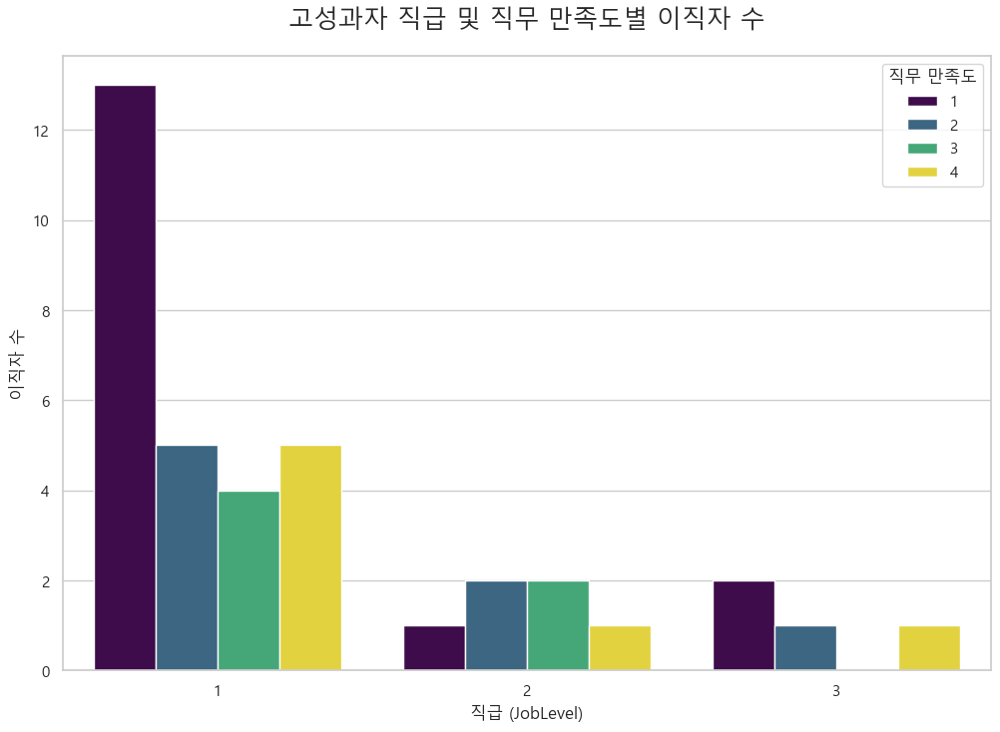
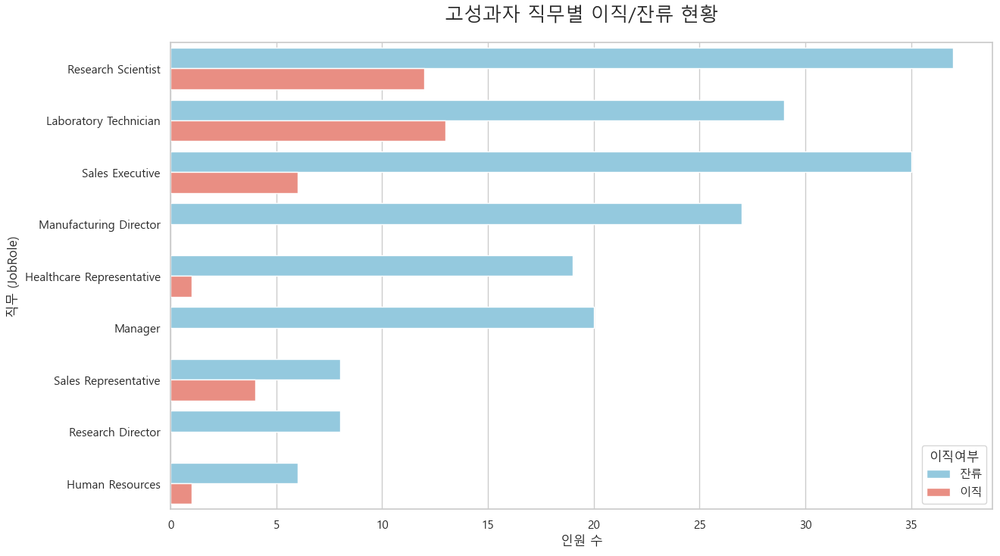
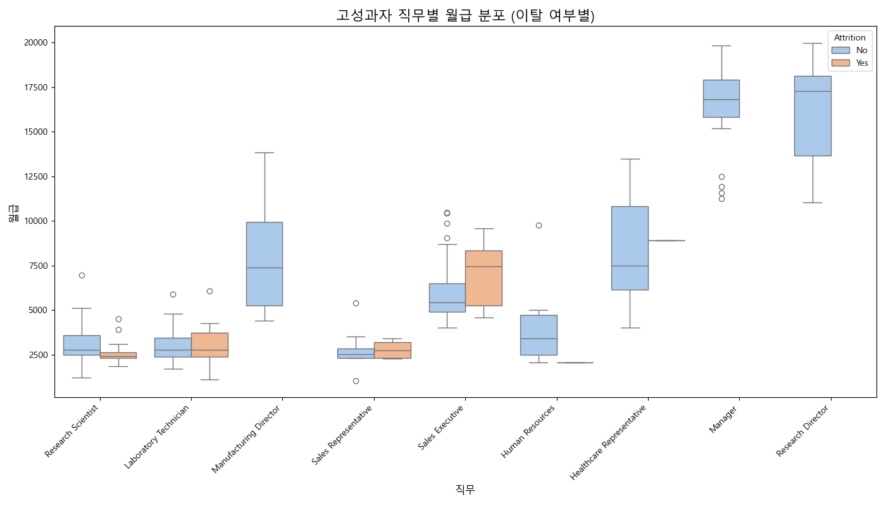
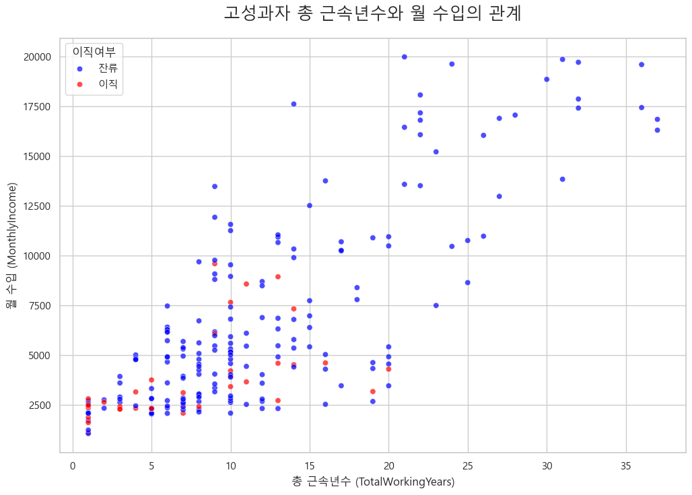
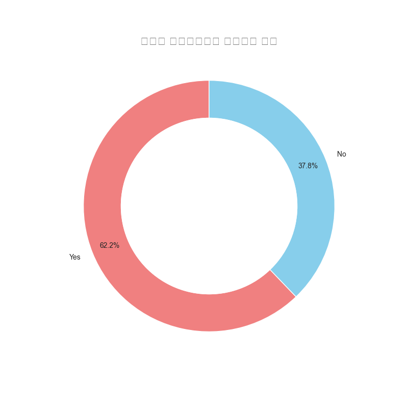
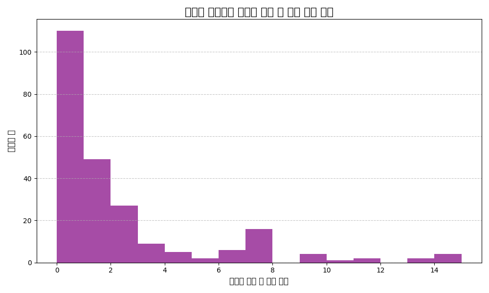
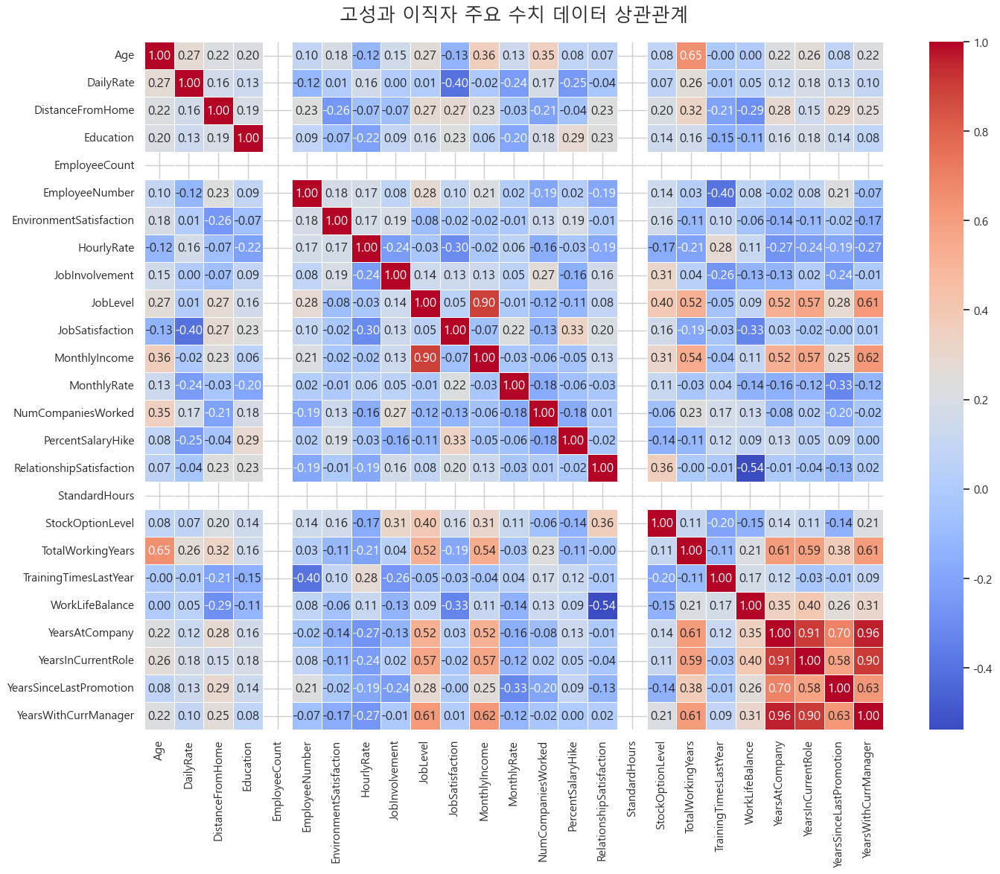
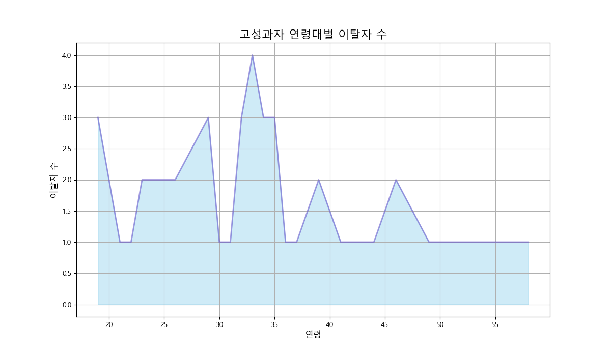
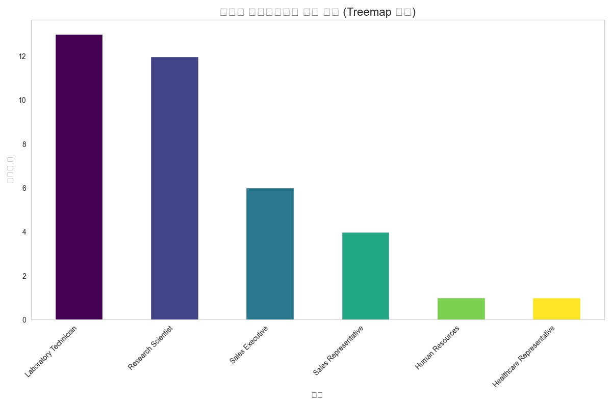

# 고성과자 이직 요인 심층 분석 보고서

 

## 📝 목차

1.  [**분석 개요**](#1-분석-개요)
2.  [**상세 분석 및 시각화**](#2-상세-분석-및-시각화)
    - [2.1. 직급 및 직무 만족도별 이직 현황](#21-고성과자-직급-및-직무-만족도별-이직자-수)
    - [2.2. 직무별 이직/잔류 현황](#22-고성과자-직무별-이직잔류-현황)
    - [2.3. 직무별 월 수입 분포 비교](#23-고성과자-직무별이직여부에-따른-월-수입-분포)
    - [2.4. 근속년수와 월 수입의 관계](#24-고성과자-총-근속년수와-월-수입의-관계)
    - [2.5. 초과근무 비율](#25-고성과-이직자의-초과근무-비율)
    - [2.6. 승진 정체 현황](#26-고성과-이직자의-마지막-승진-후-경과-년수-분포)
    - [2.7. 주요 데이터 상관관계](#27-고성과-이직자-주요-수치-데이터-상관관계)
    - [2.8. 급여 인상률 및 환경 만족도 비교](#28-고성과자-이직-여부에-따른-평균-급여-인상률-및-환경-만족도)
    - [2.9. 연령대별 이직자 분포](#29-고성과자-연령대별-이직자-수)
    - [2.10. 이직자 직무 분포](#210-고성과-이직자의-직무-분포)
3.  [**핵심 인사이트 요약**](#3-핵심-인사이트-요약)
4.  [**실행 계획 제안 (Action Plan)**](#4-실행-계획-제안-action-plan)
    - [4.1. 고성과자 보상 체계 개편](#41-고성과자-보상-체계-개편)
    - [4.2. 체계적인 경력 개발 경로 재설계](#42-체계적인-경력-개발-경로-재설계)
    - [4.3. 워라밸 개선 및 조직 문화 혁신](#43-워라밸-개선-및-조직-문화-혁신)
    - [4.4. 핵심 직무 그룹 집중 관리](#44-핵심-직무-그룹-집중-관리)

 

---

## 1. 분석 개요

본 보고서는 HR 데이터를 기반으로 **고성과자(Performance Rating 4등급)** 그룹의 이직에 영향을 미치는 주요 요인을 심층적으로 분석하는 것을 목표로 합니다. 분석 결과를 바탕으로 핵심적인 인사이트를 도출하고, 고성과자들의 이직률을 낮추기 위한 구체적인 실행 계획을 제안합니다.

---

## 2. 상세 분석 및 시각화

### 2.1. 고성과자 직급 및 직무 만족도별 이직자 수

-   **📊 분석:** 낮은 직무 만족도(`1`, `2`)를 가진 고성과자들이 모든 직급(`Job Level`)에 걸쳐 이직하는 경향이 나타납니다. 특히 **직급 1, 2의 낮은 연차 직원들** 사이에서 직무 만족도가 낮을 때 이직자 수가 두드러집니다.
-   **💡 인사이트:**
    > 직무 만족도는 고성과자의 이직 결정에 중요한 변수입니다. 특히 **주니어 레벨의 고성과자**들이 직무에 만족하지 못할 경우 이직 가능성이 크게 높아집니다.

### 2.2. 고성과자 직무별 이직/잔류 현황

-   **📊 분석:** `Sales Executive`, `Research Scientist`, `Laboratory Technician` 직무에서 고성과자 이직자 수가 가장 많았습니다.
-   **💡 인사이트:**
    > 특정 직무에 고성과자의 이직이 집중되는 경향이 있습니다. 해당 직무들의 **업무 환경, 보상 체계, 성장 기회** 등에 대한 면밀한 검토가 필요합니다.

### 2.3. 고성과자 직무별/이직여부에 따른 월 수입 분포

-   **📊 분석:** 대부분의 직무에서 이직한 고성과자들의 월 수입 중앙값이 잔류하는 고성과자들보다 낮거나 비슷한 수준입니다. 특히 `Sales Executive`의 경우, 이직자 그룹의 수입 편차가 크지만 중앙값은 잔류자 그룹보다 낮습니다.
-   **💡 인사이트:**
    > 동등한 성과를 내고 있음에도 불구하고, **상대적으로 낮은 월 수입**이 이직을 결심하게 만드는 주요 요인일 수 있습니다.

### 2.4. 고성과자 총 근속년수와 월 수입의 관계

-   **📊 분석:** **근속 기간 10년 미만**인 고성과자 그룹에서 이직이 집중적으로 발생하며, 이들은 비교적 낮은 수입 구간에 분포해 있습니다.
-   **💡 인사이트:**
    > 입사 초기 및 중기 단계에 있는 고성과자들이 회사에 대한 기여에 비해 **충분한 보상을 받지 못한다**고 느낄 가능성이 큽니다. 이 시기의 인재 유출이 심각함을 보여줍니다.

### 2.5. 고성과 이직자의 초과근무 비율

-   **📊 분석:** 이직한 고성과자 중 절반 이상(**56.5%**)이 초과근무를 한 것으로 나타났습니다.
-   **💡 인사이트:**
    > 높은 성과를 내기 위해 잦은 초과근무가 요구되는 환경은 **워라밸(Work-Life Balance)을 저해**하고, 결국 고성과자의 번아웃과 이직으로 이어질 수 있습니다.

### 2.6. 고성과 이직자의 마지막 승진 후 경과 년수 분포

-   **📊 분석:** 승진 없이 **0~2년 정도 지난 시점**에 가장 많은 고성과자들이 이직을 선택했습니다.
-   **💡 인사이트:**
    > 고성과자들은 빠른 성장과 인정을 기대합니다. **승진이 정체되거나 지연될 경우**, 외부에서 새로운 기회를 찾으려는 동기가 강해집니다.

### 2.7. 고성과 이직자 주요 수치 데이터 상관관계

-   **📊 분석:** 월 수입(`MonthlyIncome`)은 총 근속년수(`TotalWorkingYears`), 직급(`JobLevel`) 등과 강한 양의 상관관계를 보입니다.
-   **💡 인사이트:**
    > 고성과 이직자 그룹 내에서는 **수입과 경력 관련 변수들이 서로 밀접하게 연관**되어 있습니다. 경력에 맞는 수입 보상이 중요함을 시사합니다.

### 2.8. 고성과자 이직 여부에 따른 평균 급여 인상률 및 환경 만족도

-   **📊 분석:** 이직한 고성과자 그룹은 잔류한 그룹에 비해 **평균 급여 인상률**과 **평균 업무 환경 만족도**가 모두 낮았습니다.
-   **💡 인사이트:**
    > **낮은 급여 인상률**과 **불만족스러운 업무 환경**은 고성과자의 이직 결정에 복합적으로 작용하는 결정적인 요인임을 시사합니다.

### 2.9. 고성과자 연령대별 이직자 수

-   **📊 분석:** **26-35세 사이의 젊은 고성과자 그룹**에서 이직률이 가장 높게 나타났습니다.
-   **💡 인사이트:**
    > 경력 개발의 황금기에 있는 **젊은 핵심 인재들이 조직을 떠나고 있습니다.** 이들의 이탈은 회사의 미래 성장 잠재력에 큰 타격을 줄 수 있습니다.

### 2.10. 고성과 이직자의 직무 분포

-   **📊 분석:** `Sales Executive` 직무가 고성과 이직자 중 가장 큰 비중을 차지하며, 그 뒤를 `Research Scientist`, `Laboratory Technician`이 잇고 있습니다.
-   **💡 인사이트:**
    > 특정 직무, 특히 **영업 및 연구 개발 직군**에서 고성과자 이탈이 심각한 수준임을 보여줍니다. 이들 직무에 대한 심층적인 원인 분석과 대책 마련이 시급합니다.

---

## 3. 핵심 인사이트 요약

-   **💸 경제적 보상 부족**
    -   이직자들은 잔류 인원에 비해 상대적으로 낮은 **월 수입**과 **급여 인상률**을 기록. 이직의 가장 직접적인 원인으로 추정됩니다.
-   **📈 성장 정체에 대한 불만**
    -   **승진이 0~2년 이상 지연**될 경우, 고성과자들은 성장의 한계를 느끼고 새로운 기회를 찾아 떠납니다.
-   **⚖️ 워라밸 문제와 과도한 업무 부담**
    -   이직자의 **56.5%가 초과근무** 경험. 이는 번아웃과 이직으로 이어지는 주요 경로입니다.
-   **🎯 핵심 인재 유출 심각**
    -   회사의 핵심인 **20대 후반 ~ 30대 초반**의 `Sales Executive`, `Research Scientist` 직무에서 이탈이 집중되어, 장기적인 경쟁력 약화가 우려됩니다.
-   **😔 낮은 직무 & 환경 만족도**
    -   직무 자체에 대한 불만족과 열악한 근무 환경은 고성과자의 이직 결심을 굳히는 데 영향을 미칩니다.

---

## 4. 실행 계획 제안 (Action Plan)

### 4.1. 고성과자 보상 체계 개편

-   **성과 기반 차등 보상 강화:**
    -   성과 등급에 따라 급여 인상률 및 인센티브를 명확히 차등 지급하여, '성과가 있는 곳에 보상이 있다'는 인식을 확립합니다.
-   **시장 임금 수준 정기 검토:**
    -   주요 경쟁사 대비 고성과자 그룹의 임금 경쟁력을 정기적으로 분석하고, 업계 상위 수준을 유지하도록 급여 테이블을 현실화합니다.

### 4.2. 체계적인 경력 개발 경로 재설계

-   **고성과자 Fast-Track 프로그램 도입:**
    -   우수 인재를 조기에 발탁하여 리더로 육성하는 프로그램을 활성화하고, 명확한 승진 기준과 로드맵을 제시하여 성장 기대감을 높입니다.
-   **도전적인 기회 제공:**
    -   희망자에 한해 직무 순환 기회를 제공하고, 개인의 성장을 이끌어낼 수 있는 도전적인 프로젝트에 우선적으로 배치하여 직무 만족도와 전문성을 동시에 강화합니다.

### 4.3. 워라밸 개선 및 조직 문화 혁신

-   **초과근무 관리 시스템 강화:**
    -   초과근무가 잦은 부서를 파악하고, 원인 분석(인력 부족, 비효율적 업무 프로세스 등)을 통해 근본적인 해결책을 마련합니다.
-   **유연 근무 및 재택근무 확대:**
    -   고성과자들이 업무 자율성과 몰입도를 극대화할 수 있도록 유연 근무 및 재택근무 제도를 적극적으로 활용하고 장려합니다.

### 4.4. 핵심 직무 그룹 집중 관리

-   **'Stay Interview' 정기적 실시:**
    -   이직률이 높은 `Sales Executive`, `Research Scientist` 등의 핵심 직무 그룹을 대상으로 정기적인 'Stay Interview(잔류 면담)'를 실시하여, 잠재적인 불만 요인을 사전에 파악하고 선제적으로 개선 조치를 취합니다.
-   **직무별 맞춤형 케어 프로그램:**
    -   영업직의 실적 압박, 연구직의 R&D 지원 부족 등 각 직무 그룹의 고충을 해결하기 위한 맞춤형 지원 프로그램을 개발하고 실행합니다.