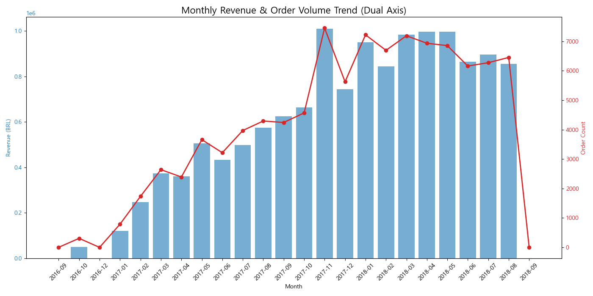
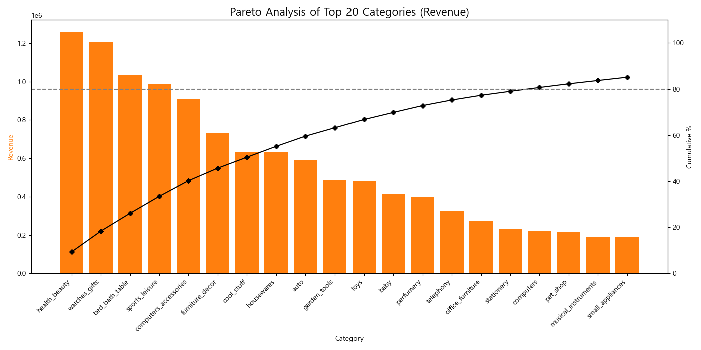
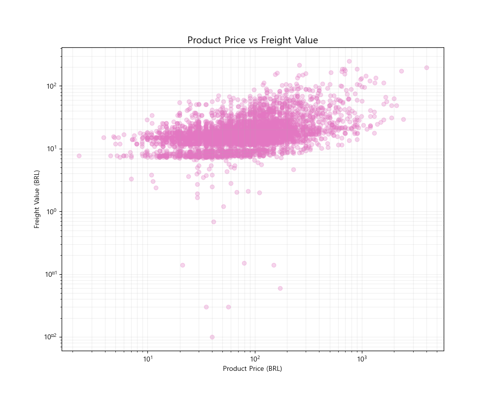
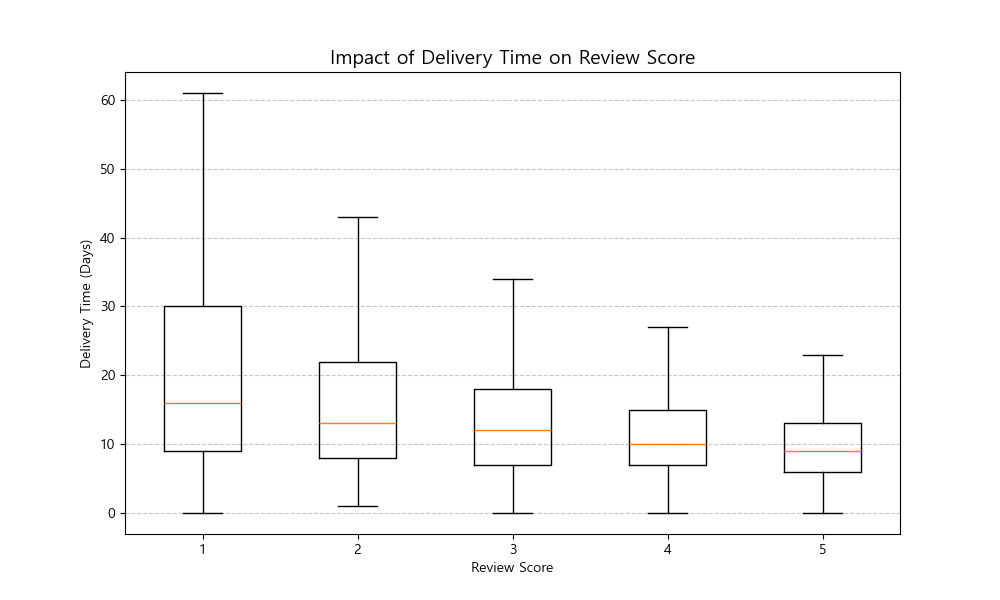
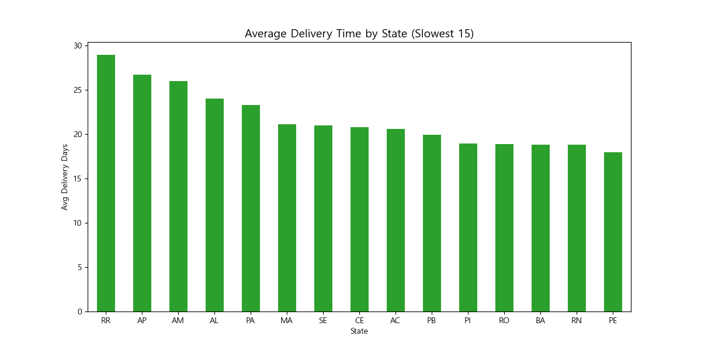
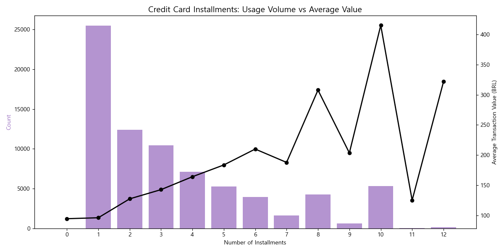
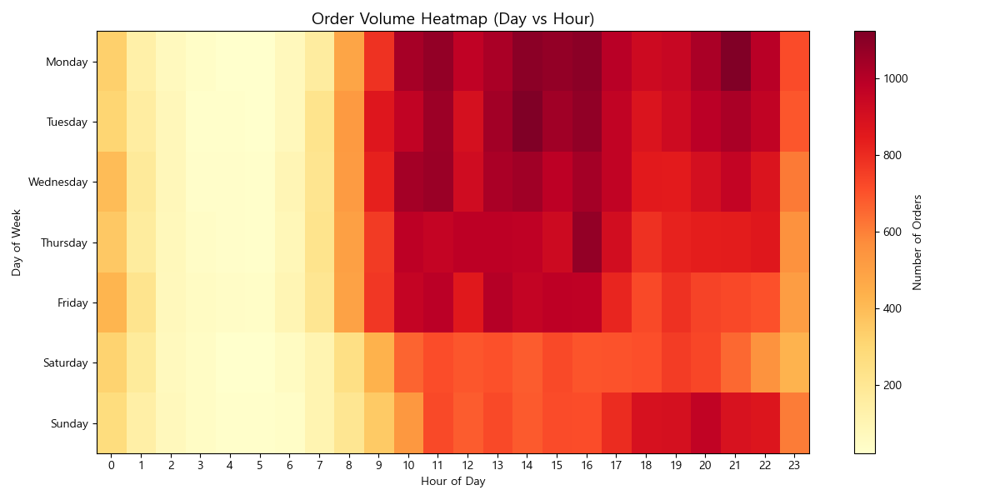

# Olist E-commerce 심층 시장 분석 보고서 (Deep EDA Report)

## 1. Executive Summary (경영 요약)

본 보고서는 브라질 Olist E-commerce 데이터를 기반으로 매출, 물류, 상품, 고객 행동 등 비즈니스 전반을 심층 분석한 결과입니다. 단순한 현황 파악을 넘어, 비즈니스 성장을 견인하는 핵심 동력(Key Drivers)과 잠재적 리스크 요인을 발굴하여 전략적 의사결정을 지원하는 것을 목표로 합니다.

**핵심 인사이트:**
*   **성장성:** 2017년 하반기를 기점으로 폭발적인 매출 성장을 기록했으며, 특히 블랙 프라이데이 시즌(11월)의 매출 집중도가 매우 높습니다.
*   **수익성:** 상위 20%의 카테고리가 전체 매출의 약 70~80%를 견인하는 파레토 법칙이 뚜렷하게 관찰됩니다.
*   **고객 경험(CX):** 배송 지연은 고객 만족도(평점) 하락의 결정적인 원인이며, 특정 주(State)에서의 물류 병목 현상이 심각합니다.
*   **결제 행동:** 고가 제품일수록 할부 결제 의존도가 높으며, 이는 구매 전환율을 높이는 핵심 레버리지입니다.

---

## 2. Sales & Growth Analysis (매출 및 성장 분석)

### 2.1 월별 매출 및 주문량 추이

*   **분석:**
    *   **급격한 성장:** 2017년 1월부터 2018년 중반까지 매출과 주문량 모두 우상향 곡선을 그리고 있습니다. 이는 플랫폼의 시장 안착 및 유저 베이스 확대가 성공적으로 이루어지고 있음을 시사합니다.
    *   **시즌성 (Seasonality):** 2017년 11월에 기록적인 매출 스파이크가 관찰됩니다. 이는 **블랙 프라이데이** 프로모션의 영향으로 해석되며, 연간 매출 목표 달성에 4분기가 결정적인 역할을 함을 알 수 있습니다.
    *   **객단가 안정성:** 주문량(빨간선)과 매출(파란 막대)의 증가 추세가 거의 비례합니다. 이는 저가 상품 위주의 '박리다매' 전략보다는, 적정 수준의 객단가(AOV)를 유지하며 건전하게 성장하고 있음을 나타냅니다.

---

## 3. Product Portfolio Analysis (상품 포트폴리오 분석)

### 3.1 카테고리 파레토 분석 (Pareto Analysis)

*   **분석:**
    *   **상위 카테고리 집중:** `bed_bath_table`, `health_beauty`, `computers_accessories`, `watches_gifts` 등 상위 5~6개 카테고리가 전체 매출의 상당 부분을 차지합니다.
    *   **Long-tail 전략:** 누적 매출 곡선(검은 선)을 보면 상위 20여 개 카테고리 이후로는 매출 기여도가 완만해집니다. 재고 관리 및 마케팅 예산 집행 시, 상위 'Power Categories'에 집중하여 ROI를 극대화하는 전략이 필요합니다. 반면 하위 카테고리는 틈새시장(Niche Market) 공략 용도로 활용해야 합니다.

### 3.2 가격 대비 배송비 효율성 (Freight Efficiency)

*   **분석:**
    *   저가 상품일수록 상품 가격 대비 배송비 부담이 큽니다. (Log-scale 그래프 좌측 하단)
    *   고가 상품(우측 상단)은 배송비가 차지하는 비중이 상대적으로 낮아, 고객 입장에서 배송비 저항이 적습니다.
    *   **제언:** 저가 상품군의 경우 '묶음 배송'이나 '일정 금액 이상 무료 배송' 정책을 통해 객단가를 높여 배송비 저항을 완화할 필요가 있습니다.

---

## 4. Logistics & CX Analysis (물류 및 고객 경험 분석)

### 4.1 배송 시간이 고객 평점에 미치는 영향

*   **분석:**
    *   **명확한 상관관계:** 평점 5점을 준 고객들의 배송 시간(중앙값 약 7-8일)은 평점 1점을 준 고객들(중앙값 약 15일 이상)보다 현저히 짧습니다.
    *   **임계점:** 배송이 2주(14일)를 넘어가면 고객 불만족(1~2점)이 급증할 가능성이 매우 높습니다.
    *   **Risk:** 1점 리뷰 그룹의 배송 시간 분포(Boxplot)가 매우 넓게 퍼져있어, 극단적인 배송 지연(30일 이상) 사례가 다수 포함되어 있음을 알 수 있습니다. 이는 고객 이탈의 주범입니다.

### 4.2 지역별 배송 퍼포먼스 (하위 15개 주)

*   **분석:**
    *   **물류 격차:** `RR`, `AP`, `AM` 등 브라질 북부/북서부 지역의 평균 배송일은 25~28일에 달합니다. 이는 남동부(SP, RJ) 지역 대비 2~3배 이상 느린 속도입니다.
    *   **제언:** 해당 지역 고객에게는 예상 배송일을 보수적으로 안내하여 기대치를 관리하거나, 현지 물류 센터 확충(Fulfillment Center)을 장기적으로 검토해야 합니다.

---

## 5. Customer Behavior & Payment (고객 행동 및 결제)

### 5.1 할부 결제 분석

*   **분석:**
    *   **할부와 객단가의 비례:** 할부 개월 수가 늘어날수록 평균 결제 금액(검은 선)이 뚜렷하게 상승합니다. 10개월 할부의 경우 평균 결제액이 500~600 BRL 수준에 달합니다.
    *   **소비 심리:** 1회 일시불 결제 빈도가 가장 높지만, 고가 제품 구매 시 브라질 소비자들이 할부(Installments) 기능을 적극적으로 활용함을 알 수 있습니다.
    *   **전략:** 고가 가전이나 가구 카테고리에서는 '무이자 할부' 프로모션이 구매 전환율(Conversion Rate)을 높이는 가장 강력한 도구가 될 것입니다.

### 5.2 주문 시간대 히트맵 (Time Heatmap)

*   **분석:**
    *   **Prime Time:** 주중(월~금) 오전 10시부터 오후 4시 사이가 가장 주문이 활발한 '골든 타임'입니다.
    *   **주말 감소:** 주말(토, 일)에는 주문량이 평일 대비 다소 감소하는 경향을 보입니다.
    *   **제언:** 마케팅 푸시 알림이나 타임 세일 이벤트는 평일 점심시간 전후(11시~14시)에 집중하는 것이 효과적입니다.

---

## 6. 결론 및 전략적 제언 (Strategic Recommendations)

1.  **배송 리스크 관리 (Risk Management):**
    *   평점 1점의 주 원인인 '장기 배송 지연'을 선제적으로 관리해야 합니다. 배송 예정일 D-3 시점에 지연 안내 메시지를 발송하는 등 **Proactive Communication** 체계가 필요합니다.
    *   배송 취약 지역(북부)에 대한 물류 파트너십 재검토가 시급합니다.

2.  **카테고리 집중과 육성 (Selection & Concentration):**
    *   `Bed_Bath_Table`, `Health_Beauty` 등 Cash Cow 카테고리의 재고 안정성을 최우선으로 확보해야 합니다.
    *   수익성이 검증된 상위 카테고리 내에서 프리미엄 라인업(High-end)을 확장하여 객단가를 추가로 높이는 전략이 유효합니다.

3.  **프로모션 최적화 (Promotion Optimization):**
    *   고가 상품에 대한 할부 혜택 강조 배너를 상세 페이지 상단에 배치하십시오.
    *   평일 낮 시간대(10:00~16:00)에 플래시 딜(Flash Deal)을 운영하여 트래픽을 매출로 전환시켜야 합니다.
