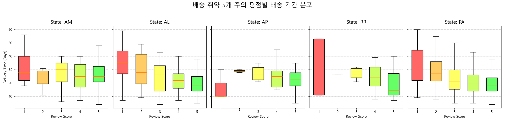
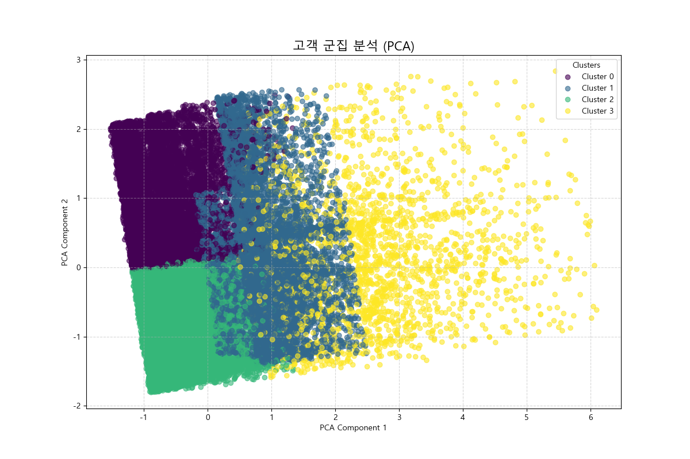

# Olist E-commerce 심층 시장 분석 및 전략 제언 v2

## 1. Executive Summary (경영 요약)

본 보고서는 Olist E-commerce 데이터를 기반으로 비즈니스 전반을 심층 분석한 v1 보고서에 더해, **고객 경험의 핵심 동인을 구체적으로 식별**하고 **고객 세분화(Segmentation)를 통한 개인화 전략**을 도출하는 데 초점을 맞춥니다. 데이터에 기반한 명확한 액션 플랜 제시를 목표로 합니다.

**핵심 인사이트 (v2 추가):**
*   **지역별 CX 편차 심각:** 특정 배송 취약 지역(북부/북서부)에서는 배송 지연이 고객 불만족으로 직결되는 현상이 다른 지역보다 훨씬 민감하게 나타납니다. 이는 단순 상관관계를 넘어 명확한 인과관계에 가깝습니다.
*   **고객 세분화를 통한 기회 발굴:** 전체 고객은 4개의 뚜렷한 그룹으로 나뉩니다: **"활동/만족"**, **"고가치/불만족(이탈위험)"**, **"불만족/이탈"**, **"만족/이탈"**. 각 그룹은 서로 다른 특성과 요구를 가지므로, 차별화된 접근 전략이 필수적입니다.
*   **전략적 우선순위:** '고가치/불만족' 고객의 이탈을 방지하고 '불만족/이탈' 고객의 부정적 인식을 개선하는 것이 단기적으로 가장 중요한 과제입니다.

---

## 2. 기존 분석 요약 (Sales, Product, Logistics)

*   **매출:** 2017년 하반기부터 폭발적으로 성장했으며, 특히 4분기(블랙 프라이데이) 시즌성이 뚜렷합니다.
*   **상품:** 상위 20% 카테고리가 매출의 80%를 차지하는 파레토 법칙이 명확하며, `bed_bath_table`, `health_beauty` 등이 핵심 카테고리입니다.
*   **물류:** 전반적으로 배송 기간이 2주를 초과하면 고객 만족도가 급격히 하락하며, 이는 비즈니스의 가장 큰 리스크 요인입니다.

---

## 3. 심층 분석 1: 배송 취약 지역의 고객 경험 민감도 분석

기존 분석에서 배송 시간과 고객 평점 간의 음의 상관관계를 확인했습니다. 이번 분석에서는 한 걸음 더 나아가, **배송이 가장 취약한 지역(평균 배송일 기준 하위 5개 주)에 한정**하여 이 관계를 심층적으로 분석했습니다.

*   **분석:**
    *   위 차트는 배송이 가장 느린 5개 주(RR, AP, AM 등) 각각에서 고객 평점(1~5점)에 따른 배송 기간의 분포를 보여줍니다.
    *   **결정적 인사이트:** 이 지역들에서는 **평점 4, 5점을 받은 경우(긍정 경험)와 1, 2점을 받은 경우(부정 경험) 간의 배송 기간 차이가 극명**합니다. 만족 그룹의 배송일 중앙값은 약 10~15일인 반면, 불만족 그룹은 25~40일 이상으로 급증합니다.
    *   특히, 평점 3점과 2점 사이의 간극이 매우 큽니다. 이는 배송이 약 20일을 넘어가는 순간, 고객 경험이 회복 불가능한 수준으로 추락한다는 것을 의미합니다.

*   **실행 계획 (Action Plan):**
    *   **(단기) 기대치 관리 및 선제적 소통:** 해당 5개 주에 대해서는 주문 시 **예상 배송일을 보수적으로(길게) 설정**하여 고객의 초기 기대치를 현실화해야 합니다. 또한, 배송 지연 발생 시 단순 알림을 넘어, 사과와 함께 소액의 할인 쿠폰을 제공하는 **선제적 보상 시스템(Proactive Compensation)**을 도입합니다.
    *   **(중장기) 타겟 물류 최적화:** 해당 지역 전담 물류 파트너를 선정하거나, 해당 지역으로 배송되는 특정 상품군에 대해 **풀필먼트 서비스(Fulfillment by Olist) 사용을 유도**하여 배송 품질을 중앙에서 관리하는 전략을 검토해야 합니다.

---

## 4. 심층 분석 2: K-Means를 활용한 고객 군집 분석

고객의 행동 패턴(총 지출액, 주문 횟수, 평균 만족도, 최근 접속일)을 기반으로 K-Means 군집 분석을 수행하여 4개의 고객 세그먼트를 도출했습니다.

*   **분석 결과:**
| 군집 | 주요 특징 | 해석 | 인원 수 |
|---|---|---|---|
| **0** | 낮은 지출, 좋은 평점, **매우 오래전 방문** | **만족 후 이탈 고객** (Satisfied Churn) | 10,689 |
| **1** | 낮은 지출, **매우 나쁜 평점**, 최근 방문 | **불만족 후 이탈 고객** (Dissatisfied Churn) | 10,847 |
| **2** | 낮은 지출, **매우 좋은 평점**, **최근 방문** | **활동적인 만족 고객 (충성 고객)** (Active & Satisfied) | 13,890 |
| **3** | **매우 높은 지출**, 보통 평점, 최근 방문 | **고가치 이탈 위험 고객 (VIP)** (High-Value, At-Risk) | 2,338 |

*   **실행 계획 (Action Plan):** 각 세그먼트별 맞춤형 전략이 필요합니다.

    *   **군집 2 (활동/만족): 육성(Nurture) 전략**
        *   **목표:** 충성도 강화 및 객단가 상승 유도.
        *   **전략:**
            *   **소액 리워드:** 구매 확정 및 5점 리뷰 작성 시 즉시 사용 가능한 1~2% 포인트 적립.
            *   **등급 기반 혜택:** 'Silver', 'Gold' 등급을 신설하여, 분기별 구매액에 따라 등급을 부여하고 차등화된 무료 배송 혜택 제공.
    
    *   **군집 3 (고가치/이탈위험): 이탈 방지(Retention) 전략**
        *   **목표:** 만족도 개선을 통한 핵심 수익원 유지. **가장 높은 우선순위.**
        *   **전략:**
            *   **전담 CS 매니저 배정:** 문제 발생 시 즉각적으로 해결해주는 1:1 케어 서비스 제공.
            *   **경험 개선 서베이:** "최고의 고객님께, 더 나은 서비스를 위해 잠시만 시간을 내어주세요"와 같은 개인화된 메시지와 함께 서베이를 발송하고, 참여 시 높은 금액의 쿠폰 제공.
            *   **프리미엄 배송 옵션:** 추가 비용 지불 시 더 빠르고 안전한 프리미엄 배송 선택권 부여.

    *   **군집 1 (불만족/이탈): 회유(Win-back) 전략**
        *   **목표:** 부정적 인식 개선 및 재구매 기회 창출.
        *   **전략:**
            *   **진심 어린 사과 캠페인:** "Olist에서의 좋지 않았던 경험에 대해 사과드립니다"라는 제목의 이메일을 발송. 배송 문제 개선을 위해 노력하고 있음을 알리고, 파격적인(예: 20% 이상) 할인 쿠폰을 제공하여 재방문 유도.
    
    *   **군집 0 (만족/이탈): 재관여(Re-engagement) 전략**
        *   **목표:** 플랫폼 재방문 유도.
        *   **전략:**
            *   **"We Miss You" 캠페인:** 과거 구매했던 상품 카테고리의 신제품, 베스트셀러 상품을 추천하는 개인화된 이메일 발송.
            *   **기간 한정 쿠폰:** "돌아온 고객님을 위한 특별 10% 할인"과 같이, 짧은 유효기간의 쿠폰을 발송하여 즉각적인 행동 유도.

---

## 5. 종합 전략 제언 (Final Recommendations)

1.  **배송 리스크 관리 시스템 고도화:**
    *   **단기:** 배송 취약 지역(북부 5개 주)에 대한 **차등적 예상 배송일 안내** 및 **선제적 보상 시스템**을 즉시 도입하여 CX 하락을 방어해야 합니다.
    *   **중장기:** 해당 지역의 물류 파트너와의 계약을 재검토하고, 주요 상품에 대한 **중앙 풀필먼트 시스템 적용**을 적극 검토해야 합니다.

2.  **고객 관계 관리(CRM)의 세분화 및 자동화:**
    *   도출된 4개의 고객 세그먼트를 CRM 시스템의 핵심 태그로 도입합니다.
    *   각 세그먼트에 대한 **액션 플랜(육성, 이탈방지, 회유, 재관여)을 자동화된 마케팅 시나리오로 구현**하여 상시 운영합니다. 특히 **'고가치 이탈 위험' 고객(군집 3)에 대한 알림 및 관리는 최우선 순위**로 설정해야 합니다.

3.  **수익성 극대화를 위한 프로모션 최적화:**
    *   **고가 상품(가구, 전자제품 등):** '무이자 할부' 프로모션을 상세 페이지 상단에 더욱 눈에 띄게 배치하여 구매 전환율을 높입니다.
    *   **저가 상품:** 'X 금액 이상 구매 시 무료배송' 또는 '유사 상품 묶음 구매' 추천 기능을 강화하여 객단가를 높이고 배송비 부담을 줄여줍니다.
    *   **타임 세일:** 주중 점심시간(11시-14시)에 집중하여 단기 트래픽을 매출로 극대화합니다.
