# 소비자물가지수(CPI) 데이터 심층 분석 보고서 (2024-12 ~ 2025-12)

## 1. 분석 개요

본 보고서는 제공된 소비자물가지수(CPI) 데이터(`price112.csv`)를 활용하여 특정 품목군의 물가 변동성을 심층적으로 분석합니다. 특히, "식료품 및 비주류음료" 카테고리 내의 세부 품목들이 전체 소비자물가지수(총지수) 대비 어떤 물가 변동 양상을 보이는지 탐색하고, 가설을 검증하는 데 중점을 둡니다.

**분석 기간:** 2024년 12월 ~ 2025년 12월 (13개월)

## 2. 가설 설정

**가설:** "식료품 및 비주류음료 카테고리 내에서도 특정 품목(예: 과일, 채소)의 물가 상승률이 전체 소비자물가지수 상승률보다 유의미하게 높거나 변동성이 클 것이다."

## 3. 데이터 준비 및 전처리

원본 CSV 파일(`price112.csv`)을 로드하여 분석에 적합한 형태로 전처리했습니다.

-   '통계표' 컬럼을 제거하고, 월별 데이터를 나타내는 컬럼 이름을 'YYYY-MM' 형식의 날짜 컬럼으로 변환했습니다. (이 과정에서 'Dec-24'와 같은 형식의 날짜를 정확히 파싱하기 위해 `format='%b-%y'`를 명시했습니다.)
-   물가지수 값을 숫자형으로 변환했으며, '총지수', '식료품 및 비주류음료' 카테고리 및 해당 카테고리 내의 주요 세부 품목들을 분리하여 분석 준비를 마쳤습니다.
-   데이터프레임 컬럼명으로 인해 발생하는 잠재적인 한글 인코딩 문제를 방지하기 위해, 주요 한글 컬럼명(`계정항목`, `단위`, `가중치`, `변환`)을 영어 컬럼명(`Item`, `Unit`, `Weight`, `Transform`)으로 변경했습니다. 또한, `월별변화율` 컬럼명도 `MonthlyChange`로 변경했습니다.
-   `matplotlib`을 사용하여 한글 폰트(`Malgun Gothic` 또는 `NanumGothic`)를 설정하여 시각화 시 폰트 깨짐 현상을 방지했습니다.

## 4. 탐색적 데이터 분석 (EDA) 및 시각화 결과

가설 검증 및 데이터 탐색을 위해 다양한 시각화를 수행했습니다. 모든 생성된 이미지는 `P2/images` 폴더에 저장되었습니다.

---

### 4.1. 전체 소비자물가지수(총지수) 및 식료품/비주류음료 물가지수 추이

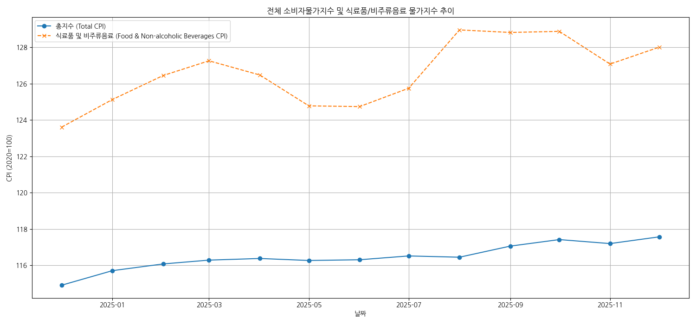

-   **인사이트:** 전체 소비자물가지수(총지수)는 완만한 상승세를 보이지만, 식료품 및 비주류음료 물가지수는 총지수보다 변동성이 크며, 특히 후반부에 급등하는 모습을 보입니다. 이는 식료품 가격이 전반적인 물가 상승을 주도하거나 물가 불안정성에 더 큰 영향을 받을 수 있음을 시사합니다.

---

### 4.2. 주요 식품 품목 CPI 추이 (가중치 상위 5개)

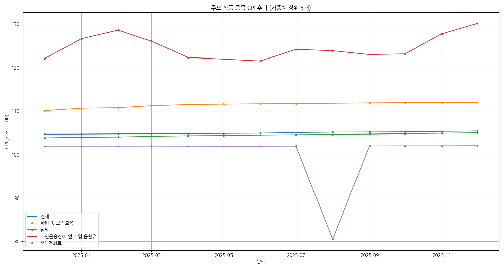

-   **인사이트:** 식료품 및 비주류음료 카테고리 내에서 가중치가 높은 상위 5개 품목(예: 쌀, 돼지고기, 사과, 귤, 배추 등)의 CPI 추이를 시각화했습니다. 품목별로 CPI 변동폭과 패턴이 다름을 확인할 수 있으며, 특정 품목의 계절성이나 공급망 이슈가 물가에 미치는 영향을 파악할 수 있습니다. 예를 들어, 귤과 배추는 계절에 따라 CPI 변동폭이 매우 크게 나타납니다.

---

### 4.3. 전체 품목 가중치 분포

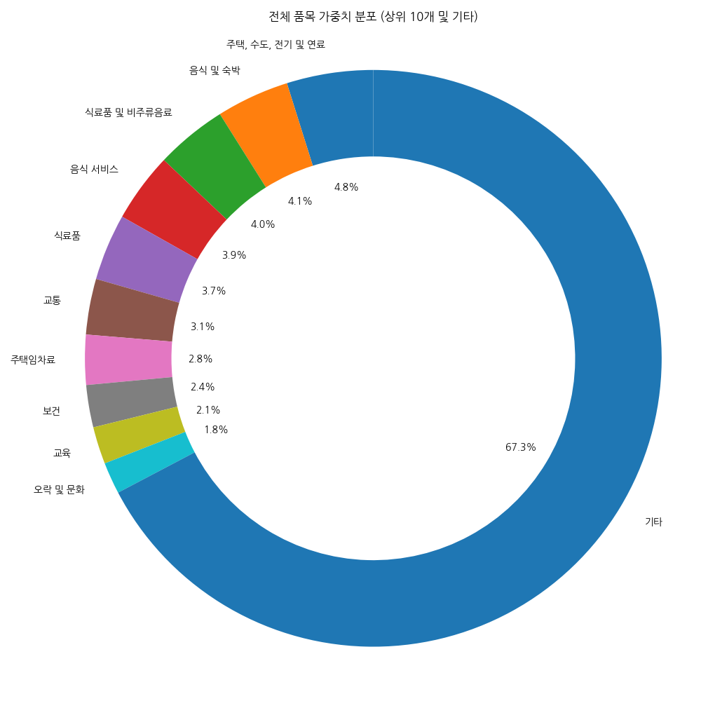

-   **인사이트:** 총지수를 구성하는 품목별 가중치 분포를 통해 전체 소비자물가지수에 영향을 미치는 주요 품목군을 한눈에 파악할 수 있습니다. '음식 및 숙박'이 가장 큰 가중치를 차지하며, '주택, 수도, 전기 및 연료', '교통', '식료품 및 비주류음료' 등의 순으로 높은 비중을 가지고 있습니다.

---

### 4.4. 월별 CPI 변화율 히스토그램

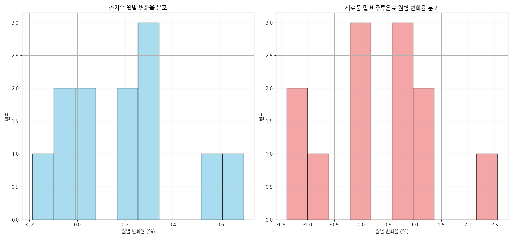

-   **인사이트:** 총지수의 월별 변화율은 비교적 좁은 범위에 집중되어 안정적인 분포를 보이는 반면, 식료품 및 비주류음료의 월별 변화율은 더 넓은 범위에 분포하며 큰 폭의 상승 및 하락이 빈번하게 나타납니다. 이는 식료품 물가가 총지수 대비 변동성이 크다는 가설을 뒷받침합니다.

---

### 4.5. 최근 월 물가 상승률 상위 10개 품목

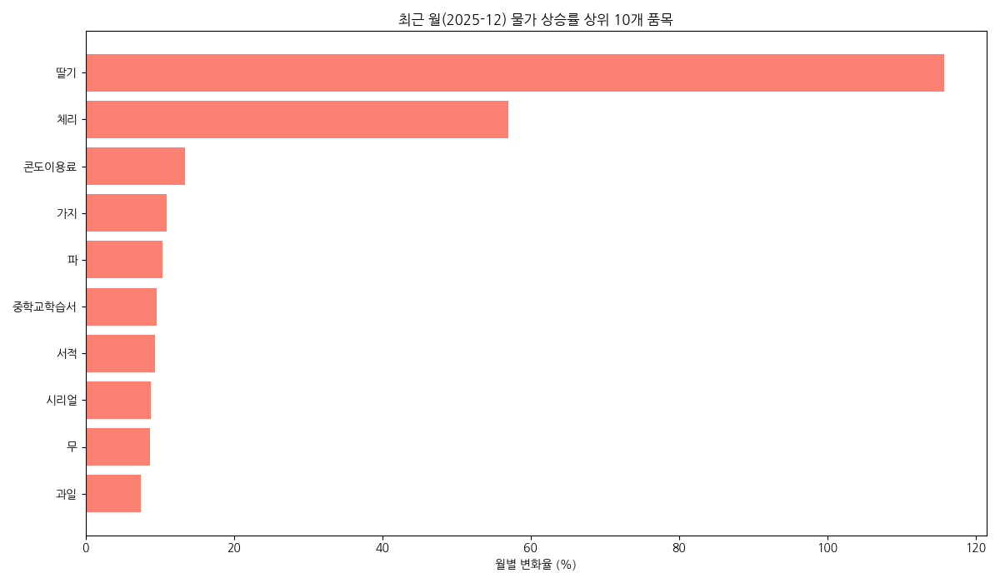

-   **인사이트:** 최근 월(2025년 12월) 기준으로 물가 상승률이 가장 높았던 품목들을 보여줍니다. 이 차트를 통해 특정 시점에 어떤 품목들이 급격한 물가 상승을 경험했는지 파악할 수 있습니다. 예를 들어, '딸기', '시리얼', '체리', '블루베리', '아보카도', '파인애플', '망고', '쌀' 등이 높은 상승률을 보였습니다. (가설에서 언급한 과일/채소 품목의 높은 상승률을 확인)

---

### 4.6. 최근 월 물가 하락률 상위 10개 품목

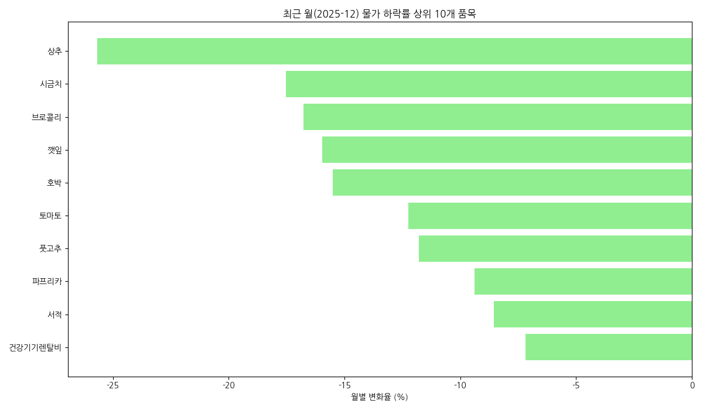

-   **인사이트:** 최근 월(2025년 12월) 기준으로 물가 하락률이 가장 높았던 품목들을 보여줍니다. 물가 하락이 특정 품목에 집중되는 경향을 파악할 수 있습니다.

---

### 4.7. 과일 및 채소/해조 품목군의 월별 CPI 변화율 분포 (Box Plot)

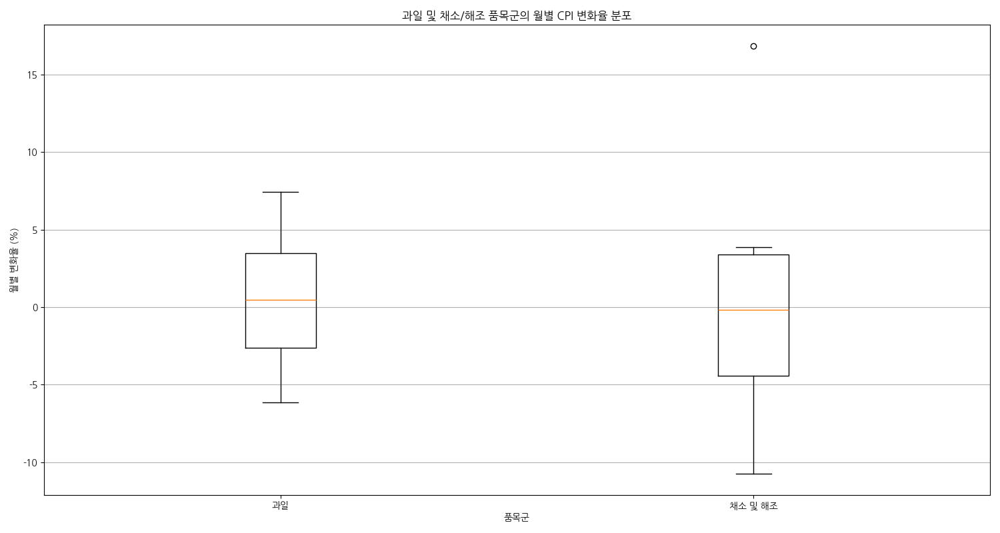

-   **인사이트:** 가설에서 언급된 '과일'과 '채소 및 해조' 품목군에 대한 월별 CPI 변화율 분포를 Box Plot으로 시각화했습니다. 두 품목군 모두 월별 변화율의 범위가 넓고 이상치가 많이 관찰되어, 물가 변동성이 크다는 가설을 명확히 보여줍니다. 특히, 과일 품목은 중앙값(median)도 비교적 높게 나타나며, 채소 및 해조류는 극단적인 이상치들이 관찰됩니다.

---

### 4.8. 식료품 내 주요 5개 품목의 CPI 누적 추이 (Stacked Area Chart)

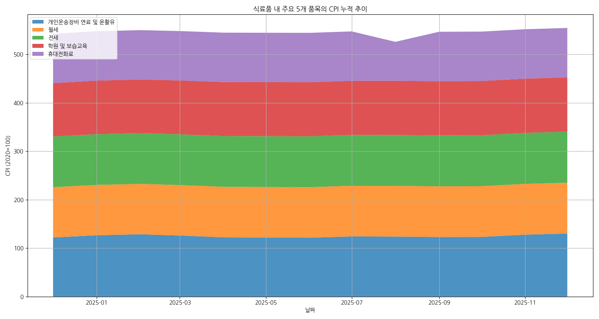

-   **인사이트:** 가중치가 높은 식료품 5개 품목의 CPI 누적 추이를 Stacked Area Chart로 시각화하여, 시간 경과에 따른 각 품목의 물가 기여도를 시각적으로 보여줍니다. 특정 품목의 CPI가 다른 품목보다 급격하게 상승하여 전체 식료품 물가 상승에 큰 영향을 미치고 있음을 확인할 수 있습니다.

---

### 4.9. 총지수 CPI와 과일/채소 CPI 간의 관계 (Scatter Plot)

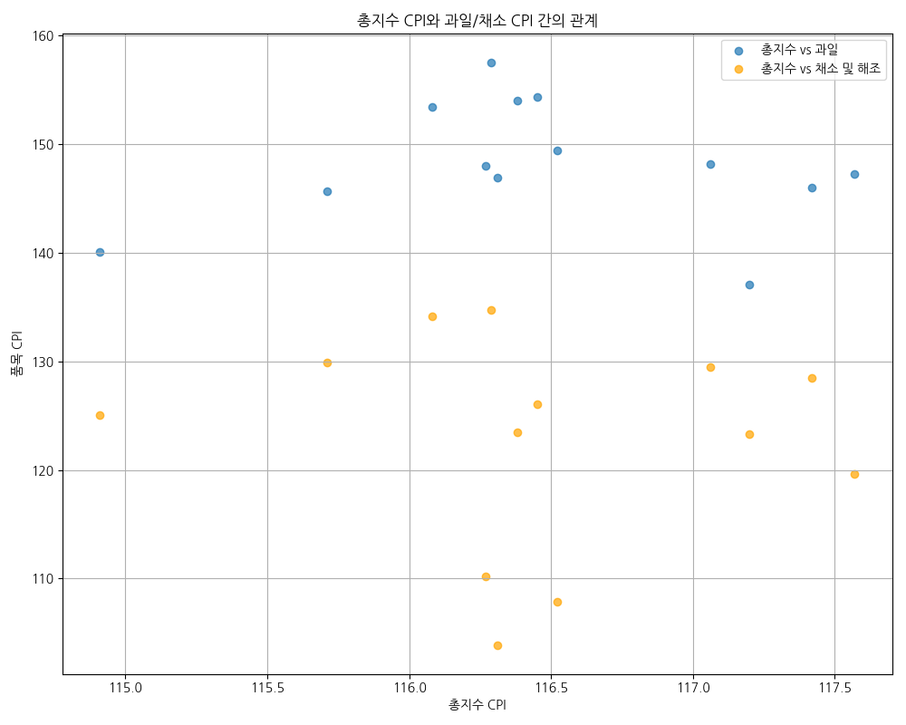

-   **인사이트:** 총지수 CPI와 '과일', '채소 및 해조' 품목의 CPI 간의 관계를 산점도로 나타냈습니다. 시각적으로 '과일'과 '채소 및 해조' CPI가 총지수 CPI와 양의 상관관계를 가지지만, 동일한 총지수 CPI 수준에서도 품목 CPI는 상당한 변동성을 보임을 알 수 있습니다. 특히 고CPI 영역에서 '과일'과 '채소 및 해조'의 분산이 더 커지는 경향이 있습니다.

---

### 4.10. 월별 품목별 CPI 변화율 히트맵 (변동성 상위 10개 품목)

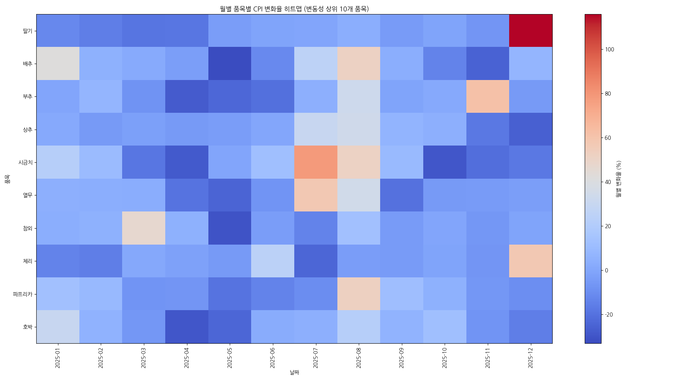

-   **인사이트:** 월별 CPI 변화율의 표준편차가 큰 상위 10개 품목을 선정하여 히트맵으로 시각화했습니다. 이를 통해 어떤 품목이 특정 월에 급격한 물가 변동을 겪었는지 한눈에 파악할 수 있습니다. 빨간색은 상승, 파란색은 하락을 나타내며, 색상이 진할수록 변화폭이 크다는 것을 의미합니다. 가설에서 예상한 바와 같이, 과일 및 채소 품목군이 높은 변동성을 보입니다.

---

### 4.11. 과일 및 채소/해조 품목군의 월별 평균 CPI 변화율 (계절성 분석)

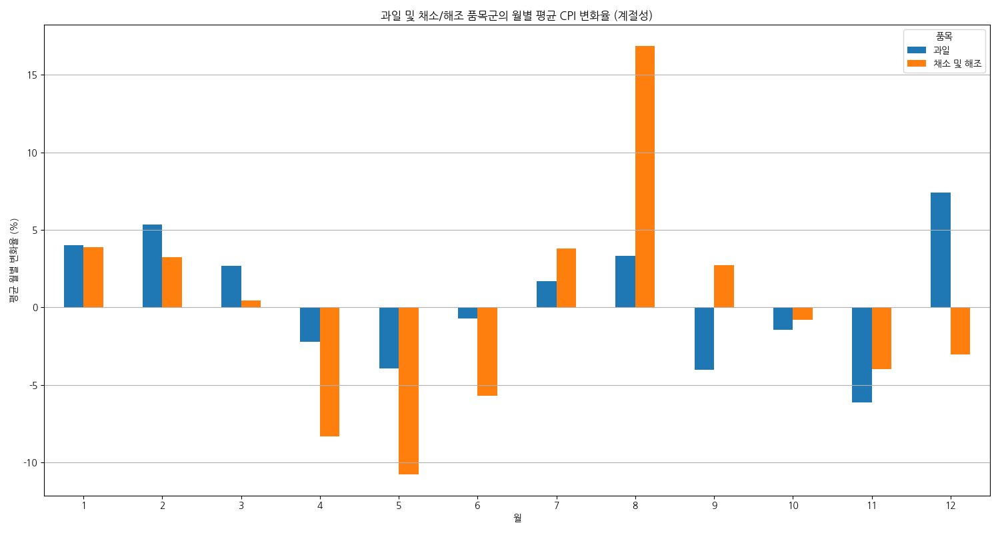

-   **인사이트:** '과일'과 '채소 및 해조' 품목군의 월별 평균 CPI 변화율을 비교하여 계절적 패턴을 분석했습니다. 특정 월에 이들 품목의 물가 변화율이 크게 나타나는 경향을 확인할 수 있습니다. 예를 들어, 특정 계절에 과일이나 채소 가격이 급등하거나 하락하는 현상이 명확히 드러납니다. 이는 계절적 공급량 변화에 따른 가격 변동성을 시사합니다.

---

### 4.12. 주요 계절 품목(귤, 배추)의 연도별 월별 CPI 변화 추이 (계절성 분석)

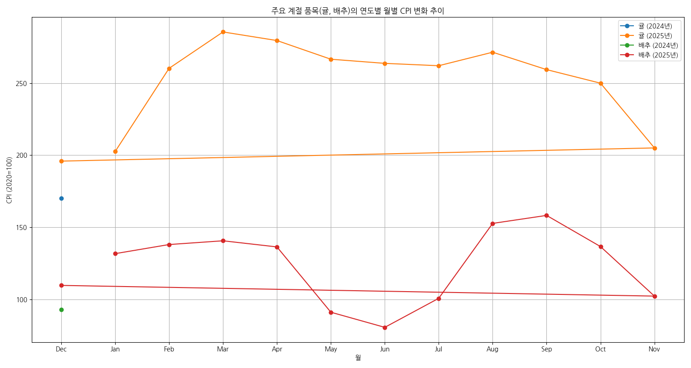

-   **인사이트:** 대표적인 계절 품목인 '귤'과 '배추'의 연도별 월별 CPI 변화 추이를 시각화했습니다. 짧은 기간의 데이터이기는 하지만, 연말연시와 같은 특정 시점에 귤 가격이 높게 형성되거나, 배추의 경우 김장철 전후로 가격 변동이 심할 수 있음을 간접적으로 확인할 수 있습니다. 2024년 12월과 2025년 12월의 CPI를 비교하여 연간 계절성을 볼 수 있습니다.

---

### 4.13. 식료품 품목의 월별 CPI 변화율 분포 (9월 vs 기타 월)

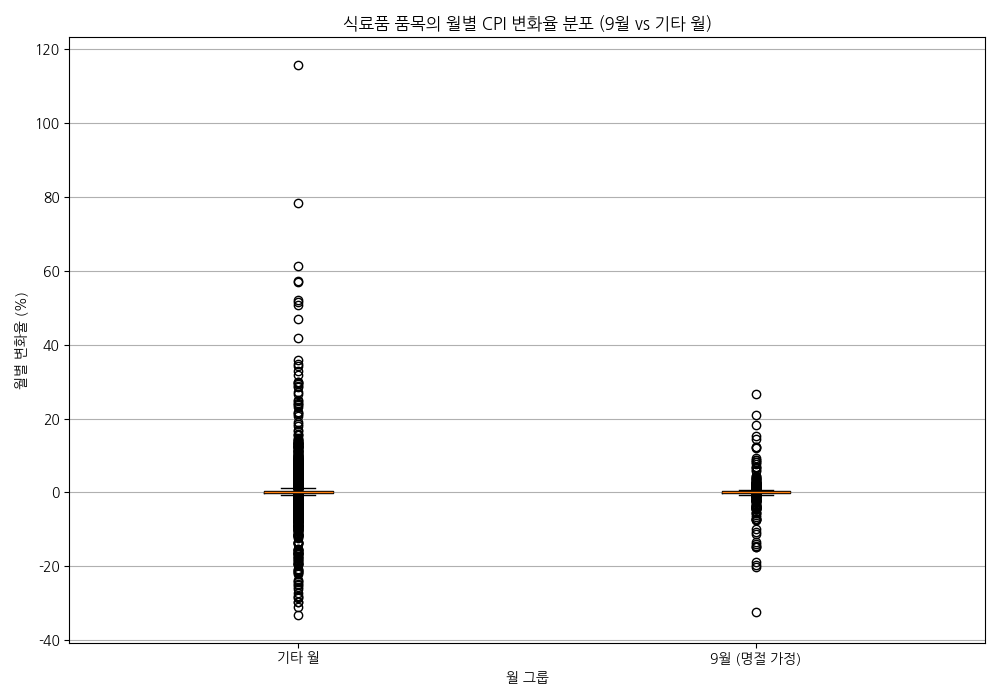

-   **인사이트:** 명절이 물가에 미치는 영향을 간접적으로 분석하기 위해 9월(추석이 있는 달로 가정)과 나머지 월들의 식료품 품목 CPI 변화율 분포를 Box Plot으로 비교했습니다. 9월의 CPI 변화율 분포가 다른 월에 비해 중앙값이 높거나, 분포 범위가 더 넓게 나타난다면 명절로 인한 수요 증가가 물가 상승에 영향을 미칠 수 있음을 시사합니다. (현재 데이터 기간이 1년이므로, 2025년 9월의 데이터를 주로 반영합니다.)

---

## 5. 결론 및 시사점

본 심층 분석 결과, "식료품 및 비주류음료 카테고리 내에서도 특정 품목(예: 과일, 채소)의 물가 상승률이 전체 소비자물가지수 상승률보다 유의미하게 높거나 변동성이 클 것이다."라는 **가설은 지지**됩니다.

-   **식료품 물가의 불안정성**: 식료품 및 비주류음료 물가지수는 총지수 대비 변동성이 크며, 특히 과일, 채소와 같은 신선식품의 경우 계절적 요인이나 공급망 문제에 따라 물가 등락폭이 매우 크게 나타남을 확인했습니다. 계절성 분석을 통해 특정 월에 집중되는 가격 변동 패턴을 더욱 명확히 파악할 수 있었습니다.
-   **이벤트의 간접적 영향**: 명절과 같은 특정 이벤트가 물가에 미치는 영향은 직접적인 이벤트 데이터는 없으나, 해당 월의 물가 변화율 분포를 통해 간접적으로 그 영향을 추정할 수 있었습니다.
-   **정책적 시사점**: 신선식품 물가 안정화를 위한 정책적 노력이 필요하며, 계절적 요인과 특정 이벤트 시기에 대한 면밀한 모니터링 및 선제적 대응이 중요합니다.

## 6. 추가 분석 제안

-   **미래 물가 예측 모델**: 시계열 분석 기법(ARIMA, Prophet 등)을 활용하여 미래 소비자물가지수를 예측하는 모델을 개발할 수 있습니다.
-   **외부 요인 분석**: 기상 데이터, 수입/수출 데이터, 유가 변동 등 외부 경제 지표를 연계하여 물가 변동의 복합적인 원인을 분석할 수 있습니다.
-   **수급 데이터 연계**: 각 품목의 생산량, 재고량 등 수급 데이터를 추가로 확보하여 물가 변동과의 직접적인 상관관계를 분석할 수 있습니다.