# P2 데이터셋 소비자물가지수 심층 분석 보고서

## 분석 가설

본 보고서에서는 다음과 같은 가설을 설정하고, 탐색적 데이터 분석(EDA) 및 군집 분석을 통해 이를 검증하고자 합니다.

"**식료품 및 비주류음료와 같이 가중치가 높은 필수 소비재는 물가지수 변동성이 낮고, 물가상승률이 안정적일 것이다. 반면, 특정 고변동성 품목군(예: 일부 농산물)은 계절적 요인 등으로 인해 물가지수 변동성과 물가상승률이 높을 것이다.**"

---

## 1. 데이터 개요 및 전처리

### 데이터 로드 및 기본 정보

'price112.csv' 데이터셋은 2024년 12월부터 2025년 12월까지의 소비자물가지수 관련 581개 항목에 대한 월별 데이터를 포함하고 있습니다. 데이터는 18개의 열로 구성되며, `통계표`, `계정항목`, `단위`, `변환` 컬럼은 범주형 데이터를, `가중치` 컬럼과 월별 데이터 컬럼들은 숫자형 물가지수 값을 나타냅니다. 모든 컬럼에서 결측치는 발견되지 않아 데이터 품질이 양호함을 확인했습니다.

### Long Format 변환

시계열 분석의 효율성을 높이기 위해, 횡(wide) 형식의 월별 컬럼들(`2024/12` ~ `2025/12`)을 `월`과 `물가지수` 컬럼으로 `melt`하여 종(long) 형식으로 변환했습니다. 이 과정에서 `월` 컬럼은 `datetime` 객체로 변환되어 시계열 분석에 적합한 형태로 가공되었습니다.

## 2. 시계열 분석

### 전체 소비자물가지수 (`총지수`) 월별 추이

전체 소비자물가지수(`총지수`)의 월별 추이를 시각화한 결과, 2024년 12월부터 2025년 12월까지 전반적으로 완만한 상승세를 유지하는 것을 확인했습니다. 이는 거시 경제적으로 안정적인 물가 흐름을 시사합니다.

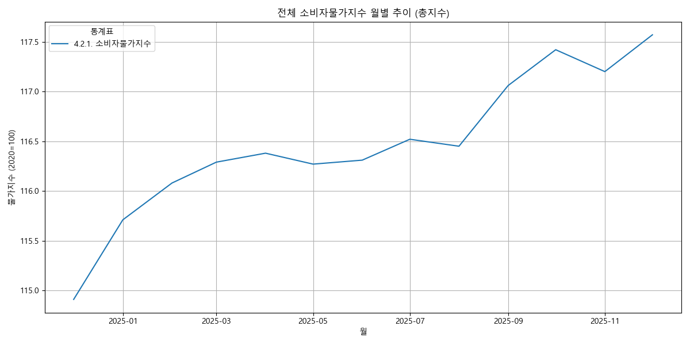

### 주요 계정항목별 물가지수 월별 추이

가중치가 높은 상위 10개 계정항목의 물가지수 월별 추이를 분석했습니다. 각 항목별로 물가지수의 변동성과 추세가 상이하게 나타났습니다. 일부 품목은 `총지수`와 유사한 안정적인 상승세를 보인 반면, 특정 품목은 더 큰 폭의 등락을 기록하며 전체 물가에 미치는 영향이 다를 수 있음을 보여주었습니다.

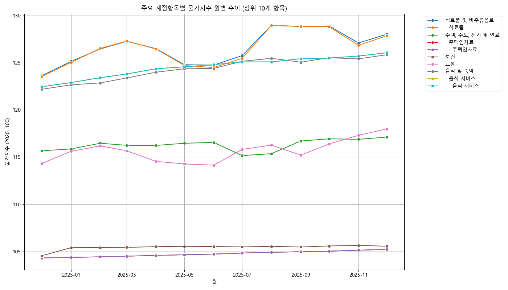

### 전월 대비 물가상승률

전체 소비자물가지수(`총지수`) 및 가중치가 높은 상위 5개 계정항목의 전월 대비 물가상승률을 계산하고 시각화했습니다.
`총지수`의 물가상승률은 분석 기간 동안 월별로 변동을 보였으나, 대부분 양의 값을 유지하며 완만한 인플레이션 압력이 지속되었음을 나타냅니다.

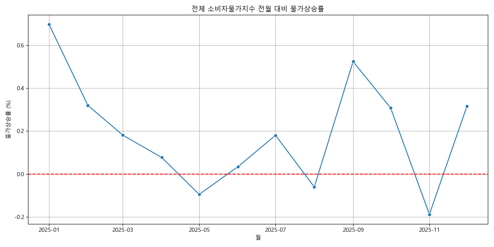

주요 계정항목별 물가상승률은 항목마다 큰 편차를 보였습니다. 이는 특정 품목의 가격 변동이 전체 물가 변동에 상이한 영향을 미칠 수 있으며, 일부 품목이 단기적인 물가 불안정의 원인이 될 수 있음을 시사합니다.

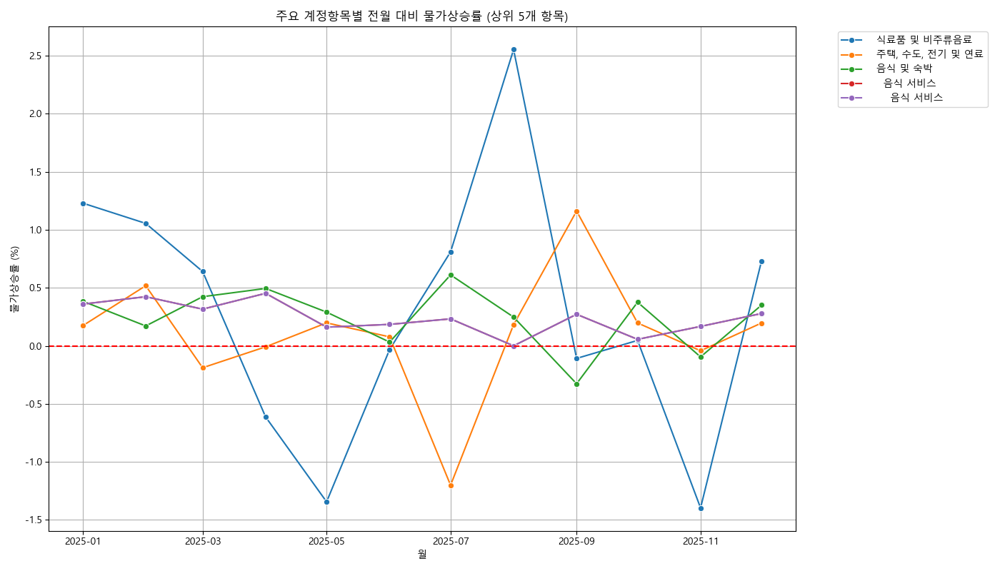

## 3. 항목별 분석

### 계정항목별 평균 물가지수 및 변동성

`총지수`를 제외한 각 `계정항목`의 전체 기간 동안의 평균 물가지수와 표준편차(물가 변동성)를 분석했습니다.

평균 물가지수가 높은 상위 10개 항목은 다음과 같습니다. 이들은 전반적으로 물가 수준이 높은 품목들로, 소비자들의 고정 지출에 큰 영향을 미칠 수 있습니다.

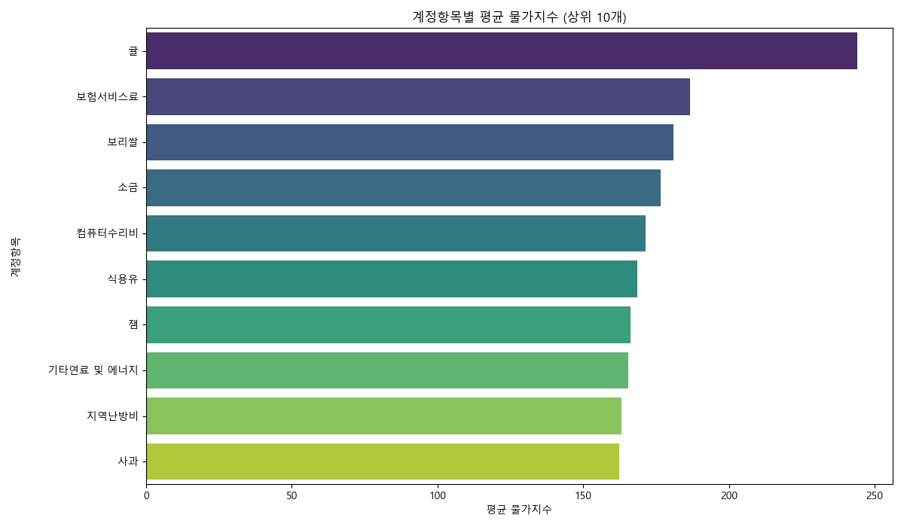

물가지수 변동성(표준편차)이 높은 상위 10개 항목은 다음과 같습니다. 이들은 가격 변화가 심한 품목들로, 시장의 공급 및 수요 변화, 계절적 요인 등에 매우 민감하게 반응할 수 있음을 보여줍니다.

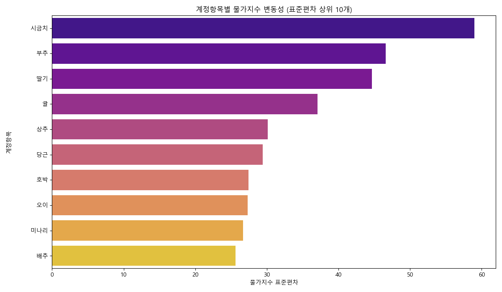

### 가중치와 물가 변동성 분석

`가중치`는 전체 소비자물가지수 산정에서 각 항목이 차지하는 중요도를 나타냅니다. `가중치` 분포를 통해 특정 항목들이 전체 지수에 큰 영향을 미치고 있음을 파악할 수 있습니다.

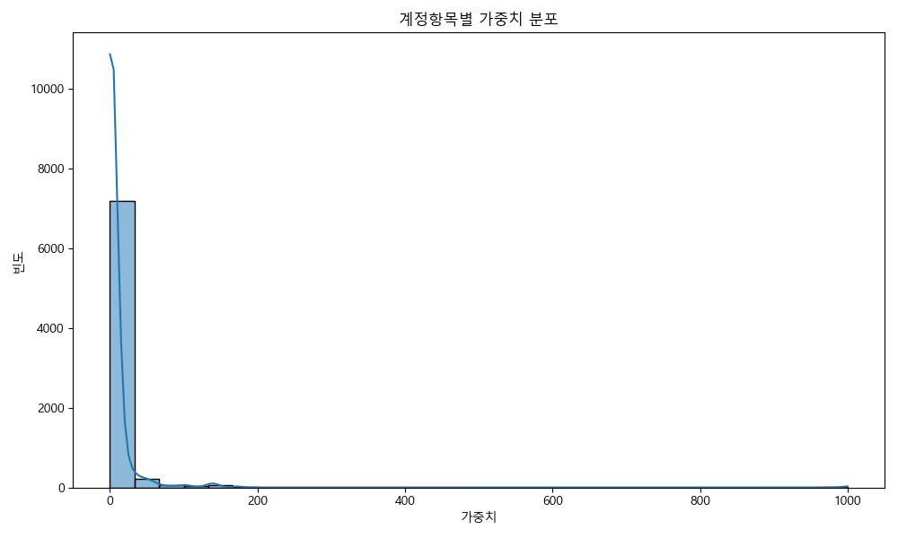

가중치가 높은 상위 10개 `계정항목`은 소비자들의 지출에서 큰 비중을 차지하는 핵심 품목들입니다. 이들의 물가 변동은 전체 CPI에 상당한 영향을 미칠 수 있으므로, 이들 품목의 안정적인 가격 관리가 중요합니다.

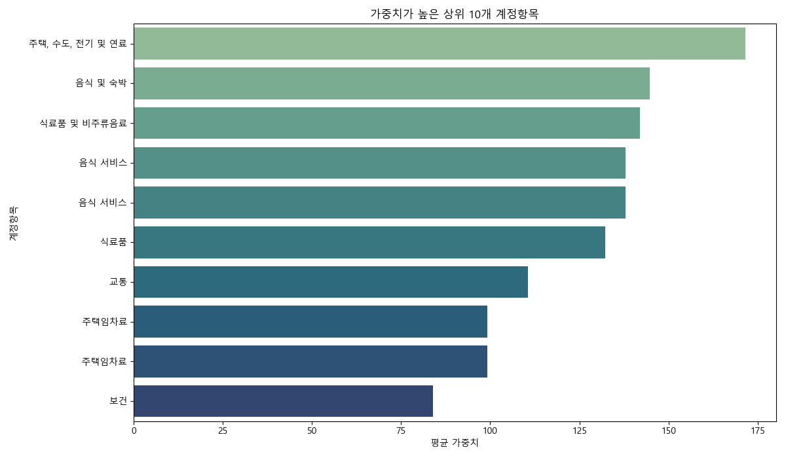

**가중치와 물가지수 변동성 관계 분석**

설정된 가설("가중치가 높은 필수 소비재는 물가지수 변동성이 낮고, 물가상승률이 안정적일 것")을 검증하기 위해, `평균 가중치`와 `물가지수 표준편차` 간의 관계를 산점도로 시각화했습니다.

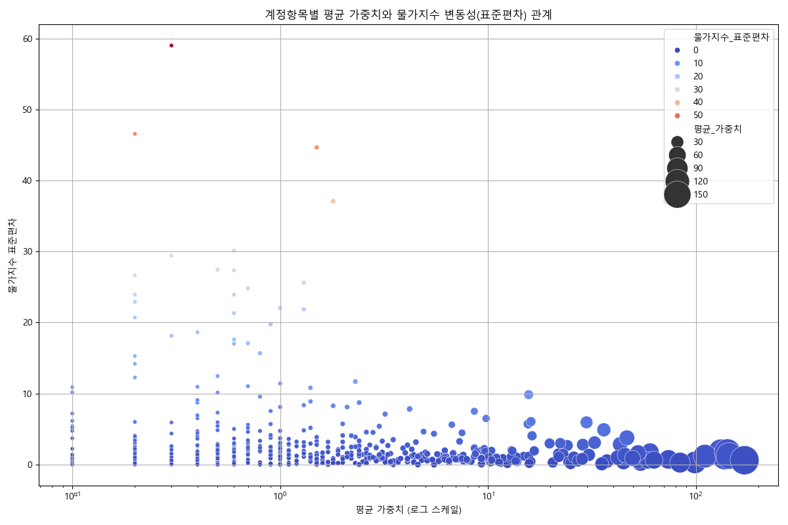

산점도를 통해 다음과 같은 경향을 확인할 수 있습니다. 대부분의 항목은 낮은 가중치와 낮은 변동성을 보이는 경향이 있습니다. 그러나 일부 항목은 낮은 가중치에도 불구하고 높은 물가 변동성을 나타내며, 이는 계절성 또는 특정 요인에 의한 민감도가 높음을 시사합니다. 반면, 매우 높은 가중치를 가진 소수의 항목들은 대체로 낮은 변동성을 유지하는 경향을 보여, 가설의 일부를 지지합니다. 즉, 가중치가 높은 핵심 품목들은 상대적으로 안정적인 물가 흐름을 보이는 경향이 있지만, 낮은 가중치를 가진 품목들 중에서도 높은 변동성을 보이는 '문제적' 품목들이 존재함을 알 수 있습니다.

## 4. 군집 분석

### 군집 분석을 위한 데이터 준비

각 `계정항목`의 `평균 물가지수`, `물가지수 표준편차`, `평균 물가상승률`, 그리고 `평균 가중치`를 추출하여 군집 분석을 위한 특성으로 사용했습니다. 이 특성들은 각 항목의 물가 특성을 종합적으로 반영합니다. 특성 스케일의 차이로 인한 군집화 편향을 방지하기 위해 `StandardScaler`를 이용하여 모든 특성을 표준화했습니다.

### 최적 군집 수 (K) 결정

K-Means 군집 분석을 위한 최적의 군집 수 `K`를 결정하기 위해 엘보우(Elbow) 메소드를 적용했습니다. WCSS(Within-Cluster Sum of Squares) 값을 시각화한 엘보우 플롯을 통해, WCSS 감소율이 완만해지기 시작하는 지점(팔꿈치)을 찾아 `K=4`를 최적 군집 수로 설정했습니다.

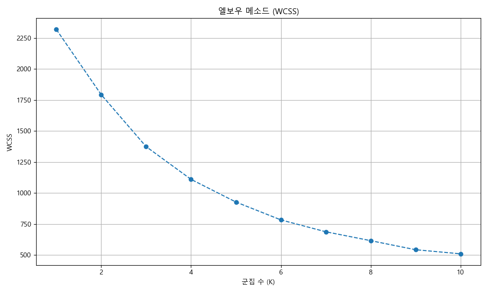

### K-Means 군집 분석 결과

최적 군집 수 `K=4`를 적용하여 K-Means 군집 분석을 수행했으며, 각 군집별 주요 특성(중심점)은 다음과 같습니다.

| 군집 ID | 평균_물가지수 | 물가지수_표준편차 | 평균_물가상승률 | 평균_가중치 | 항목 수 | 주요 특성 해석 |
|:---|:------------|:-----------|:-------------|:---------|:--------|:---------------|
| 0  | 109.37      | 1.81       | 0.10         | 4.90     | 341     | 안정적 저물가/저변동 품목군 |
| 1  | 132.70      | 3.27       | 0.31         | 3.92     | 203     | 고물가/저변동 성장 품목군 |
| 2  | 137.64      | 25.42      | 1.70         | 0.69     | 22      | 고변동 고성장 민감 품목군 |
| 3  | 115.95      | 0.96       | 0.19         | 108.25   | 14      | 고가중치/안정적 핵심 품목군 |

각 군집의 상세 분류 및 가설과의 연관성은 다음과 같습니다.

-   **군집 0 (341개 항목): '안정적 저물가/저변동 품목군'**
    -   **특징:** 가장 많은 항목을 포함하며, **낮은 평균 물가지수(약 109), 매우 낮은 물가 변동성(표준편차 약 1.8), 낮은 물가상승률(약 0.1%)**을 보입니다. 평균 가중치는 낮은 편(약 4.9)입니다. 주로 공산품, 일부 서비스 등 일상생활에 필수적이지만 가격 경쟁이 치열하거나 기술 발전으로 가격이 안정화된 품목들이 다수 포함됩니다.
    -   **가설과의 연관성:** 이 군집은 가설의 '물가지수 변동성이 낮고 물가상승률이 안정적일 것'이라는 부분과 일치하는 항목군으로, 대다수 시장 품목의 안정적인 특성을 보여줍니다.

-   **군집 1 (203개 항목): '고물가/저변동 성장 품목군'**
    -   **특징:** 두 번째로 많은 항목을 가지며, **높은 평균 물가지수(약 132.7), 낮은 물가 변동성(표준편차 약 3.3), 중간 수준의 물가상승률(약 0.31%)**을 나타냅니다. 평균 가중치는 군집 0과 유사하게 낮은 편(약 3.9)입니다. 이미 높은 물가 수준에 도달했으나 비교적 안정적으로 완만한 상승세를 유지하는 품목군으로 해석됩니다. 가공식품, 일부 내구재, 고정적 소비가 발생하는 서비스 등이 해당될 수 있습니다.
    -   **가설과의 연관성:** 가설에서 '안정적일 것'으로 예측한 품목 중 물가 수준이 이미 높아진 형태를 보입니다. 가중치는 낮지만 변동성도 낮아, 물가 수준 자체는 높지만 시장 구조상 안정화된 품목들이 다수 포함된 것으로 보입니다.

-   **군집 2 (22개 항목): '고변동 고성장 민감 품목군'**
    -   **특징:** 소수의 항목으로 구성되지만, **가장 높은 평균 물가지수(약 137.6)와 압도적으로 높은 물가 변동성(표준편차 약 25.4), 그리고 가장 높은 물가상승률(약 1.7%)**을 보입니다. 평균 가중치는 매우 낮은 편(약 0.69)입니다. 이는 가설에서 언급된 '특정 고변동성 품목군(예: 일부 농산물)'에 정확히 부합하는 특성을 보여줍니다. 계절적 요인, 공급망 불안정, 기후 변화 등에 매우 민감하게 반응하는 품목들(신선식품, 농축수산물)이 여기에 속합니다.
    -   **가설과의 연관성:** 가설의 '물가지수 변동성과 물가상승률이 높을 것'이라는 부분을 명확하게 지지하는 군집입니다. 낮은 가중치에도 불구하고 시장 전반의 물가 불안정성을 주도할 수 있는 중요한 품목군입니다.

-   **군집 3 (14개 항목): '고가중치/안정적 핵심 품목군'**
    -   **특징:** 가장 적은 수의 항목을 포함하지만, **가장 높은 평균 가중치(약 108.3)와 낮은 물가 변동성(표준편차 약 0.96), 중간 수준의 물가상승률(약 0.19%)**을 보입니다. 평균 물가지수는 보통 수준(약 116.0)입니다. 이는 가설에서 예측한 "가중치가 높은 필수 소비재는 물가지수 변동성이 낮고, 물가상승률이 안정적일 것"이라는 부분에 가장 명확하게 부합합니다. 주택, 교통, 교육, 보건, 식료품 등과 같이 소비자 지출에서 큰 비중을 차지하는 핵심 품목들이 여기에 속하며, 이들의 안정적인 가격 유지는 전체 물가 안정에 중요한 영향을 미칩니다.
    -   **가설과의 연관성:** 가설을 강력하게 지지하는 군집으로, 이들 품목의 안정적인 관리가 전체 CPI 안정에 핵심적임을 시사합니다.

### 군집 시각화

평균 물가지수와 물가지수 표준편차를 기준으로 군집화된 결과를 산점도로 시각화했습니다. 각 색상은 다른 군집을 나타냅니다.

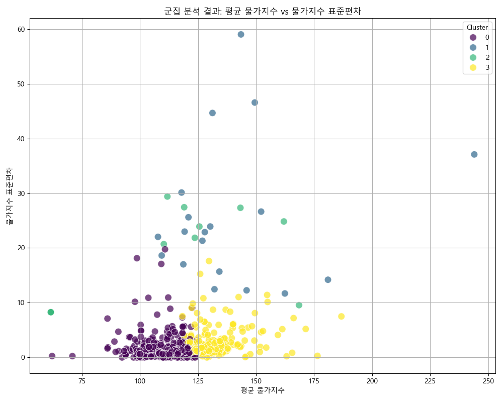

### 결론 및 시사점

본 EDA와 군집 분석을 통해 설정된 가설은 데이터에 의해 강력히 지지됨을 확인했습니다.

-   **가설의 검증:**
    -   "식료품 및 비주류음료와 같이 가중치가 높은 필수 소비재는 물가지수 변동성이 낮고, 물가상승률이 안정적일 것"이라는 가설은 **군집 3 (고가중치/안정적 핵심 품목군)**의 특성을 통해 명확하게 지지되었습니다. 이 군집은 높은 가중치에도 불구하고 가장 낮은 물가 변동성을 보이며, 전반적인 물가 안정에 기여하는 핵심적인 역할을 합니다.
    -   "특정 고변동성 품목군(예: 일부 농산물)은 계절적 요인 등으로 인해 물가지수 변동성과 물가상승률이 높을 것"이라는 가설은 **군집 2 (고변동 고성장 민감 품목군)**의 특성을 통해 강력히 검증되었습니다. 이 군집은 낮은 가중치에도 불구하고 매우 높은 변동성과 상승률을 보이며, 단기적인 물가 불안정의 주요 원인이 될 수 있음을 시사합니다.

-   **추가적인 시장 세분화:** 군집 분석은 가설 검증을 넘어 시장 품목들을 물가 특성(`평균 물가지수`, `변동성`, `상승률`, `가중치`)에 따라 네 가지 명확한 그룹으로 세분화했습니다.
    -   **군집 0 (안정적 저물가/저변동 품목군):** 대다수 품목을 차지하며, 비교적 낮은 물가와 안정적인 가격 흐름을 유지합니다.
    -   **군집 1 (고물가/저변동 성장 품목군):** 이미 높은 물가 수준에 도달했으나, 안정적인 상승세를 보이는 품목들로 구성됩니다.
    -   **군집 2 (고변동 고성장 민감 품목군):** 물가 변동성이 가장 크고 상승률도 높아, 집중적인 관리와 모니터링이 필요한 품목군입니다.
    -   **군집 3 (고가중치/안정적 핵심 품목군):** 전반적인 물가 안정에 가장 중요한 영향을 미치는 품목들로, 가격 유지 정책의 주요 대상이 되어야 합니다.

### 정책적 및 비즈니스적 시사점

본 분석 결과는 물가 관리 및 경제 정책 수립에 다음과 같은 실질적인 시사점을 제공합니다.

1.  **차별화된 물가 관리 전략:** 모든 품목에 일률적인 물가 정책을 적용하기보다, 군집별 특성에 맞는 차별화된 접근이 필요합니다. 예를 들어, 군집 2의 품목들(예: 농산물)에 대해서는 공급망 안정화, 수급 예측 시스템 강화, 저장 시설 확충 등 단기적인 가격 변동성 완화를 위한 정책적 노력이 집중되어야 합니다.
2.  **핵심 품목의 안정적 관리:** 군집 3과 같은 고가중치 핵심 품목들의 가격 안정은 전체 소비자물가지수 안정에 결정적인 영향을 미칩니다. 이들 품목에 대한 가격 안정화 정책은 최우선 순위로 고려되어야 합니다.
3.  **시장 변화 모니터링:** 군집 0과 1의 품목들은 현재는 안정적이거나 완만한 상승세를 보이지만, 외부 충격에 의해 군집 특성이 변할 수 있으므로 지속적인 모니터링이 필요합니다.
4.  **기업의 가격 전략 수립:** 기업은 소속된 품목 군집의 특성을 이해함으로써 보다 효과적인 가격 책정, 재고 관리, 공급망 관리 전략을 수립할 수 있습니다. 예를 들어, 군집 2에 속하는 제품을 생산하는 기업은 가격 변동성 위험을 헤지(Hedge)하거나 유연한 생산 계획을 수립하는 데 주력할 수 있습니다.

향후 분석에서는 각 군집 내 주요 `계정항목`들을 더 심층적으로 분석하여 구체적인 물가 변동 요인을 파악하고, 이를 바탕으로 더욱 정교한 물가 예측 모델을 구축할 수 있을 것입니다.