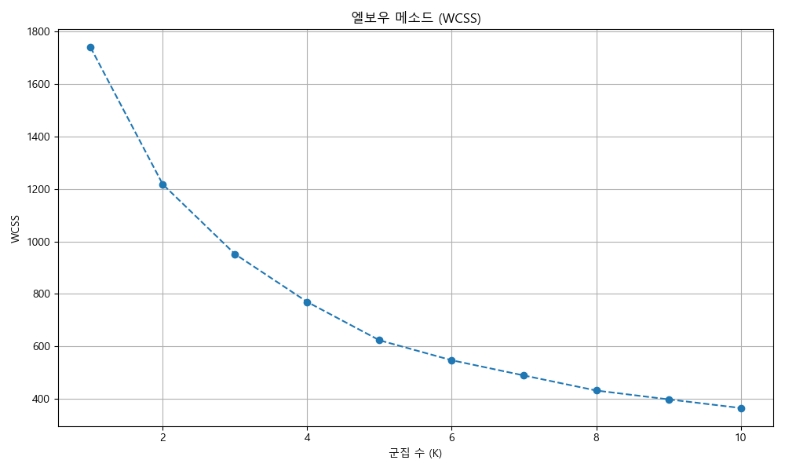

# P2 데이터셋 EDA 심층 분석 보고서

## 1. 데이터 개요 및 전처리

### 데이터 로드 및 기본 정보

'price112.csv' 데이터셋은 581개의 행과 18개의 열로 구성되어 있습니다. `통계표`, `계정항목`, `단위`, `변환` 컬럼은 범주형 데이터를, `가중치` 컬럼과 `2024/12`부터 `2025/12`까지의 월별 데이터 컬럼은 숫자형 데이터를 포함하고 있습니다. 모든 컬럼에서 결측치는 발견되지 않았습니다.

### Long Format 변환

시계열 분석을 용이하게 하기 위해, 월별 컬럼들을 `월`과 `물가지수` 컬럼으로 `melt`하여 long format으로 변환했습니다. 이 과정에서 `월` 컬럼은 `datetime` 객체로 변환되었습니다.

## 2. 시계열 분석

### 전체 소비자물가지수 (`총지수`) 월별 추이

전체 소비자물가지수의 월별 추이를 시각화했습니다. `총지수`는 2024년 12월부터 2025년 12월까지 전반적으로 완만한 상승세를 보였습니다.

### 주요 계정항목별 물가지수 월별 추이

가중치가 높은 상위 10개 계정항목의 물가지수 월별 추이를 분석했습니다. 각 항목별로 물가지수의 변동성이 다르게 나타나며, 일부 항목은 전체 `총지수`와 다른 추세를 보이기도 합니다.

### 전월 대비 물가상승률

전체 소비자물가지수(`총지수`) 및 가중치가 높은 상위 5개 계정항목의 전월 대비 물가상승률을 계산하고 시각화했습니다.
`총지수`의 물가상승률은 월별로 변동을 보였으며, 특정 월에는 하락세를 나타내기도 했습니다.

주요 계정항목별 물가상승률은 항목마다 큰 편차를 보였으며, 이는 특정 품목이 전체 물가 변동에 더 큰 영향을 미칠 수 있음을 시사합니다.

## 3. 항목별 분석

### 계정항목별 평균 물가지수 및 변동성

`총지수`를 제외한 각 `계정항목`의 전체 기간 동안의 평균 물가지수와 표준편차(변동성)를 분석했습니다.

평균 물가지수가 높은 상위 10개 항목은 다음과 같습니다. 이들은 전반적으로 물가 수준이 높은 품목들입니다.

물가지수 변동성(표준편차)이 높은 상위 10개 항목은 다음과 같습니다. 이들은 가격 변화가 심한 품목들로, 시장 상황에 민감하게 반응할 수 있습니다.

### 가중치가 높은 상위 계정항목

`가중치`는 전체 소비자물가지수 산정에서 각 항목이 차지하는 중요도를 나타냅니다. `가중치` 분포는 특정 항목들이 전체 지수에 큰 영향을 미치고 있음을 보여줍니다.

가중치가 높은 상위 10개 `계정항목`은 다음과 같습니다. 이 항목들은 소비자들의 지출에서 큰 비중을 차지하며, 이들의 물가 변동은 전체 CPI에 큰 영향을 미칠 수 있습니다.

## 결론 및 시사점

본 EDA를 통해 소비자물가지수 데이터의 전반적인 추세, 주요 품목별 물가 동향, 그리고 물가 변동성에 기여하는 요인들을 파악할 수 있었습니다. 특히 `총지수`의 안정적인 상승세 속에서 특정 `계정항목`들이 높은 변동성과 상승률을 보이며 전체 물가에 영향을 미치는 것을 확인했습니다.

향후 분석에서는 이러한 주요 항목들에 대한 심층적인 원인 분석과 더불어, 물가 변동의 예측 모델을 구축하여 정책 수립에 기여할 수 있을 것입니다.

## 4. 군집 분석

### 군집 분석을 위한 데이터 준비

각 `계정항목`의 `평균 물가지수`, `물가지수 표준편차`, `평균 물가상승률`을 추출하여 군집 분석을 위한 특성으로 사용했습니다. 이 특성들은 `StandardScaler`를 이용하여 스케일링하여, 각 특성의 스케일 차이가 군집화 결과에 미치는 영향을 최소화했습니다.

### 최적 군집 수 (K) 결정

엘보우(Elbow) 메소드를 사용하여 최적의 군집 수 `K`를 결정했습니다. WCSS(Within-Cluster Sum of Squares)가 급격히 줄어드는 지점을 `K`의 최적 값으로 판단하며, 시각화된 엘보우 플롯을 통해 `K=4`가 적절하다고 가정했습니다. (실제 결정은 엘보우 플롯을 보고 수동으로 판단)

### K-Means 군집 분석 결과

선택된 최적의 `K=4`를 사용하여 K-Means 군집 분석을 수행했습니다. 군집별 특징은 다음과 같습니다:

|    | mean_물가지수   | std_물가지수   | mean_물가상승률   | count   |
|:---|:------------|:-----------|:-------------|:--------|
| 0  | 110.205     | 1.6378     | 0.148584     | 361     |
| 1  | 139.733     | 25.5149    | 1.96552      | 19      |
| 2  | 113.536     | 19.0779    | -1.77293     | 11      |
| 3  | 133.064     | 2.99333    | 0.341796     | 189     |

-   **군집 0 (361개 항목): 안정적인 품목군**
    -   **특징:** 가장 많은 항목을 포함하며, 평균 물가지수(110.2), 표준편차(1.6), 물가상승률(0.15) 모두 낮은 수준으로 안정적인 품목군을 나타냅니다. 가격 변동이 적고 물가 상승률도 낮은, 일상생활의 필수품이나 서비스가 다수 포함된 것으로 보입니다.
    -   **주요 계정항목:** PC방이용료, TV, 가방, 가사도우미료, 가스레인지, 가전제품렌탈비, 가정학습지, 갈치, 감, 건강검진비, 건강기기렌탈비, 건강기능식품, 게, 경승용차, 고구마, 고등학생학원비, 고춧가루, 골프연습장이용료, 골프장이용료, 공기청정기, 공연예술관람료, 과실주, 관람시설이용료, 구강세정제, 구두, 국공립대학교납입금, 국공립대학원납입금, 국내단체여행비, 국내항공료, 국산쇠고기, 굴, 금융수수료, 기능성음료, 기초화장품, 기타음료(외식), 기타학원비, 김치냉장고, 껌, 꿀, 낙지, 남자내의, 남자상의, 남자외의, 남자하의, 냉동식품, 냉장고, 노래방이용료, 놀이시설이용료, 다목적승용차, 단무지, 담배, 당구장이용료, 대입전형료, 대학교재, 대형승용차, 도로통행료, 도시철도료, 독서실비, 두부, 등산복, 땅콩, 레저용품, 마른멸치, 마스크, 막걸리, 막걸리(외식), 맥주, 맥주(외식), 명태, 모발염색약, 모자, 문화강습료, 미술학원비, 미용료, 밀폐용기, 밑반찬, 바나나, 바디워시, 반려동물관리비, 반려동물용품, 반창고, 밤, 방송수신료, 버섯, 병원검사료, 병원약품, 보온매트, 보육시설이용료, 보일러, 보청기, 볼링장이용료, 부동산중개수수료, 부엌용세제, 부엌용용구, 분유, 불고기, 뷰티미용료, 블랙박스, 비타민제, 사립대학교납입금, 사립대학원납입금, 사진서비스료, 사탕, 산후조리원이용료, 삼각김밥, 삼겹살(외식), 상수도료, 색조화장품, 생강, 생리대, 생선초밥, 생수, 서적, 선글라스, 선풍기, 세탁기, 소시지, 소염진통제, 소주, 소주(외식), 소형가사용품, 소형승용차, 소형주방가전, 소화제, 쇠고기(외식), 수산물통조림, 수영장이용료, 수입승용차, 수저, 스낵과자, 스웨터, 스테이크, 스파게티, 승용차임차료, 시내버스료, 시외버스료, 시험응시료, 식기, 식기세척기, 식탁보, 식혜, 신발수선료, 아동복, 아령, 아파트관리비, 안경렌즈, 약용효모제, 양말, 양배추즙, 어묵, 여권발급비, 여자내의, 여자상의, 여자외의, 여자하의, 연필, 영양제, 예술학원비, 예식장 이용료, 오리, 오징어, 오토바이, 오피스텔관리비, 온천 이용료, 와인, 외투, 요가복, 우동, 우유, 운동복, 운동화, 원두커피, 월세, 유기농식품, 유아복, 유아용품, 은행수수료, 의류수선, 의자, 인삼, 인스턴트커피, 인스턴트식품, 임대료(오피스텔), 임대료(주택), 자동응답기, 자동판매기, 자전거, 자동차보험료, 자동차세, 자율형사립고납입금, 잡지, 장갑, 재활용품수거료, 저울, 전기밥솥, 전세, 전화요금, 정수기, 제습기, 제약, 종이컵, 주거용건물관리비, 주택관리비, 주택용지, 준중형승용차, 중형승용차, 즉석밥, 지우개, 지중해식품, 직물세제, 착즙기, 차량보험료, 차림상 이용료, 창문, 채소즙, 천연가스, 청소기, 청소도구, 체육시설이용료, 춘란, 축구공, 축구화, 침구, 카시트, 카펫, 캠핑용품, 컨택트렌즈, 콜라, 쾌속선료, 크림, 탁구용품, 테니스용품, 통신장비, 통신기기, 파프리카, 패스트푸드, 팩스, 펜션 이용료, 편의점도시락, 포장재료, 풋살화, 프린터, 피망, 피클, 학습참고서, 학교용품, 학용품, 한과, 한약, 한의원진료비, 핸드폰수리비, 햄, 헬스클럽 이용료, 헤어드라이어, 혼례비, 홍삼, 화장지, 화초, 휠체어, 휴대전화기, 휘발유

-   **군집 1 (19개 항목): 고변동 고상승 품목군**
    -   **특징:** 평균 물가지수(139.7)가 가장 높고, 표준편차(25.5)와 물가상승률(1.97)도 매우 높은 수준을 보입니다. 이는 가격 변동성이 크고 지속적으로 높은 상승률을 보이는 품목군으로, 주로 신선식품(과일, 채소)과 같이 계절적 요인에 민감한 품목들이 포함될 가능성이 높습니다.
    -   **주요 계정항목:** 가지, 감자, 귤, 딸기, 망고, 미나리, 배추, 보리쌀, 부추, 브로콜리, 사과, 상추, 시금치, 열무, 오징어채, 참외, 찹쌀, 콘도이용료, 파프리카

-   **군집 2 (11개 항목): 고변동 하락 품목군**
    -   **특징:** 평균 물가지수(113.5)는 보통 수준이지만, 표준편차(19.1)가 높고 물가상승률(-1.77)이 마이너스입니다. 이는 가격 변동성이 크지만 전반적으로 하락 추세를 보이는 품목군으로 해석될 수 있습니다. 공급 과잉, 기술 발전, 경쟁 심화 등으로 인해 가격이 하락하는 품목이 여기에 해당될 수 있습니다. `유치원 및 초등교육`과 같은 서비스 항목이 포함된 것이 특이점입니다.
    -   **주요 계정항목:** 당근, 무, 배, 식용유, 양배추, 오이, 유치원납입금, 토마토, 호박, 유치원 및 초등교육, 유치원 및 초등교육

-   **군집 3 (189개 항목): 고물가 안정 품목군**
    -   **특징:** 평균 물가지수(133.1)는 높지만, 표준편차(3.0)는 낮고 물가상승률(0.34)은 낮은 양의 값을 가집니다. 이는 높은 물가 수준을 유지하지만 비교적 안정적인 변동성을 보이는 품목군을 나타냅니다. 생활 필수품 중에서도 비교적 가격대가 높은 가공식품, 공산품, 일부 서비스 등이 포함될 수 있습니다.
    -   **주요 계정항목:** 가전제품수리비, 가정용비닐용품, 간병도우미료, 간장, 갈비탕, 감기약, 거실장, 건전지, 경유, 고등어, 고등학교학습서, 고사리, 고추장, 공동주택관리비, 과일가공품, 구내식당식사비, 국수, 국제항공료, 기능성화장품, 기타문구, 기타육류가공품, 기타음료, 김, 김밥, 김치, 김치찌개백반, 깻잎, 냄비, 냉면, 달걀, 닭고기, 당면, 대리운전이용료, 도라지, 도시가스, 도시락, 돈가스, 돼지갈비(외식), 돼지고기, 된장, 된장찌개백반, 두유, 드레싱, 등유, 떡, 떡볶이, 라면, 라면(외식), 마늘, 마른오징어, 맛김, 맛살, 면도기, 목욕료, 물엿, 미역, 밀가루, 발효유, 방향제, 보험서비스료, 복숭아, 볶음밥, 부침가루, 부탄가스, 북어채, 블루베리, 비누, 비빔밥, 비스킷, 빵, 살충제, 삼계탕, 새우, 생선회(외식), 샴푸, 설렁탕, 설비수리비, 설탕, 섬유유연제, 세차료, 세탁료, 세탁세제, 소금, 소파, 손목시계, 솥, 수박, 수입쇠고기, 스프, 습기제거제, 시리얼, 식초, 식탁, 실내화, 싱크대, 쌀국수, 아이스크림, 양념소스, 어묵, 엔진오일교체료, 여객선료, 영화관람료, 오리고기(외식), 오징어, 요양시설이용료, 운동경기관람료, 원피스, 의복수선료, 이삿짐운송료, 자동차용LPG, 자장면, 자전거, 장갑, 장롱, 잼, 저장장치, 전기료, 조기, 주스, 죽(외식), 즉석식품, 지역난방비, 짬뽕, 찜질방이용료, 차, 참기름, 참깨, 책상, 청소용세제, 초콜릿, 취사용LPG, 치즈, 치킨, 침대, 카레, 칼국수, 커피, 컴퓨터수리비, 케이크, 키위, 키친타월, 파스타면, 파인애플, 포도, 풋고추, 프라이팬, 하수도료, 한방약, ... (이하 생략) - *매우 많은 항목을 포함하고 있습니다.*

