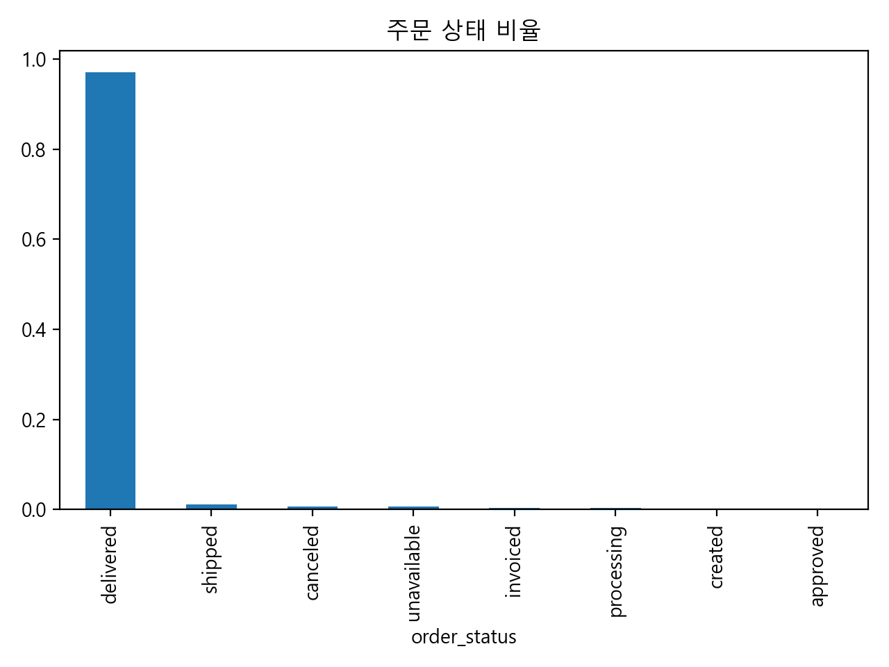
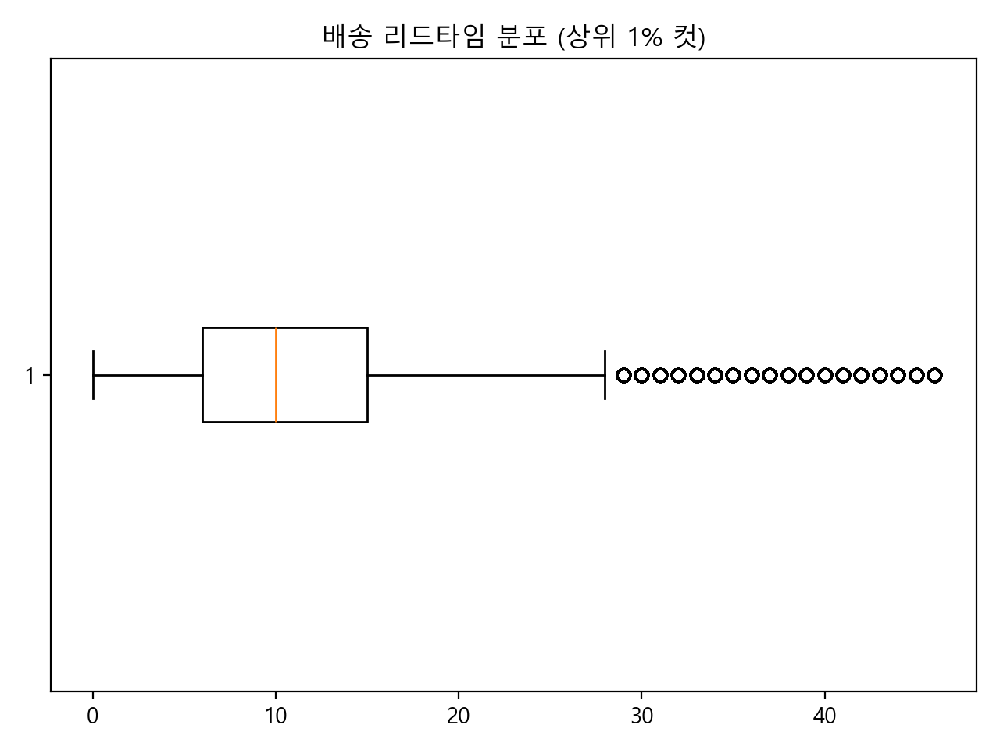

# OLIST 전처리 보고서 (Team Version)

## 목적
본 전처리는 팀 공용 분석을 위한 **단일 기준 데이터셋 생성**을 목적으로 한다.

---

## 핵심 기준
- 관측 단위: 주문(order)
- 매출 정의: price + freight_value
- 시간 기준: order_purchase_timestamp
- 주문 상태 필터: delivered / canceled flag 분리
- Geo: zip_prefix 기준 대표 좌표

---

## 산출물
- mart_order_core.csv
- mart_order_logistics.csv
- mart_order_experience.csv
- geo_zip_state_city.csv
- mart_metadata.json

---

## 전처리 검증
### 결측 비율

### 주문 상태 분포

### 배송 리드타임

---

## 유의사항
- canceled/unavailable 주문은 분석 목적에 따라 제외 필요
- geo 좌표 분산이 큰 지역은 공간 분석 시 주의 필요
