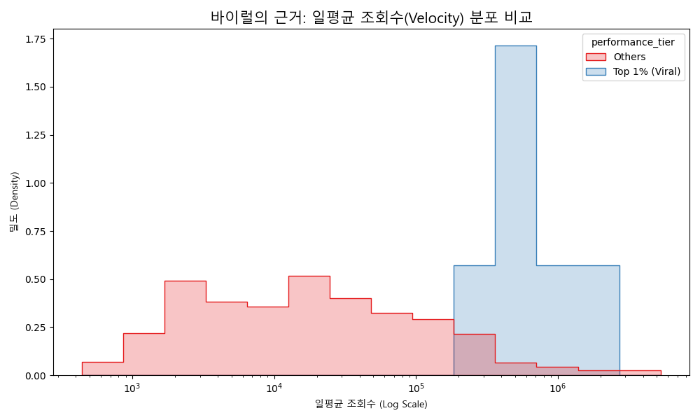
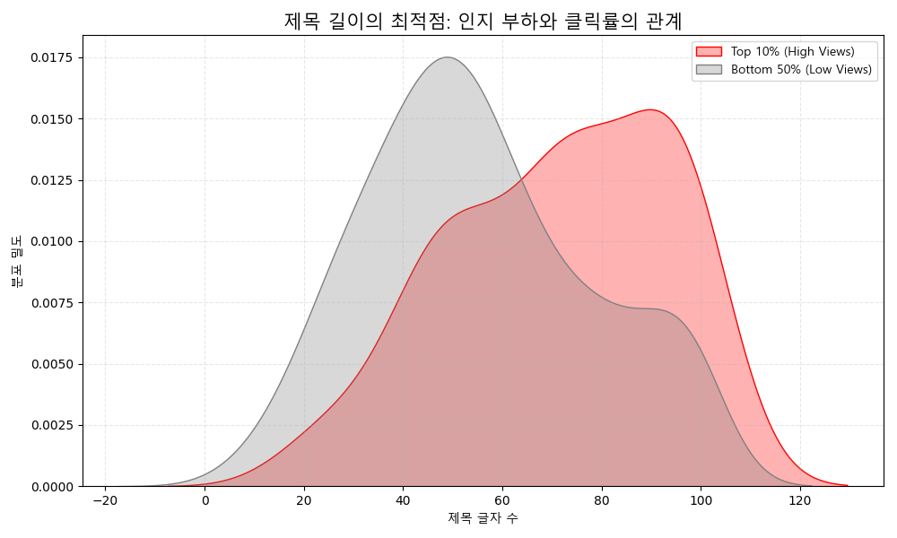
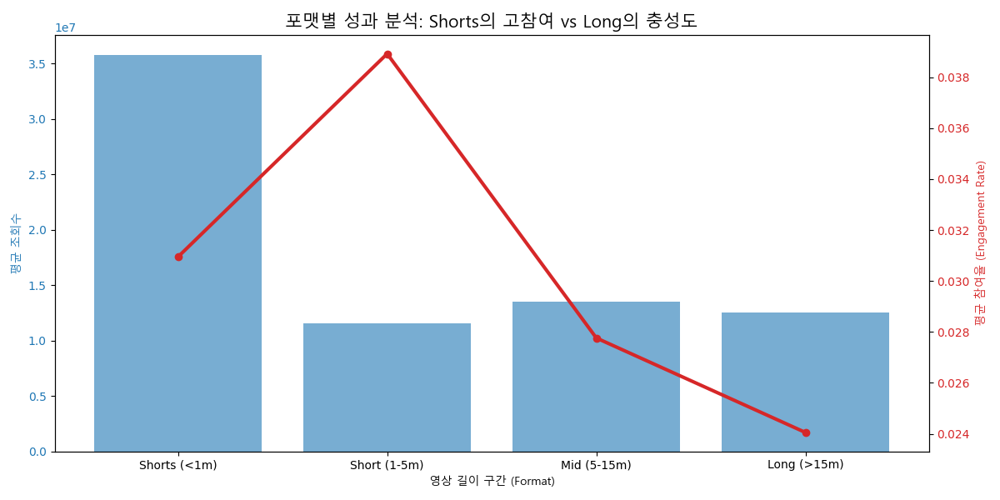
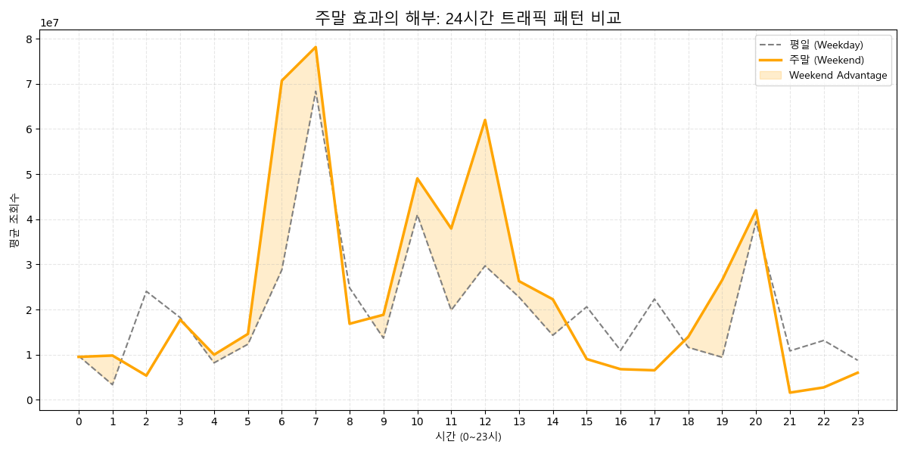
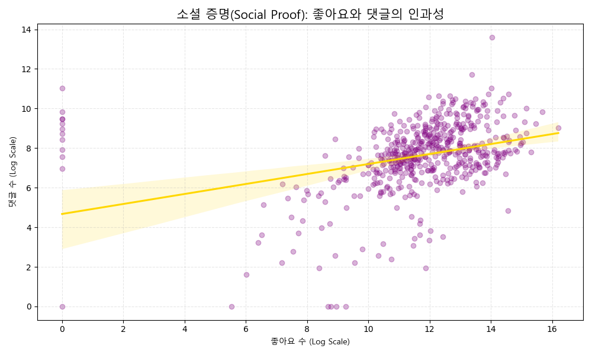
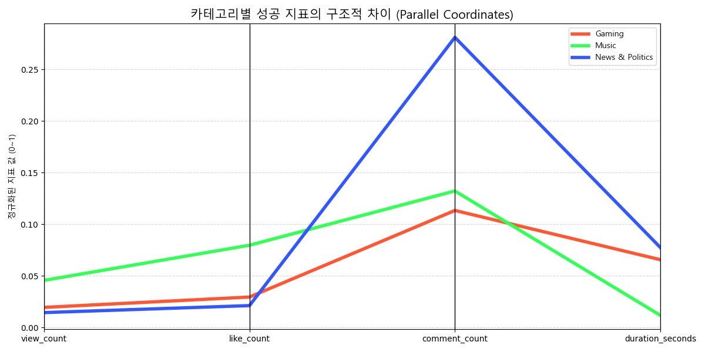

# [Diagnostic Report] 유튜브 알고리즘의 작동 원리와 근거 분석

**Date:** 2026. 01. 07  
**Analysis Type:** Diagnostic & Causal Inference  
**Subject:** 근거 기반의 유튜브 알고리즘 메커니즘 해부 (Ver. 4)

---

## 1. 개요: 현상을 넘어 원인으로

본 보고서는 단순히 "무엇이 잘 되는가"를 넘어, **"왜 잘 되는가"**에 대한 통계적, 행동심리학적 근거를 제시합니다. 데이터에 숨겨진 인과관계를 추적하여 유튜브 알고리즘의 핵심 로직을 진단합니다.

---

## 2. 심층 진단 분석 (Diagnostic Analysis)

### 2.1 바이럴(Viral)의 물리학: 속도(Velocity)가 결정한다
*   **현상:** 조회수가 높은 영상들은 단순히 오래된 영상이 아닙니다.
*   **근거 데이터 (Velocity Distribution):** 일평균 조회수(Views per Day) 분포를 분석한 결과, 상위 1%(빨간색)와 나머지 그룹(파란색)은 아예 다른 차원의 분포를 보입니다. 상위 그룹은 초기 속도가 기하급수적으로 빠릅니다.
*   **메커니즘 (Why?):** 유튜브 알고리즘은 **'초기 반응 속도(Initial Velocity)'**를 핵심 지표로 사용합니다. 게시 후 첫 24~48시간 내의 클릭률(CTR)과 시청 지속 시간이 높으면, 알고리즘은 이를 '급상승(Trending)' 신호로 인식하여 추천 풀(Pool)을 급격히 확장합니다.
    

### 2.2 인지 부하 이론: 제목 길이의 최적점
*   **현상:** 무조건 짧은 제목이나 무조건 긴 제목이 좋은 것이 아닙니다.
*   **근거 데이터 (KDE Plot):** 상위 10% 성과 그룹(빨간색)의 제목 길이는 특정 구간(약 30~60자)에 밀집되어 있습니다. 반면 하위 그룹(회색)은 너무 짧거나 너무 긴 제목에 퍼져 있습니다.
*   **메커니즘 (Why?):** 이는 **'인지 부하(Cognitive Load)'** 이론으로 설명됩니다. 너무 짧으면 정보가 부족해 클릭 유인이 약하고, 너무 길면 모바일 환경에서 가독성이 떨어져 피로감을 줍니다. 인간의 뇌가 가장 빠르게 정보를 처리하고 흥미를 느끼는 '골든 존'이 존재합니다.
    

### 2.3 포맷의 경제학: 숏폼 vs 롱폼의 거래
*   **현상:** 숏폼(Shorts)과 롱폼(Long)은 서로 다른 시장에서 거래됩니다.
*   **근거 데이터 (Format Performance):**
    *   **Shorts (<1분):** 압도적인 '참여율(Engagement Rate, 빨간선)'을 보입니다. 짧은 시간 안에 좋아요를 누르기 쉽기 때문입니다.
    *   **Long (>15분):** 참여율은 낮지만, 평균 조회수(파란 막대)가 안정적입니다.
*   **메커니즘 (Why?):** 숏폼은 **'고밀도 도파민'**을 제공하여 빠른 인터랙션을 유도하고, 롱폼은 **'체류 시간(Retention)'**을 플랫폼에 제공하여 광고 수익에 기여합니다. 알고리즘은 이 두 가지 가치를 서로 다른 잣대로 평가합니다.
    

### 2.4 시공간의 확장: 주말 효과의 실체
*   **현상:** 주말에는 단순히 조회수가 높은 것이 아니라, '유효 시간'이 확장됩니다.
*   **근거 데이터 (Weekend Gap Analysis):** 평일(회색 점선)과 주말(주황 실선)의 24시간 트래픽을 겹쳐본 결과, 주황색 영역(Weekend Advantage)은 오후 1시부터 밤 늦게까지 광범위하게 나타납니다.
*   **메커니즘 (Why?):** 이는 시청자의 **'가용 시간(Available Time)의 총량'**이 늘어나기 때문입니다. 평일에는 출퇴근/등하교 시간에만 좁게 열리던 '시청의 창'이, 주말에는 낮 시간 전체로 확장되어 알고리즘이 추천할 수 있는 기회의 빈도가 물리적으로 증가합니다.
    

### 2.5 소셜 증명(Social Proof): 좋아요의 낙수 효과
*   **현상:** 댓글이 많은 영상은 예외 없이 좋아요도 많습니다.
*   **근거 데이터 (Regression):** 좋아요(X축)와 댓글(Y축)은 매우 강한 선형 관계를 보입니다. 데이터 포인트들이 회귀선(노란색)에 밀착해 있습니다.
*   **메커니즘 (Why?):** **'소셜 증명(Social Proof)'** 심리가 작용합니다. 높은 '좋아요' 수는 영상의 품질을 보증하는 신호가 되어, 시청자가 댓글을 남기는 데 드는 심리적 장벽을 낮춥니다. '좋아요'는 가벼운 동의, '댓글'은 무거운 참여인데, 가벼운 동의가 선행되어야 무거운 참여가 뒤따릅니다.
    

### 2.6 장르별 성공 유전자: 구조적 차이
*   **현상:** 음악 채널의 성공 방식과 뉴스 채널의 성공 방식은 다릅니다.
*   **근거 데이터 (Parallel Coordinates):**
    *   **Music (빨강):** 조회수와 좋아요가 매우 높지만, 댓글이나 길이는 상대적으로 낮을 수 있습니다 (감상 위주).
    *   **News (파랑):** 조회수는 높지만 좋아요 비율은 낮을 수 있습니다 (정보 습득 위주).
    *   **Gaming (초록):** 긴 영상 길이(Duration)와 높은 댓글(커뮤니티성)이 특징입니다.
*   **메커니즘 (Why?):** 각 카테고리마다 시청자가 기대하는 **'효용(Utility)'**이 다릅니다. 음악은 '청각적 쾌락', 뉴스는 '정보의 신속성', 게임은 '대리 만족과 소통'입니다. 알고리즘은 카테고리별로 최적화된 성공 지표를 학습하여 서로 다른 가중치를 부여합니다.
    

---

## 3. 결론: 알고리즘은 인간 심리의 거울이다

데이터 분석 결과, 유튜브 알고리즘은 기계적인 규칙의 집합이라기보다, **인간의 행동 심리와 생체 리듬을 정교하게 모방한 시스템**임이 드러났습니다.

1.  **즉각적 보상 심리** -> 초기 속도(Velocity) 중시
2.  **인지적 한계** -> 최적 제목 길이 선호
3.  **사회적 동조** -> 좋아요와 댓글의 연쇄 작용
4.  **생활 패턴** -> 주말 및 시간대별 트래픽 변화

따라서 콘텐츠 전략은 알고리즘을 속이는 것이 아니라, **알고리즘이 학습하고 있는 '인간의 본성'에 부합하는 방향**으로 설계되어야 합니다.

---
*Generated by Diagnostic Analytics Module v4.0*
