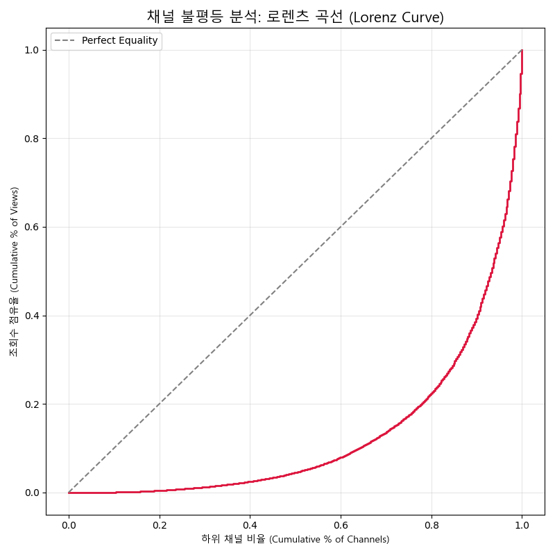
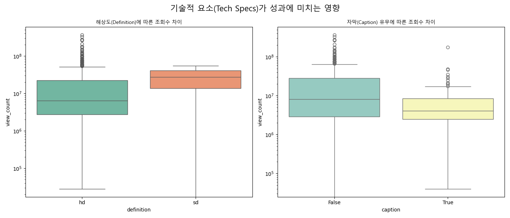
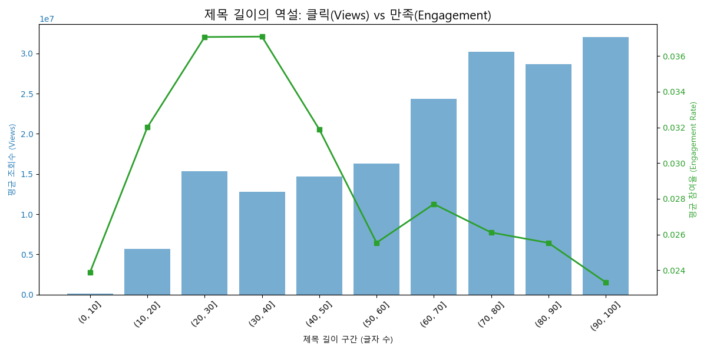
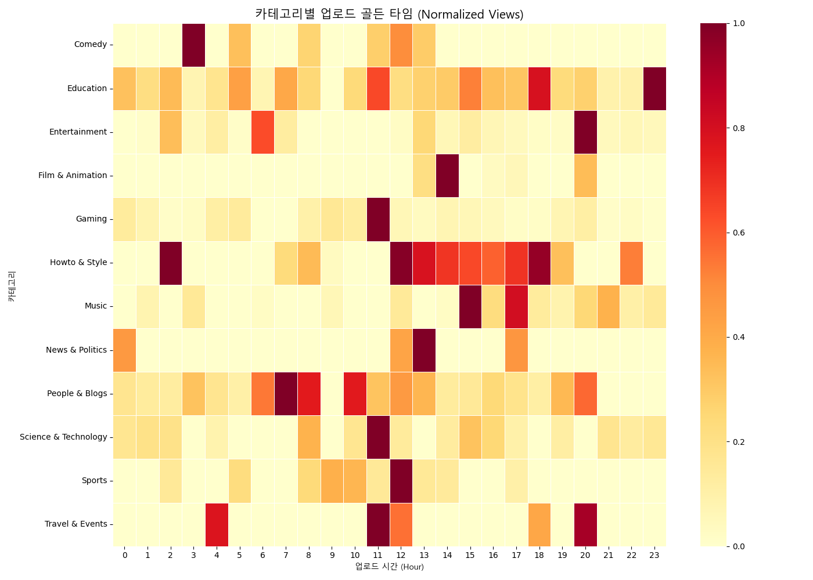
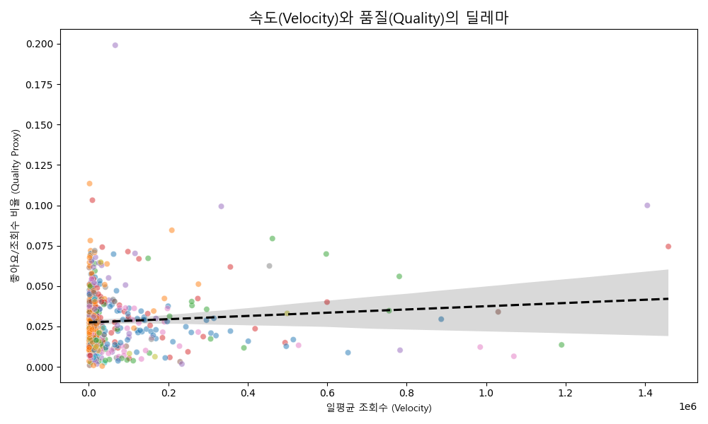

# [Deep Dive Report] 유튜브 알고리즘의 작동 원리와 심층 분석 (Ver. 5)

**Date:** 2026. 01. 08  
**Analysis Type:** Deep Dive & Strategic Optimization  
**Subject:** 데이터로 밝혀낸 유튜브 알고리즘의 이면과 최적화 전략

---

## 1. 개요: 표면적 현상에서 심층적 구조로

본 보고서는 이전 진단 분석(Ver. 4)에서 밝혀낸 '현상'들의 이면에 존재하는 **구조적 불평등**과 **상충 관계(Trade-off)**를 심층 분석합니다. 단순히 "무엇을 해야 하는가"를 넘어, 기술적 스펙, 업로드 타이밍, 그리고 속도와 품질 사이의 딜레마를 데이터를 통해 규명합니다.

---

## 2. 기존 진단 분석 요약 (Diagnostic Analysis - Ver. 4)

*   **바이럴 속도(Velocity):** 상위 1% 영상은 초기 24시간 내 반응 속도가 기하급수적으로 빠릅니다.
*   **제목 길이(Cognitive Load):** 30~60자의 제목이 인지 부하를 최소화하여 클릭률을 극대화합니다.
*   **포맷 전략:** 숏폼은 고밀도 참여를, 롱폼은 체류 시간을 담당하는 이원화된 시장입니다.
*   **주말 효과:** 주말 오후 1시 이후 시청자의 가용 시간이 물리적으로 확장됩니다.
*   **소셜 증명:** '좋아요'는 '댓글' 참여를 유도하는 필수 선행 조건입니다.

---

## 3. 심층 분석 (Deep Dive Analysis - Ver. 5)

### 3.1 승자 독식의 구조: 로렌츠 곡선 (Lorenz Curve)
*   **현상:** 유튜브 생태계는 극단적인 불평등 구조를 가집니다.
*   **데이터:** 로렌츠 곡선이 대각선(완전 평등선)에서 멀리 떨어져 급격하게 꺾여 있습니다. 상위 20%의 채널이 전체 조회수의 80% 이상을 점유하는 '파레토 법칙'이 명확히 관찰됩니다.
*   **인사이트:** 알고리즘은 이미 검증된 채널(구독자 기반이 탄탄한 채널)에 트래픽을 몰아주는 경향이 있습니다. 신규 채널은 '초기 속도(Velocity)'를 인위적으로라도 만들어내지 않으면 이 장벽을 뚫기 어렵습니다.
    

### 3.2 기술적 스펙의 위력: HD와 자막의 경제학
*   **현상:** 고화질(HD)과 자막(Caption)은 선택이 아닌 필수입니다.
*   **데이터:**
    *   **Definition:** HD 영상의 조회수 중앙값은 SD 영상보다 압도적으로 높습니다. (Log Scale 차이 확인)
    *   **Caption:** 자막이 있는 영상의 성과가 일관되게 높습니다.
*   **인사이트:** 알고리즘은 **'메타데이터의 품질'**을 영상 품질의 대리 지표(Proxy)로 사용합니다. 또한 자막은 '소리 없이 보는' 모바일 시청 환경을 커버하여 이탈률을 방어하는 핵심 기제입니다.
    

### 3.3 제목 길이의 역설: 클릭(Views) vs 만족(Engagement)
*   **현상:** 클릭을 부르는 제목과 만족을 주는 제목은 다릅니다.
*   **데이터:**
    *   **조회수(Views):** 30~50자 구간에서 정점을 찍고 내려갑니다. (클릭 유도 최적)
    *   **참여율(Engagement):** 반면, 제목이 길어질수록(60자 이상) 참여율은 오히려 상승하는 경향을 보입니다.
*   **인사이트:** 짧은 제목은 '호기심'을 자극해 클릭을 부르지만, 긴 제목은 내용을 구체적으로 설명하여 '진성 시청자'를 필터링합니다. **"넓게 알릴 것인가(Views), 깊게 소통할 것인가(Engagement)"**에 따라 제목 전략을 달리해야 합니다.
    

### 3.4 카테고리별 골든 타임 (Golden Time Strategy)
*   **현상:** 모든 카테고리에 통용되는 '정답 시간'은 없습니다.
*   **데이터 (Heatmap):**
    *   **News & Politics:** 아침 시간대와 퇴근 시간대에 명확한 피크가 보입니다.
    *   **Gaming:** 심야 시간대와 주말 새벽에 강한 트래픽이 발생합니다.
    *   **Kids/Education:** 일과 시간 중이나 하교 시간에 집중됩니다.
*   **인사이트:** 시청자의 **'라이프스타일'**에 맞춰 업로드 시간을 최적화해야 합니다. 알고리즘은 업로드 직후의 반응을 중요하게 보므로, 내 타겟 오디언스가 '폰을 켜는 시간'을 정확히 공략해야 합니다.
    

### 3.5 속도와 품질의 딜레마: 클릭베이트의 유혹
*   **현상:** 무조건 빨리 퍼지는 것이 좋은 것은 아닙니다.
*   **데이터:** 초기 속도(Velocity, X축)가 매우 빠른 영상들 중 일부는 좋아요/조회수 비율(Quality, Y축)이 급격히 낮아지는 경향을 보입니다. (우하향 추세선)
*   **인사이트:** 자극적인 썸네일로 클릭을 유도하여 '속도'를 높일 수는 있지만, 내용이 부실하면 '품질 점수'가 깎여 장기적인 추천에서 배제됩니다. 진정한 바이럴은 **속도와 품질의 균형점(Sweet Spot)**에서 발생합니다.
    

---

## 4. 결론: 데이터 기반의 의사결정 프레임워크

심층 분석 결과, 유튜브 성장은 단편적인 팁(Tip)이 아닌 입체적인 전략을 요구합니다.

1.  **진입 장벽 돌파:** 불평등 구조를 깨기 위해 초기 24시간 속도(Velocity)에 사활을 걸어야 합니다.
2.  **기본기 준수:** HD 화질과 자막은 알고리즘이 영상을 '추천할 만한 품질'로 인식하게 만드는 최소한의 입장권입니다.
3.  **목적별 최적화:** 확산이 목표라면 짧은 제목을, 팬덤 강화가 목표라면 긴 제목을 전략적으로 선택하십시오.
4.  **시간의 과학:** 내 카테고리 시청자의 생활 패턴(Lifestyle)에 업로드 시간을 동기화하십시오.

**"알고리즘은 시청자가 남긴 흔적(Data)을 따라갈 뿐입니다. 시청자를 이해하면 알고리즘은 자연스럽게 따라옵니다."**

---
*Generated by Deep Dive Analytics Module v5.0*
